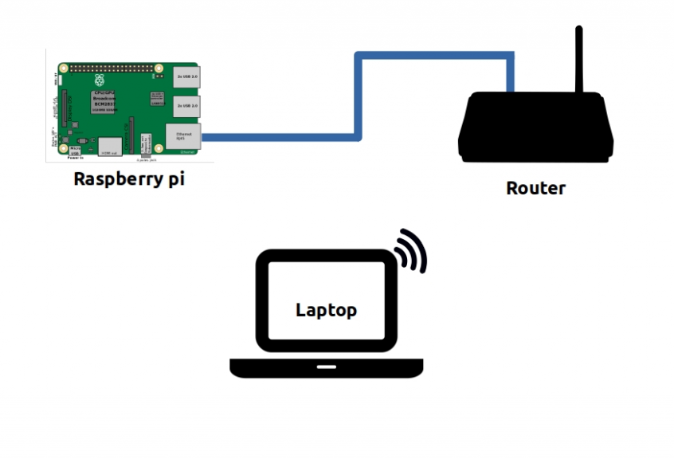

What is this course
===================


This course guides you to step through development of a simple app running on the Wazigate platform.

What you will learn:

- **How do WaziApps work?**
  - The structure of WaziGate
  - How the AppManager works
  - How to utilize docker containers as WaziApps
- **Preparing the RPI for development of WaziApps**
  - Setup Wazigate Firmware
  - Connect your PC to the Raspberry pi
  - Install IDE and communicate to the pi over SSH
  - Setup FTP on the Raspberry pi
- **Develop a WaziApp in Python, GoLang and Javascript**
- **For each App you will learn how to:**
  - Install and run the sample App
  - Make a “Hello world” RESTful API
  - Make APIs to handle POST/PUT/DELETE requests
  - Configure “docker-compose.yml” file
  - Configure “package.json” file
  - Package and build the docker image for the App
  - Push the App image to the docker hub

___________________________________________________________________________________________________________________


Prerequisites:
=============
- You need to be familiar with:
  - Raspberry Pi
  - A general knowledge of sensor nodes (e.g. Arduino, ESP, etc)
  - Docker container concept
- You need to have basic knowledge of at least one of the following programming languages:
  - Python
  - Go Lang
  - JavaScript
- The required Hardware:
  - A Raspberry pi
  - An SD Card (at least 8GB)
  - Internet Connection


Level: **Intermediate**

___________________________________________________________________________________________________________________

How do WaziApps work?
=====================

Wazigate uses a microservice architecture to manage its Apps. This architecture allows each
application to operate independently in isolation which makes the development and
maintenance much simpler than a monolithic architecture.



**Useful links:**
- [https://www.waziup.io/](https://www.waziup.io/)
- [https://microservices.io/](https://microservices.io/)
- [https://man7.org/linux/man-pages/man7/unix.7.html](https://man7.org/linux/man-pages/man7/unix.7.html)
- [https://docs.docker.com/](https://docs.docker.com/)

___________________________________________________________________________________________________________________

Preparing the development environment
=====================================

Setup Wazigate Firmware
-----------------------
In this section we learn how to set up our development environment. We need to
flash a Raspberry pi with Wazigate Firmware, configure it, install the required tools
and finally prepare our PC.



In order to flash the Raspberry pi, we go to [waziup.io/downloads](https://www.waziup.io/downloads/) and download the
latest SD card image.
We use [Etcher tool](https://www.balena.io/etcher/) to flash the downloaded image on the SD card. After flashing is
done, we insert the SD card into the raspberry pi and turn it on.

___________________________________________________________________________________________________________________

Setup communication channel with Wazigate (WiFi/Ethernet)
---------------------------------------------------------
When we boot a Raspberry pi with Wazigate Firmware for the first time, it goes to
WiFi access point mode by default. We can either connect to the pi through the
access point or use an Ethernet cable to reach the pi. Using Ethernet is
recommended for development as it is more reliable. You can either wire it like this
to your local router:



Or just connect it directly to your PC, just remember to share your Ethernet
connection in order to allow the pi to connect to your PC as a client.
If you want to communicate to your pi through WiFi, here is how to configure your
Wazigate to connect to your local WiFi connection. On our PC we should see a
wireless network that starts with **WAZIGATE_** connect to it, the default password is
**loragateway** .



When the pi is in WiFi access point mode, the default IP address is: 192.168.200.1

___________________________________________________________________________________________________________________

Find the Wazigate’s IP address with Angry IP Scanner
----------------------------------------------------

Either we connect our pi through Ethernet or WiFi, we need to find its IP address to be able to work with it. Here, there are two ways to find it.
One of the tools that helps us to find the IP address of our pi is [Angry IP Scanner](https://angryip.org/).




___________________________________________________________________________________________________________________

Find the Wazigate’s IP address with nmap
----------------------------------------

Nmap is a bit more advanced, initially developed for Unix, but now you can [install it](https://nmap.org/book/inst-windows.html) on windows machines as well.
On Debian based machines you can install it this way:

```
sudo apt-get install nmap
```

Here is how to use it to find the IP address of the pi:



___________________________________________________________________________________________________________________

IDE installation: VS-Code
-------------------------

You can use any IDE that suits you, here I show what I use and how I communicate my code to the pi. I use [Visual Studio Code](https://code.visualstudio.com/) which is multi-platform and has tons of extensions.




___________________________________________________________________________________________________________________

Install FTP on Wazigate
-----------------------

FTP comes handy when we want to copy files to/from our pi.



 We can install it easily by running the following code in the terminal of the pi:

```
sudo apt-get install -y pure-ftpd
sudo groupadd ftpgroup
sudo usermod -a -G ftpgroup $USER
sudo chown -R $USER:ftpgroup "$PWD"
sudo pure-pw useradd upload -u $USER -g ftpgroup -d "$PWD" -m <<EOF
loragateway
loragateway
EOF
sudo pure-pw mkdb
sudo service pure-ftpd restart
```

___________________________________________________________________________________________________________________


A Wazigate Application in Python
================================

Install and run the Python sample App
-------------------------------------



___________________________________________________________________________________________________________________

Make a “Hello world” API
------------------------



- **Default password:** loragateway
- **The App folder:** ~/waziup-gateway/apps/waziup/hello-world-python/
- **Change the ownership:** sudo chown pi -R .
- **Start the container:** docker-compose up -d
- **Shell into the container:** sudo docker exec -it <container_name> sh
- **Start the App inside the container:** python /root/src/main.py

___________________________________________________________________________________________________________________

Make APIs to handle POST/PUT/DELETE requests
--------------------------------------------



- **Start the container:** docker-compose up -d
- **Shell into the container:** sudo docker exec -it <container_name> bash
- **Start the App inside the container:** python /root/src/main.py

___________________________________________________________________________________________________________________

Configure “docker-compose.yml” file
-----------------------------------



___________________________________________________________________________________________________________________

Configure “package.json” file
-----------------------------



___________________________________________________________________________________________________________________

Package and build the docker image for the Python App
-----------------------------------------------------




- **Build our app:** docker-compose build

___________________________________________________________________________________________________________________

Push the App image to the docker hub
------------------------------------



The used commands:
```
docker login
docker push <the_full_image_name_with_tag>
```

___________________________________________________________________________________________________________________

How the update mechanism works in WaziGate
------------------------------------------



___________________________________________________________________________________________________________________

A Wazigate Application in GoLang
================================

Install and run the Go sample App
---------------------------------



___________________________________________________________________________________________________________________

Make a “Hello world” API
------------------------



- **Default password:** loragateway
- **The App folder:** ~/waziup-gateway/apps/waziup/hello-world-go/
- **Change the ownership:** sudo chown pi -R .
- **Start the container:** docker-compose up -d
- **Shell into the container:** sudo docker exec -it <container_name> sh
- **Build and start the App inside the container:** go build -o start . && ./start

___________________________________________________________________________________________________________________

Make APIs to handle POST/PUT/DELETE requests
--------------------------------------------



- **Start the container:** docker-compose up -d
- **Shell into the container:** sudo docker exec -it <container_name> sh
- **Build and start the App inside the container:** go build -o start . && ./start

**Tip:**  Wazigate-system is actually a WaziApp that is written in Go Lang and its UI is based on REACT.

Please check out its repository to see real-world examples: https://github.com/Waziup/wazigate-system

___________________________________________________________________________________________________________________

Configure “docker-compose.yml” file
-----------------------------------



___________________________________________________________________________________________________________________

Configure “package.json” file
-----------------------------



___________________________________________________________________________________________________________________

Package and build the docker image for the GoLang App
-----------------------------------------------------



**Build our app:** docker-compose build

___________________________________________________________________________________________________________________

Push the App image to the docker hub
------------------------------------



The used commands:
```
docker login
```
```
docker push <the_full_image_name_with_tag>
```

___________________________________________________________________________________________________________________


How the update mechanism works in WaziGate
------------------------------------------



___________________________________________________________________________________________________________________

A Wazigate Application in Javascript
====================================

Install and run the Javascript sample App
-----------------------------------------



___________________________________________________________________________________________________________________

Make a GET Request API call
---------------------------



- **Default password:** loragateway
- **The App folder:** ~/waziup-gateway/apps/waziup/hello-world-js/
- **Change the ownership:** sudo chown pi -R .
- **Start the container:** docker-compose up -d
- **API lists:**
    - [Wazigate-System](https://raw.githack.com/Waziup/wazigate-system/master/docs/index.html)
	- [Wazigate-Edge](https://raw.githack.com/Waziup/wazigate-edge/v2/www/docs/index.html)

___________________________________________________________________________________________________________________


Call an API on the Edge to list all registered devices on Wazigate
------------------------------------------------------------------



- **Default password:** loragateway
- **The App folder:** ~/waziup-gateway/apps/waziup/hello-world-js/
- **Change the ownership:** sudo chown pi -R .
- **Start the container:** docker-compose up -d
- **API lists:**
  -	[Wazigate-System](https://raw.githack.com/Waziup/wazigate-system/master/docs/index.html)
  -	[Wazigate-Edge](https://raw.githack.com/Waziup/wazigate-edge/v2/www/docs/index.html)
 
**Notes:**
	You can also make your WaziApp entirely based on other popular Javascript libraries like REACT as the UI of the [Wazigate-System](https://github.com/Waziup/wazigate-system) and [Wazigate-Edge](https://github.com/Waziup/wazigate-edge) are made with REACT.
	Please check out the Waziup-JS library that we use ourselves, it makes the life easier: https://www.npmjs.com/package/waziup-js


Configure “docker-compose.yml” file



___________________________________________________________________________________________________________________

Configure “package.json” file
-----------------------------



___________________________________________________________________________________________________________________

Package and build the docker image for the App
----------------------------------------------




**Build our app:** docker-compose build

___________________________________________________________________________________________________________________

Push the App image to the docker hub
------------------------------------



**The used commands:**
```
docker login
```
```
docker push <the_full_image_name_with_tag>
```

___________________________________________________________________________________________________________________

How the update mechanism works in WaziGate
------------------------------------------




