In this course you will learn step by step everything there is to know about IoT. The course is structured with external material and with material produced directly from the WAZIUP / WAZIHUB project

What is IoT 
=====================

Introduction to IoT
-----------------------------------------------------------------

The Internet of things (IoT) is a system of interrelated computing devices, mechanical and digital machines provided with unique identifiers (UIDs) and the ability to transfer data over a network without requiring human-to-human or human-to-computer interaction.

The definition of the Internet of things has evolved due to the convergence of multiple technologies, real-time analytics, machine learning, commodity sensors, and embedded systems. Traditional fields of embedded systems, wireless sensor networks, control systems, automation (including home and building automation), and others all contribute to enabling the Internet of things. In the consumer market, IoT technology is most synonymous with products pertaining to the concept of the "smart home", including devices and appliances (such as lighting fixtures, thermostats, home security systems and cameras, and other home appliances) that support one or more common ecosystems, and can be controlled via devices associated with that ecosystem, such as smartphones and smart speakers.

IoT system architecture, in its simplistic view, consists of three parts:
- Device
- Edge Gateway
- Cloud

Devices include networked things, such as the sensors and actuators found in IIoT equipment,The Edge Gateway consists of sensor data aggregation systems that provide functionality, such as pre-processing of the data, securing connectivity to cloud, using systems such as WebSockets, the event hub, and, even in some cases, edge analytics or fog computing.The final part includes the cloud application built for IIoT using the microservices architecture it also includes various database systems that store sensor data, such as time series databases or asset stores using backend data storage systems.



_________________________________________________________________________________________________________________________________

WAZIUP and IoT
-------------------------



The WAZIUP project uses cutting edge technology from IoT and Big Data to improve the working conditions in the rural ecosystem of Sub-Saharan Africa. First, WAZIUP involves end users of IoT and Big Data in order to define focused validation cases. Secondly, it engages the ICT ecosystem by fostering new tools and good practices amongst entrepreneurs and start-ups.

The technology we use to do this is:
- **WAZIDEV**: WaziDev is a Sensing and Actuation platform for your applications! It can send your data up to 7 Km using the LoRa technology. It is easily programmable and customizable, using Arduino technology. It is an ideal solution for start-ups and entrepreneurs who want to rapid prototype a IoT applications.
- **WAZIGATE** : WaziGate is a IoT LoRa Gateway, ideal for all your remote IoT applications. The Gateway can cover up to 100 IoT Sensors and actuator nodes using LoRa radio network: Weather stations, soil monitoring, GPS applications... The possibilities are endless! The Gateway can also control your actuators, such as electro-valves. You can host your own applications directly in the gateway, and connect to it through WiFi. The gateway can easily work without Internet connectivity and still provides data to end-users through its embedded database and web-based visualization module.
- **WAZICLOUD** : The WAZIUP Cloud platform allows you to manage your sensors, actuators and IoT data. WAZIUP Cloud platform offers everything that you need for your application:



__________________________________________________________________________________________________________________________________

Introduction to Electronics
===========================

Basic Electronics: Introduction
---------------------------------

Basic knowledge of electronics is crucial to design your IoT solutions, but more importantly, it keeps yourself and your users safe from electric shock or unpredictable hazards.

Before we get into more exciting electronic components in details, let’s understand why there is a need for the ground. In the light bulb example, everything works just fine without the ground.  However, the reason we need the ground is that of the safety issue, and electronic components can be damaged easily by the extra unwanted energy on the circuit. The ground is not a specific component or a place.  The ground is like a buffer that can accept extra electrons or negative charges.  If you are working on a low voltage device, the ground can be the big metal table since it can accept some extra electrons without giving off charges or discharging to other things.  If you are working on a high voltage device, the best ground is the soil under a few feet below. However, if the ground contains more sand than soil, it is not a good buffer since it does not conduct electricity well.  As a result, the ground acts like a buffer that neutralizes extra negative charges. The circuit board does not like extra charges running around, and it can cause significant damages to the electronic components easily.

Electronics is always an exciting field of discovery and innovation.  We cannot cover all of them in detail as they are an enormous subject. However, we hope that you will have a good overview of what small electronic component can do and how it relates to the design of your IoT solutions and learn some basics on the wonder of what electric power can do.

_________________________________________________________________________________________________________________________________

Basic Electronics: Tools
-----------------------------------------------

In this section we are going to see the main tools of the electronics.

**Breadboard**

Breadboards are an essential tool for prototyping and building temporary circuits.  These boards contain holes for inserting wire and components.  Because of their temporary nature, they allow you to create circuits without soldering.  The holes in a breadboard are connected in rows both horizontally and vertically as shown below.

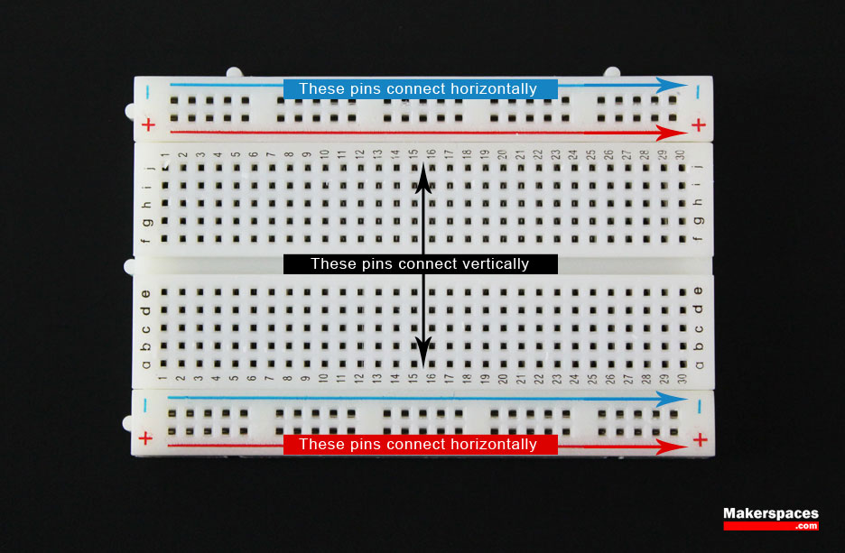

**Jumper Wire**

These wires are used with breadboard and development boards and are generally 22-28 AWG solid core wire.  Jumper wires can have male or female ends depending on how they need to be used.

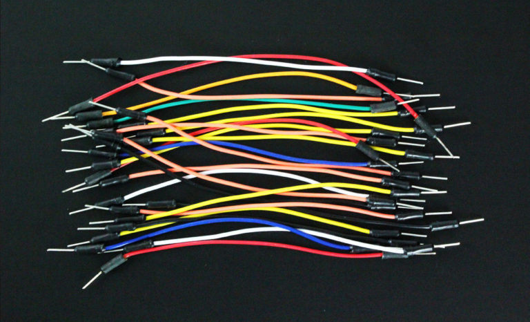

**Soldering Iron**

When it time to create a permanent circuit, you’ll want to solder the parts together.  To do this, a soldering iron is the tool you would use.  Of course a soldering iron isn’t any good unless you have solder to go with it.  You can choose leaded or lead-free solder in a few diameters.

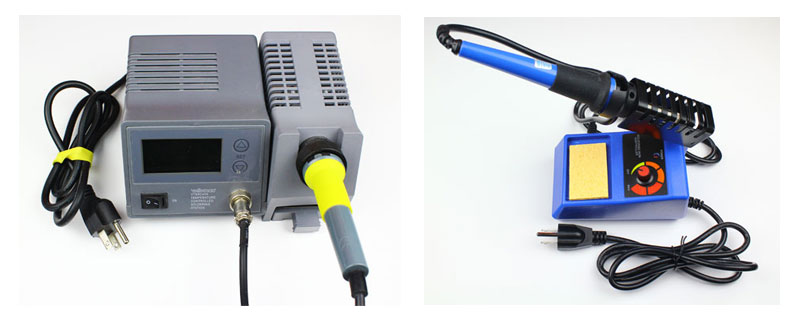

__________________________________________________________________________________________________________________________________

Basic Electronics : Components
---------------------------------

This section talk about the different components that make your electronic projects come to life.

**Switch** 

Switches can come in many forms such as pushbutton, rocker, momentary and others.  Their basic function is to interrupt electric current by turning a circuit on or off.

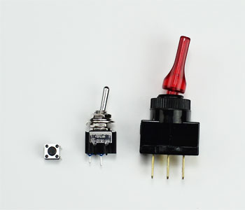

**Resistor**

Resistors are used to resist the flow of current or to control the voltage in a circuit.  The amount of resistance that a resistor offers is measured in Ohms.  Most resistors have colored stripes on the outside and this code will tell you it’s value of resistance.  You can use a multimeter or Digikey’s resistor color code calculator to determine the value of a resistor.

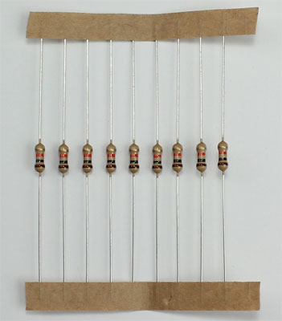

**Variable Resistor (Potentiometer)**

A variable resistor is also known as a potentiometer.  These components can be found in devices such as a light dimmer or volume control for a radio.   When you turn the shaft of a potentiometer the resistance changes in the circuit.

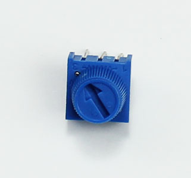

**Light-Dependent Resistor (LDR)**

A light-dependent resistor is also a variable resistor but is controlled by the light versus turning a knob.  The resistance in the circuit changes with the intensity of the light.  These are often found in exterior lights that automatically turn on at dusk and off at dawn.

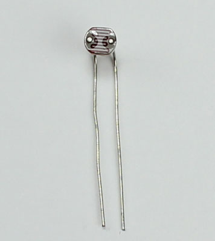

**Capacitor**

Capacitors store electricity and then discharges it back into the circuit when there is a drop in voltage.  A capacitor is like a rechargeable battery and can be charged and then discharged.  The value is measured in F (Farad), nano Farad (nF) or pico Farad (pF) range.

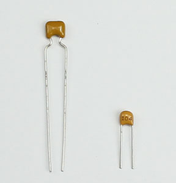

**Diode**

A diode allows electricity to flow in one direction and blocks it from flowing the opposite way.  The diode’s primary role is to route electricity from taking an unwanted path within the circuit.

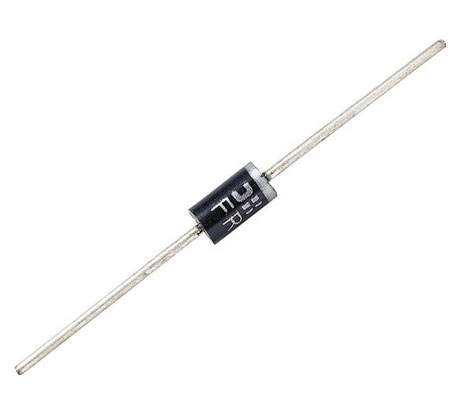

**Light-Emitting Diode (LED)**

A light-emitting diode is like a standard diode in the fact that electrical current only flows in one direction.  The main difference is an LED will emit light when electricity flows through it.  Inside an LED there is an anode and cathode.  Current always flows from the anode (+) to the cathode (-) and never in the opposite direction.  The longer leg of the LED is the positive (anode) side.

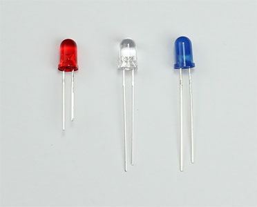

**Transistor**

Transistor are tiny switches that turn a current on or off when triggered by an electric signal.  In addition to being a switch, it can also be used to amplify electronic signals.  A transistor is similar to a relay except with no moving parts.

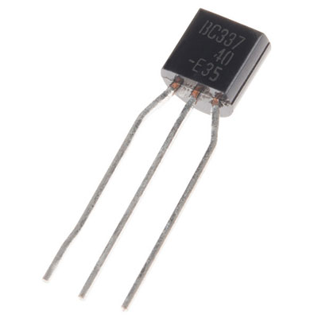

**Relay**

A relay is an electrically operated switch that opens or closes when power is applied.  Inside a relay is an electromagnet which controls a mechanical switch.

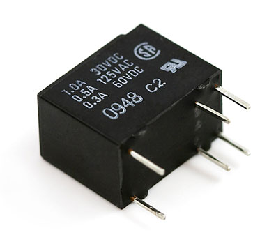

**Integrated Circuit (IC)**

An integrated circuit is a circuit that’s been reduced in size to fit inside a tiny chip.  This circuit contains electronic components like resistors and capacitors but on a much smaller scale.  Integrated circuits come in different variations such as 555 timers, voltage regulators, microcontrollers and many more.  Each pin on an IC is unique in terms of it’s function.

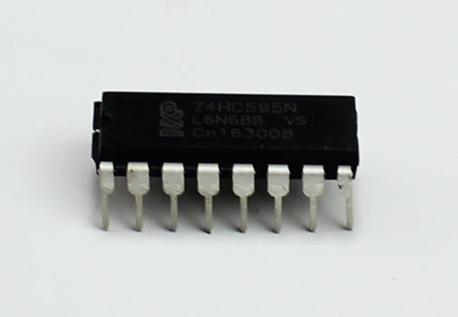



__________________________________________________________________________________________________________________________________

Basic Electronics: Circuit
--------------------------

Before you design an electronic project, you need to know what a circuit is and how to create one properly.

An electronic circuit is a circular path of conductors by which electric current can flow.  A closed circuit is like a circle because it starts and ends at the same point forming a complete loop. Furthermore, a closed circuit allows electricity to flow from the (+) power to the (-) ground uninterrupted.

In contrast, if there is any break in the flow of electricity, this is known as an open circuit.  As shown below, a switch in a circuit can cause it to be open or closed depending on it’s position.

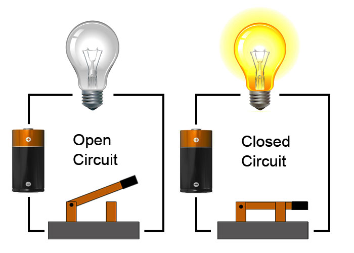

All circuits need to have three basic elements.  These elements are a voltage source, conductive path and a load.

The voltage source, such as a battery, is needed in order to cause the current to flow through the circuit.  In addition, there needs to be a conductive path that provides a route for the electricity to flow.  Finally, a proper circuit needs a load that consumes the power.  The load in the above circuit is the light bulb.

**Schematic Diagram**

When working with circuits, you will often find something called a schematic diagram.  These diagrams use symbols to illustrate what electronic components are used and where they’re placed in the circuit.  These symbols are graphic representations of the actual electronic components.

Below is an example of a schematic that depicts an LED circuit that is controlled by a switch.  It contains symbols for an LED, resistor, battery and a switch.   By following a schematic diagram, you are able to know which components to use and where to put them.  These schematics are extremely helpful for beginners when first learning circuits.

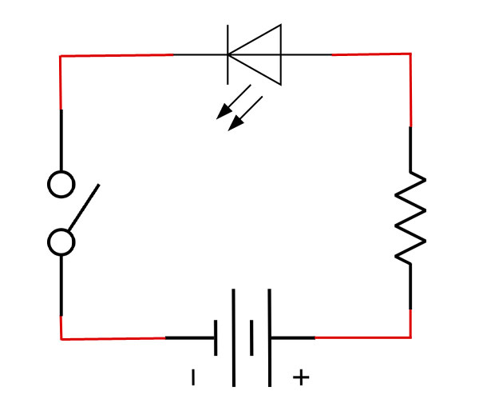

There are many types of electronic symbols and they vary slightly between countries.  Below are a few of the most commonly used electronic symbols in the US.

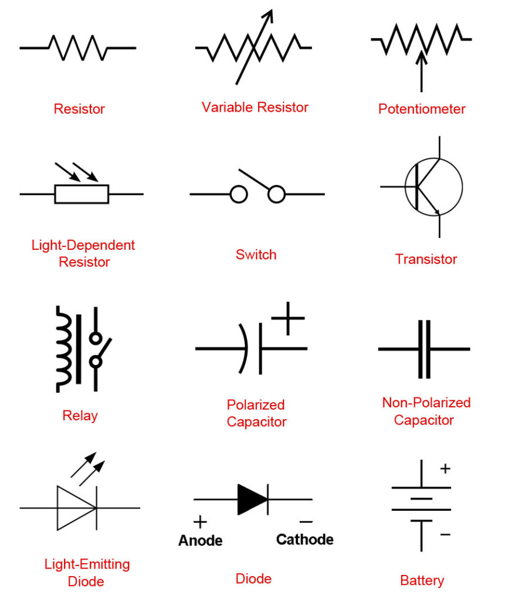

**How To Determine A Resistor Size**

Resistors are commonly used in electronics projects and it’s important to know which size to use.  To find the resistor value, you need to know the voltage and the amps for your LED and battery.

A standard LED generally needs a voltage of around 2V and a current of 20mA or .02A to operate correctly.  Next, you need to find out what voltage your battery is.  In this example, we will be using a 9V battery.  In order to determine the resistor size, we need to use a formula known as Ohm’s law as shown below.

Resistance (R) = Voltage (V) / Current (I)

- Resistance is measured in Ohms (Ω)
- Voltage is measured in volts (V)
- Current is measured in amps (A)

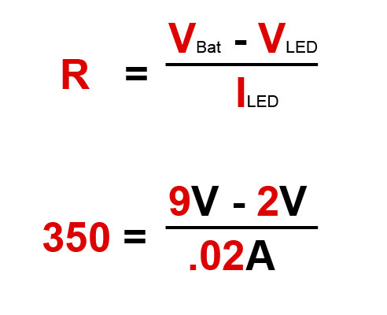

__________________________________________________________________________________________________________________________________

Basic Electronics : Sensor
------------------------------------

We have already created a section within the documentation, we invite you to look at it to find out more about the main sensors. you can find it by clicking on this [link](https://www.waziup.io/documentation/wazidev/sensors/#overview)

Below we leave you a short video where we will talk about some sensors



__________________________________________________________________________________________________________________________________

IoT Devices, Architecture & Ecosystem
=====================================

IoT Ecosystem
-------------

The IoT ecosystem includes all those technologies that enable consumers, businesses, and governments to connect, control and derive value from their connected objects in diverse environments, including manufacturing, agriculture, transportation, smart cities, construction, oil, and gas. The ecosystem includes remotes, dashboards, networks, gateways, analytics, data storage, and security.

It is clear then that the IoT market is a huge and expanding space which offers opportunities but threatens confusion, as the number of IoT products proliferates and it becomes less clear what distinguishes them.

IoT Device
----------

IoT devices are the nonstandard computing devices that connect wirelessly to a network and have the ability to transmit data.

Connected devices are part of an ecosystem in which every device talks to other related devices in an environment to automate home and industry tasks. They can communicate usable sensor data to users, businesses and other intended parties. The devices can be categorized into three main groups: consumer, enterprise and industrial.

Consumer connected devices include smart TVs, smart speakers, toys, wearables and smart appliances. Smart meters, commercial security systems and smart city technologies -- such as those used to monitor traffic and weather conditions -- are examples of industrial and enterprise IoT devices. Other technologies, including smart air conditioning, smart thermostats, smart lighting and smart security, span home, enterprise and industrial uses

**connectivity and networking**

The networking, the communication and connectivity protocols used with internet-enabled devices largely depend on the specific IoT application deployed. Just as there are many different IoT applications, there are many different connectivity and communication options.

Communications protocols include CoAP, DTLS and MQTT, among others. Wireless protocols include IPv6, LPWAN, Zigbee, Bluetooth Low Energy, Z-Wave, RFID and NFC. Cellular, satellite, Wi-Fi and Ethernet can also be used.

Each option has its tradeoffs in terms of power consumption, range and bandwidth, all of which must be considered when choosing connected devices and protocols for a particular IoT application.

To share the sensor data they collect, IoT devices connect to an IoT gateway or another edge device where data can either be analyzed locally or sent to the cloud for analysis.

_________________________________________________________________________________________________________________________________

IoT architecture
----------------

The term Internet of Things (IoT) refers to a heterogeneous network of physical and virtual objects
embedded with electronics, software, sensors and connectivity to enable objects to achieve greater value
and service by exchanging data with other connected objects via the internet 

An example of IoT-enabled environment is an integrated transport system that can be dynamically
routed and reorganized in response to changing traffic needs and conditions.

The physical/perception layer contains embedded devices that make use of sensors to gather real world data. The network layer provides the mechanism The middle-ware layer facilitates and manages the communication between the real world sensed activities
and the application layer. The application layer maps onto applications that can be used by the consumer to send commands to real word objects over the Internet via mobile applications, webapps, etc.

IoT software
============
The software and the programming languages on which IoT works uses very common programming languages that programmers use and already know. So which language should be chosen?

Firstly, because embedded systems have less storage and processing power, their language needs are different. The most commonly used operating systems for such embedded systems are Linux or UNIX-like OSs like Ubuntu Core or Android.

IoT software encompasses a wide range of software and programming languages from general-purpose languages like C++ and Java to embedded-specific choices like Google’s Go language.

Here’s a quick overview of each one of IoT Software:
- **C & C++**: The C programming language has its roots in embedded systems—it even got its start for programming telephone switches. It’s pretty ubiquitous, that is, it can be used almost everywhere and many programmers already know it. C++ is the object-oriented version of C, which is a language popular for both the Linux OS and Arduino embedded IoT software systems. These languages were basically written for the hardware systems which makes them so easy to use.
- **Java**: While C and C++ are hardware specific, the code in JAVA is more portable. It is more like a write once and read anywhere language, where you install libraries, invests time in writing codes once and you are good to go.
- **Python**: There has been a recent surge in the number of python users and has now become one of the “go-to” languages in Web development. Its use is slowly spreading to the embedded control and IoT world—specially the Raspberry Pi processor. Python is an interpreted language, which is, easy to read, quick to learn and quick to write. Also, it’s a powerhouse for serving data-heavy applications.

Arduino IDE
===========

Introduction to Arduino IDE
---------------------------

The Arduino Integrated Development Environment (IDE) is a cross-platform application (for Windows, macOS, Linux) that is written in functions from C and C++. It is used to write and upload programs to Arduino compatible boards, but also, with the help of third-party cores, other vendor development boards.

The Arduino Integrated Development Environment - or Arduino Software (IDE) - contains a text editor for writing code, a message area, a text console, a toolbar with buttons for common functions and a series of menus. It connects to the Arduino and Genuino hardware to upload programs and communicate with them.

Programs written using Arduino Software (IDE) are called sketches. These sketches are written in the text editor and are saved with the file extension .ino. The editor has features for cutting/pasting and for searching/replacing text. The message area gives feedback while saving and exporting and also displays errors. The console displays text output by the Arduino Software (IDE), including complete error messages and other information. The bottom righthand corner of the window displays the configured board and serial port. The toolbar buttons allow you to verify and upload programs, create, open, and save sketches, and open the serial monitor.

The Arduino Software (IDE) uses the concept of a sketchbook: a standard place to store your programs (or sketches). The sketches in your sketchbook can be opened from the File > Sketchbook menu or from the Open button on the toolbar. The first time you run the Arduino software, it will automatically create a directory for your sketchbook. You can view or change the location of the sketchbook location from with the Preferences dialog.

Libraries provide extra functionality for use in sketches, e.g. working with hardware or manipulating data. To use a library in a sketch, select it from the Sketch > Import Library menu. This will insert one or more #include statements at the top of the sketch and compile the library with your sketch. Because libraries are uploaded to the board with your sketch, they increase the amount of space it takes up. If a sketch no longer needs a library, simply delete its #include statements from the top of your code.



To know how to download and set up Arduino IDE for WAZIUP click on this [link](https://www.waziup.io/documentation/wazidev/user-manual/#install-arduino-ide) to be directed to the dedicated section