LoRa
====

LoRa (Long Range) is a low-power wide-area network (LPWAN) protocol developed by Semtech.
It is based on spread spectrum modulation techniques derived from chirp spread spectrum (CSS) technology.
It was developed by Cycleo of Grenoble, France and acquired by Semtech, the founding member of the LoRa Alliance.

Introduction
------------

LoRa is specifically designed for sending small data packages over long distances, with devices operating on a battery.
The folowing table picture shows the ranges and powers for various well-know protocols.

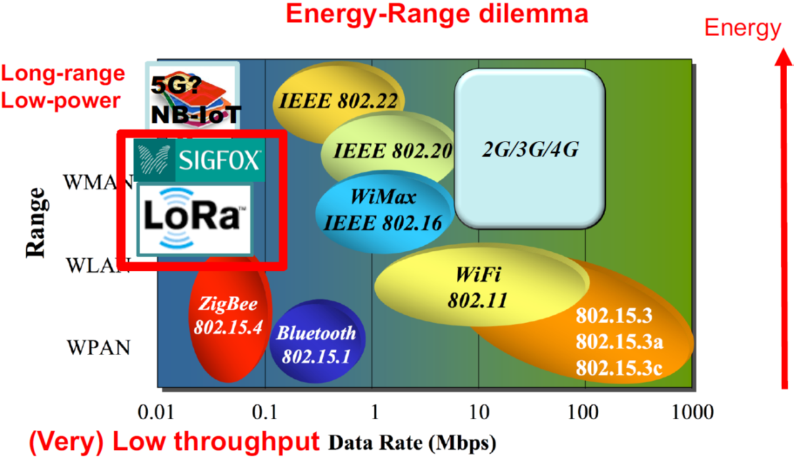

The data rates supported are between 0.3 kbps to 5.5 kbps.
The gateways can listen to multiple frequencies simultaneously, in every spreading factor at each frequency.
This allows the gateways to handle 100s of devices at the same time, with bidirectional communications.

LoRa protocol stack
------------------

LoRa is a physical layer protocol. It is defining radio signal, frequencies and modulation...
This is to diferenciate it from the LoRaWAN protocol, which is at MAC layer and application layer.

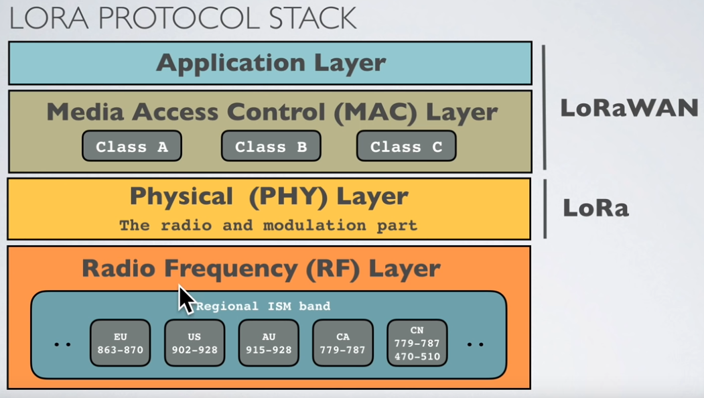

Radio bands
-----------

LoRa operates in the unlicensed ISM (Industrial, Scientific and Medical) radio band that are available worldwide.


In Europe the [European Telecommunications Standards Institute (ETSI)](https://www.etsi.org/) creates standards which are used by local regulatory authorities.

ISM band advantages:
- Anyone is allowed to use these frequencies.
- No license fee is required.

ISM band disadvantages:
- Low data rate.
- Lots of interference because anyone can use these frequencies.


Duty cycle / time on air (ToA)
-----------------------------

When a signal is send from a sender it takes a certain amount of time before a receiver receives this signal.
This time is called Time on Air (ToA).
Duty cycle is the proportion of time during which a component, device, or system is operated.
The duty cycle can be expressed as a ratio or as a percentage.
As mentioned previously in Europe there is a 0.1% and 1.0% duty cycle per day depending on the channel.
To respect the 1% duty cycle :
For example : ToA = 530ms => affer sending a message, we have to wait 99x530ms = 52.47s before sending a new message.

Fresnel zone
------------

The Fresnel zone is an elliptical shaped body around the direct line of sight path between the end node and the gateway.
Any obstacle within this volume, for example buildings, trees, hilltops or ground can weaken the transmitted signal even if there is a direct line of sight between the end node and the gateway.

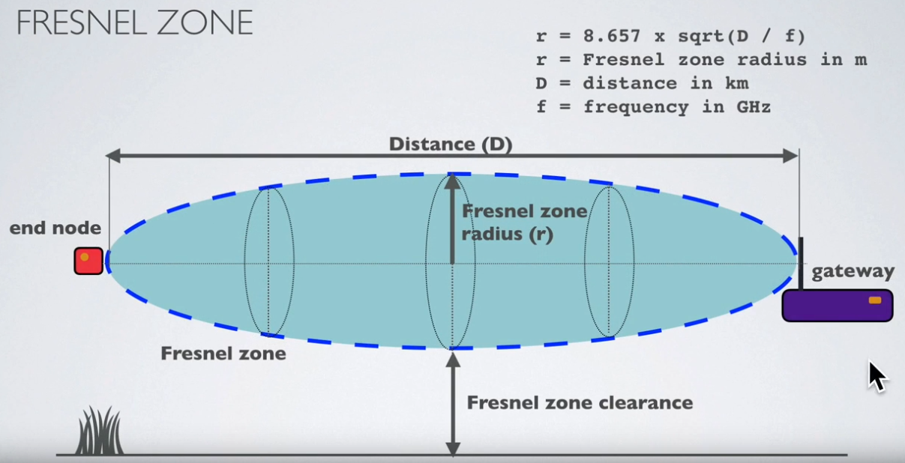

For long distance transmissions, the earth curvature has an influence.
The following table shows the recommended height for deployement of the devices/gateways.

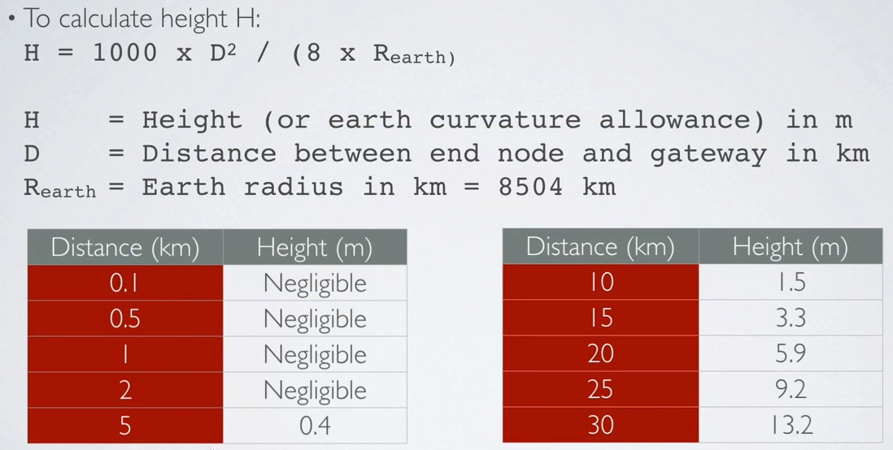

As a rule of thumb Fresnel zone should always be clear of obstruction but this can be impractical so it is said that beyond 40% blockage, signal loss will become significant.

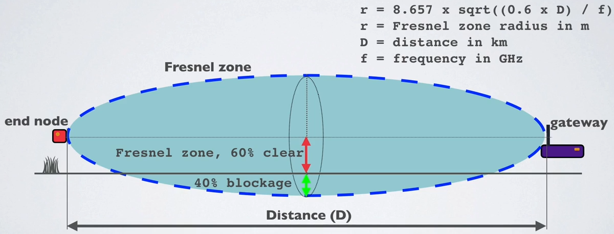

Example :

- f = 868 MHz
- H : earth curvature allowance
- r+H : minimum end node and gateway height above ground

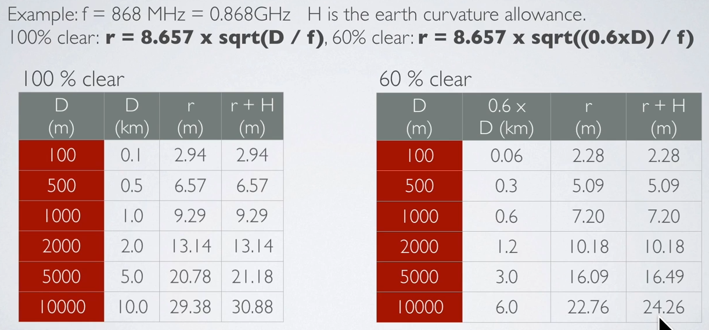

- For the best radio signal performance: The gateway antenna must be placed outdoors at a high location (avoiding obstacles in the Fresnel zone)
- The antenna design for both gateway and end nodes must be optimised for its regional frequency.
- Keep the antenna polarisation vertical for both gateway and end nodes and use omnidirectional antenna to cover a large area.


Link Budget
-----------

A link budget is the sum of all of the gains and losses from the transmitter, through the medium (aka free space), to the receiver in a telecommunication system. It is a way of quantifying the link performance.

The receiver sensitivity is the lowest power level at which receiver can receive or demodulate the signal.


EIRP and ERP
------------

RF transmitting systems must adhere to certain rules set by the regulatory bodies such as FCC or ETSI.
One of these rules: radio devices must not exceed certain ERP or EIRP values set by these regulatory bodies.
The Effective Isotropic Radiated Power (EIRP) is the total power radiated by a hypothetical isotropic antenna in a single direction.

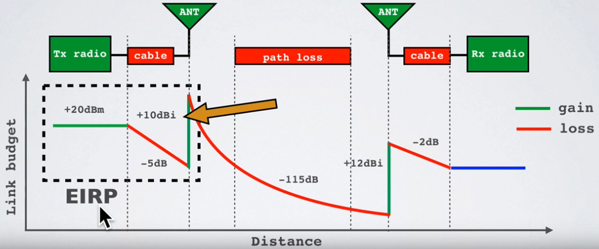

The Effective Radiated Power (ERP) is the total power radiated by an actual antenna relative to a half-wave dipole rather than a theoretical isotropic antenna.

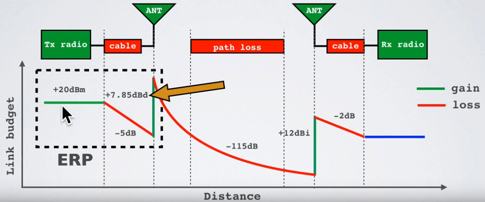

The definition of EIRP is:
```
EIRP = Tx power (dBm) + antenna gain (dBi) - cable loss (dBm)
```
For example: EIRP = 20 + 10 - 5 = 25 dBm

The definition of ERP is:
```
ERP = Tx power (dBm) + antenna gain (dBd) - cable loss (dBm)
```
For example: ERP = 20 + 7.85 - 5 = 22.85 dBm

Relationship EIRP and ERP: `EIRP (dBm) = ERP (dBm) + 2.15`


RSSI and SNR
----

The Received Signal Strength Indication (RSSI) is the received signal power in milliwatts and is measured in dBm.
This value can be used as a measurement of how well a receiver can “hear” a signal from a sender.


The RSSI is measured in dBm and is a negative value.
The closer to 0 the better the signal is.
Typical LoRa RSSI values are: 
- If RSSI=-30dBm: signal is strong.
- If RSSI=-120dBm: signal is weak.

Signal-to-Noise Ratio (SNR) is the ratio between the received power signal and the noise floor power level.
The noise floor is an area of all unwanted interfering signal sources which can corrupt the transmitted signal and therefore re-transmissions will occur.
- If SNR is greater than 0, the received signal operates above the noise floor.
- If SNR is smaller than 0, the received signal operates below the noise floor.

Normally the noise floor is the physical limit of sensitivity, however LoRa works below the noise level.
Typical LoRa SNR values are between: -20dB and +10dB
A value closer to +10dB means the received signal is less corrupted.
LoRa can demodulate signals which are -7.5 dB to -20 dB below the noise floor.


LoRaWAN
=======

Introduction
------------

The LoRaWAN® specification is a Low Power, Wide Area (LPWA) networking protocol designed to wirelessly connect battery operated ‘things’ to the internet in regional, national or global networks, and targets key Internet of Things (IoT) requirements such as bi-directional communication, end-to-end security, mobility and localization services.
LoRaWAN® network architecture is deployed in a star-of-stars topology in which gateways relay messages between end-devices and a central network server.
The gateways are connected to the network server via standard IP connections and act as a transparent bridge, simply converting RF packets to IP packets and vice versa. The wireless communication takes advantage of the Long Range characteristics of the LoRaÒ physical layer, allowing a single-hop link between the end-device and one or many gateways.
All modes are capable of bi-directional communication, and there is support for multicast addressing groups to make efficient use of spectrum during tasks such as Firmware Over-The-Air (FOTA) upgrades or other mass distribution messages.
The specification defines the device-to-infrastructure (LoRa®) physical layer parameters & (LoRaWAN®) protocol and so provides seamless interoperability between manufacturers, as demonstrated via the device certification program.
While the specification defines the technical implementation, it does not define any commercial model or type of deployment (public, shared, private, enterprise) and so offers the industry the freedom to innovate and differentiate how it is used.
The LoRaWAN® specification is developed and maintained by the LoRa Alliance®: an open association of collaborating members.

LoRaWAN Network
-------

The following picture shows the LoRaWAn network.

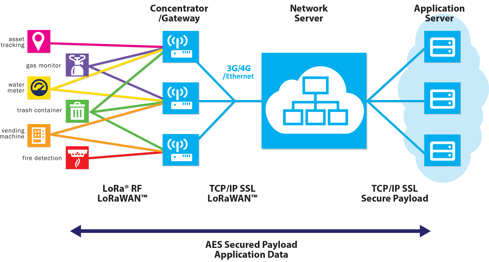

Frequencies
-----------

The allowed frequencies are given by the [Regional Alliance parameters](https://lora-alliance.org/lorawan-for-developers):

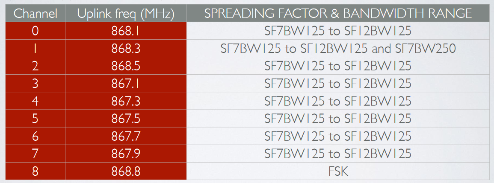

Downlink is the same as uplink with an additional one:


If your country uses the EU863-870 ISM band, than according to the LoRaWAN Regional Parameters document every EU868MHz end device must implement the following default channels:

- 868.10 MHz, bandwidth = 125 kHz
- 868.30 MHz, bandwidth = 125 kHz
- 868.50 MHz, bandwidth = 125 kHz

and additional 5 frequencies.

The other 5 frequencies can be freely attributed by the network operator. For example, The Things Network implemented the following frequencies: 867.1, 867.3, 867.5, 867.7 and 867.9.
LoRaWAN only uses the following bandwidth ranges: 125 kHz, 250 kHz and 500 kHz.
Which of these 3 ranges are actual used depends on the region or frequency plan.
For example in Europe only the bandwidths 125kHz and 250 kHz are used.

Data Rates
----------

In addition to frequency hopping, all communication packets between end-devices and gateways also include a variable ‘Data rate’ (DR) setting.
The selection of the DR allows a dynamic trade-off between communication range and message duration.
Also, due to the spread spectrum technology, communications with different DRs do not interfere with each other and create a set of virtual ‘code’ channels increasing the capacity of the gateway.
To maximize both battery life of the end-devices and overall network capacity, the LoRaWAN® network server manages the DR setting and RF output power for each end-device individually by means of an Adaptive Data Rate (ADR) scheme.

LoRaWAN® baud rates range from 0.3 kbps to 50 kbps.

Security
--------

Security is a primary concern for any mass IoT deployment and the LoRaWAN® specification defines two layers of cryptography:

A unique 128-bit Network Session Key shared between the end-device and network server
A unique 128-bit Application Session Key (AppSKey) shared end-to-end at the application level
AES algorithms are used to provide authentication and integrity of packets to the network server and end-to-end encryption to the application server. By providing these two levels, it becomes possible to implement ‘multi-tenant’ shared networks without the network operator having visibility of the users payload data.

The keys can be Activated By Personalisation (ABP) on the production line or during commissioning, or can be Over-The-Air Activated (OTAA) in the field. OTAA allows devices to be re-keyed if necessary.

LoRaWAN Device Classes
----------------------

The LoRaWAN specification defines three device classes:

- A(ll) Battery powered devices. Each device uplink to the gateway and is followed by two short downlink receive windows.
- B(eacon) Same as class A but these devices also opens extra receive windows at scheduled times.
- C(ontinuous) Same as A but these devices are continuously listening. Hence these devices uses more power and are often mains powered.

**Class A**

The default class which must be supported by all LoRaWAN end-devices, class A communication is always initiated by the end-device and is fully asynchronous.
Each uplink transmission can be sent at any time and is followed by two short downlink windows, giving the opportunity for bi-directional communication, or network control commands if needed.
This is an ALOHA type of protocol.
The end-device is able to enter low-power sleep mode for as long as defined by its own application: there is no network requirement for periodic wake-ups.
This makes class A the lowest power operating mode, while still allowing uplink communication at any time.
Because downlink communication must always follow an uplink transmission with a schedule defined by the end-device application, downlink communication must be buffered at the network server until the next uplink event.


*Note : “All” means the class A mode is supported by all classes.*

**Class B**

In addition to the class A initiated receive windows, class B devices are synchronised to the network using periodic beacons, and open downlink ‘ping slots’ at scheduled times.
This provides the network the ability to send downlink communications with a deterministic latency, but at the expense of some additional power consumption in the end-device.
The latency is programmable up to 128 seconds to suit different applications, and the additional power consumption is low enough to still be valid for battery powered applications.


**Class C**

In addition to the class A structure of uplink followed by two downlink windows, class C further reduces latency on the downlink by keeping the receiver of the end-device open at all times that the device is not transmitting (half duplex). Based on this, the network server can initiate a downlink transmission at any time on the assumption that the end-device receiver is open, so no latency. The compromise is the power drain of the receiver (up to ~50mW) and so class C is suitable for applications where continuous power is available.


Changing frequencies for every transmission
------------------------------------------

An end device changes channel in a pseudo-random fashion for every transmission.
Changing frequencies makes the system more robust to interferences.
For example in Europe for uplink transmissions 8 different frequencies are used.


- **Dwell time** (or transmit time) is the amount of time needed to transmit on a frequency.
- **Hop time** is the amount of time needed to change from one frequency to another in which the radio is not transmitting

Modulation Types and Chirp Spread Spectrum
------------------------------------------

LoRa is based on Chirp Spread Spectrum modulation (CSS).
**Chirp** Spread Spectrum is a spread spectrum technique that uses wideband linear frequency modulated chirp pulses to encode information.
A chirp pulse is a sweep in frequency on the corresponding bandwidth (125kHz, 250kHz…) defined earlier. 

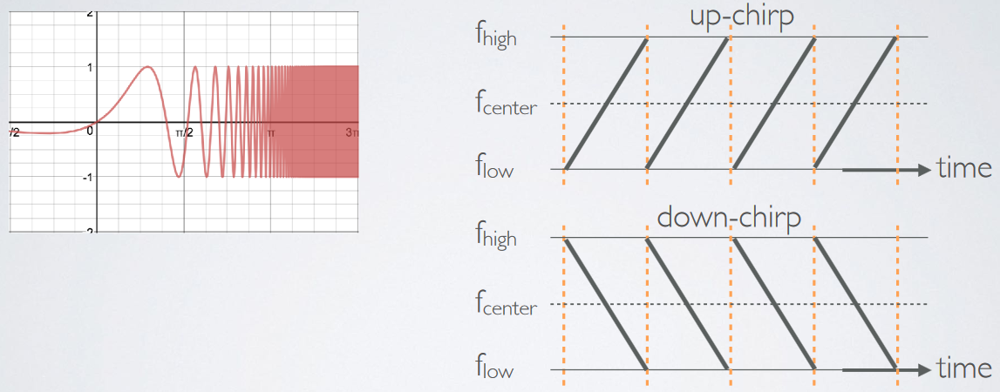

- **Spread spectrum** techniques are methods by which a signal is deliberately spread in the frequency domain. For example a signal is transmitted in short bursts, “hopping” between frequencies in a pseudo random sequence.

Symbol, Spreading Factor and Chirp
---------------------------------

To generate symbols/chirps, the modem modulates the phase of an oscillator.
The number of times per second that the modem adjusts the phase is called the chirp rate and defines the modulation bandwidth.
Chirp rate is a direct subdivision of the quartz frequency (32 MHz).
Basic chirps are simply a ramp from fmin to fmax (up-chirp) or fmax to fmin (down-chirp). Data-carrying chirps are chirps that are cyclically-shifted, and this cyclical shift carries the information.


Annexes
=======

dBm, dBi, dBd
-------------

- dBm : reference is 1mW
- dBi : refers to the antenna gain with respect to an isotropic antenna
- dBd : dBd refers to the antenna gain with respect to a reference dipole antenna

dBi = dBd + 2.15

Free space losses
----------------

L(fs) = 32.45 + 20log(D) + 20log(f)

- Lfs = Free space loss in dB
- D = Distance between end node and gateway in km
- f = frequency in MHz

For example: f=868MHz

- D=0.01 km, Lfs = 32.45 + 20log(0.01) + 20log(868) = 51 dB
- D=0.05 km, Lfs = 32.45 + 20log(0.05) + 20log(868) = 65 dB
- D=0.10 km, Lfs = 32.45 + 20log(0.10) + 20log(868) = 71 dB
- D=0.50 km, Lfs = 32.45 + 20log(0.50) + 20log(868) = 85 dB
- D=1.00 km, Lfs = 32.45 + 20log(1.00) + 20log(868) = 91 dB
