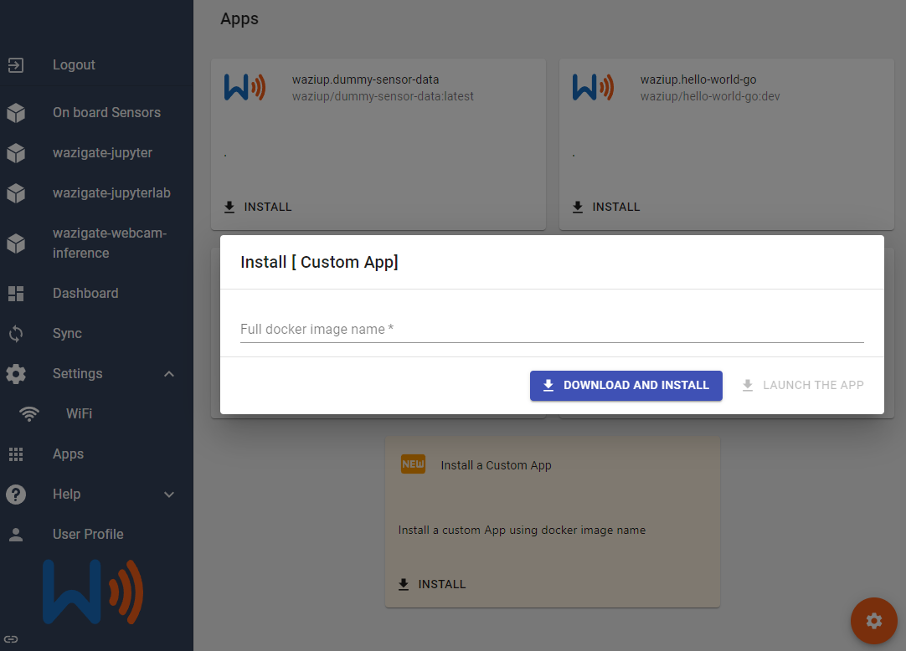
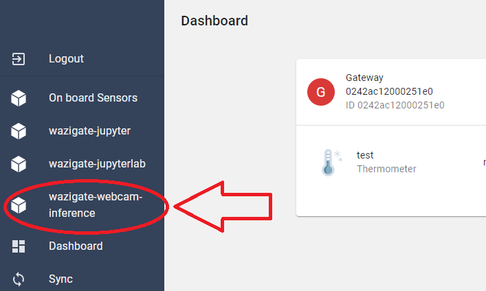
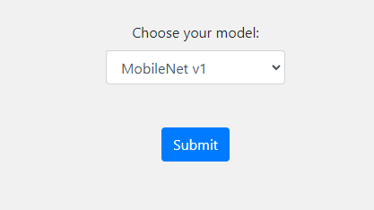
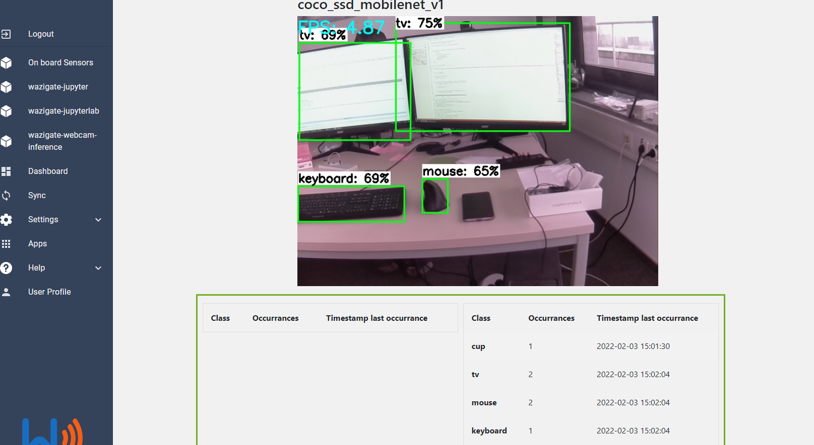
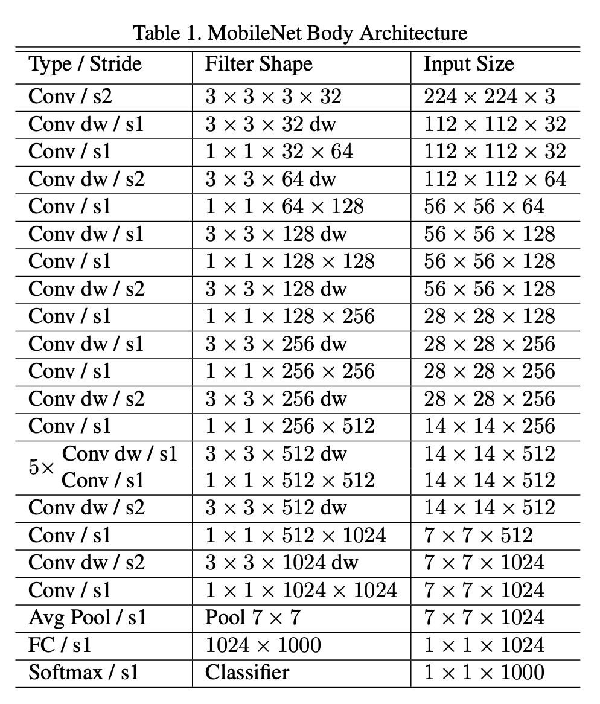

___________________________________________________________________________________________________________________

Introduction
============

Computer vision is a subfield of machine learning and artificial intelligence, which deals with how computers can recognize visual data in form of images or videos. One understands various techniques to locate elements in images or identify and catalog videos. The goal is to use an automated process to gain a visual understanding while distinguishing between relevant and less distinguish relevant information. This is a complex process that otherwise reserved only for the human visual system, part of the nervous system. Today it is common to train image recognition models, which take an image as a Receive input and output one or more objects and possibly more recognize attributes. The various objects possible to recognize are in classes assigned. Examples of these images must first be stored in so-called image databases collected. In addition to the class prediction these image recognition models also provide an assessment of the accuracy of the prediction meeting. This value can be understood as a kind of probability of prediction and describes how confident the model is that an image becomes a learned class can be assigned. In general, the recognition systems distinguish between single and multiple recognition. With a single detection, the model says only one class as prediction for the entire image. Models designed for multiple detection were able to recognize several objects of different classes in one image. Consequently, information on the localization of the object in the image and confidence needed.


In this course, we will learn how to build a WaziApp capable or performing object detection on the WaziGate.
With the help of this application you can utilize the WaziGate to track objects and evaluate their occurrences. This is done via a RaspiCam, a Webcam or a URL using the Real Time Streaming Protocol (RTSP). 

**Link to Github repository:** [waziup/wazigate-webcam-inference](https://github.com/Waziup/wazigate-webcam-inference)


The models are trained with the COCO (Common Objects in Context) [1] dataset. It contains 80 classes, you can have a look on them [here](coco_tiny_yolov5/labelmap.txt "labelmap.txt"). 

For now you can choose between two models for object detection.

1. Mobile Net v1 (224x224) [2]
2. Yolo Version 5s (320x320) [3]

The App is in an early stage of development, it is still work in progress, some features are missing.

___________________________________________________________________________________________________________________

Quick start
===========

Install via user interface
--------------------------

You can just download the build docker image from the Waziup Dockerhub directly on your RPI. All you have to do is, to navigate in the user interface of your WaziGate to App menu, which is located in the sidebar. Then you want to press the "plus" button, located in the right-hand side bottom of the webpage, illustrated below.


After you pressed the button you will see a menu, where you can type a name of an image. The image has to be available on dockerhub.



Type the name of the image you want to install, in this case you have to type:

```
waziup/wazigate-webcam-inference
```

Now you can press the "DOWNLOAD AND INSTALL" button, after the install routine is finished, press the "LAUNCH THE APP" button.

Install via docker
------------------

You can also connect to via ssh to your Raspberry Pi and issue the following command, to pull the image from [dockerhub](https://hub.docker.com/r/waziup/wazigate-webcam-inference)

```
docker pull waziup/wazigate-webcam-inference
```

Afterwards you have to start the app, you can either do this via the following command:

```
cd /var/lib/waziup

wget -O docker-compose.yml https://raw.githubusercontent.com/Waziup/wazigate-webcam-inference/main/docker-compose.yml

docker-compose up   (docker-compose file has to be in the same location)
```


Building the application
========================

The WaziApp is available at [github](https://github.com/Waziup/wazigate-webcam-inference)

If you want to build it from source you have to follow these steps.

1. Download the repository to your local machine:

```
git clone https://github.com/Waziup/wazigate-webcam-inference.git
```

2. Install docker and issue the following commands

```
docker buildx create --name rpibuilder --platform linux/arm/v7
docker buildx use rpibuilder 
docker buildx inspect –bootstrap
docker run --rm --privileged multiarch/qemu-user-static --reset -p yes
```

3. Navigate to the repository:

```
cd wazigate-webcam-inference
```

4. Issue the following command to build the docker image from the [Dockerfile](https://github.com/Waziup/wazigate-webcam-inference/blob/main/Dockerfile "Dockerfile"):

```
docker buildx build –platform linux/arm/v7 -t waziup/wazigate-webcam-inference:latest –load .
```

5. To copy the image via SSH to the raspberry pi with the following command:

```
docker save <id_of_build_image> | gzip | pv | ssh pi@<ip_of_pi_in_local_network> docker load
```

6. It can occur that the name of the repository is lost, so tag the image appropriate to the docker-compose.yml

```
docker tag <id_of_build_image> waziup/wazigate-webcam-inference:latest
```

7. Afterwards, start the application with via the UI of the WaziGate or run the following command, to see the logs in console:

```
docker-compose up
```

Your WaziApp is now up an running!


Usage
=====

After you installed the app, with one of the previous steps. It should be visible in the user interface, in the sidebar. Like shown below:



Click on "wazigate-webcam-inference" in the sidebar to start the application. If the application does not start, go into the Apps menu and click on "wazigate-webcam-inference" card and press the "START" button.

In the first screen of the application, there is a dropdown menu, here you can choose the network which should be utilized. 



MobilNetv1 is a very fast network, which is not that accurate. YOLOv5 is also fast, but more accurate. More information on the used networks are available in the next chapter.

Below there is an example screenshot, that shows the WaziApp which is running on the WaziGate.




Below the videostream, there is a table which shows the amount of detections and the timestap of the last detection. 

With the help of this application you can count visual occurrences of different objects, with help of your Raspicam. This can be beneficial in a surveillance uncase. 

<!-- TODO: how to use the application? add usage examples-->

Some remarks on the networks used
============

For now, like mentioned above, there are two networks someone can choose from. In the following there is some information about the used networks.

**MobileNetv1**

MobileNet is a simple convolutional neural network it has 30 layers and 4.2 million parameters. In the following there is an overview of the architecture.

 [4]

Further information about the network is given in the [paper of the inventors](https://arxiv.org/abs/1704.04861). 

**YOLOv5s**

Yolov5 is a state of the art realtime object detection network [3]. It has got 213 layers, 7.2 million parameters. In the following there is an overview of the architecture.

 [5]

Further information about the network is given [here](https://arxiv.org/abs/1704.04861). There is no Yolov5 paper, to this date, but Yolov4 has a paper and does not differ much.


References
==========

[1] https://cocodataset.org/#home

[2] https://github.com/EdjeElectronics/TensorFlow-Lite-Object-Detection-on-Android-and-Raspberry-Pi

[3] https://github.com/ultralytics/yolov5

[4] https://arxiv.org/abs/1704.04861

[5] https://github.com/ultralytics/yolov5/issues/280

[6] https://zenodo.org/record/5563715