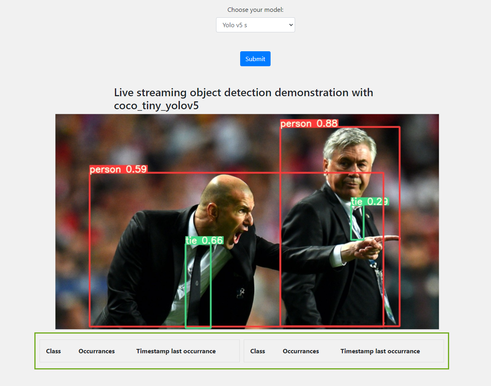

Introduction
============

In this course, we will learn how to build a WaziApp capable or doing object detection from a webcam.
With the help of this application you can utilize the WaziGate and RaspiCam to track objects and evaluate their occurrences.

<!-- TODO: add some intro on what is computer vision-->




The models are trained with the COCO (Common Objects in Context) [1] dataset. It contains 80 classes, you can have a look on them [here](coco_tiny_yolov5/labelmap.txt "labelmap.txt"). 

From now you can choose between two models for object detection.

1. Mobile Net v1 (224x224) [2]
2. Yolo Version 5s (320x320) [3]

The App is in an early stage of development, it is still work in progress, some features are missing.


Quick start
===========

You can just download the build docker image from the Waziup Dockerhub directly on your RPI.

```
docker pull waziup/wazigate-webcam-inference
```
<!-- TODO: add instructions to start on the RPI -->


Building the application
========================

The WaziApp is available at [github](https://github.com/Waziup/wazigate-webcam-inference)

If you want to build it from source you have to follow these steps.

1. Download the repository to your local machine:

```
git clone https://github.com/Waziup/wazigate-webcam-inference.git
```

2. Install docker and issue the following commands

```
docker buildx create --name rpibuilder --platform linux/arm/v7
docker buildx use rpibuilder 
docker buildx inspect –bootstrap
docker run --rm --privileged multiarch/qemu-user-static --reset -p yes
```

3. Navigate to the repository:

```
cd wazigate-webcam-inference
```

4. Issue the following command to build the docker image from the [Dockerfile](https://github.com/Waziup/wazigate-webcam-inference/blob/main/Dockerfile "Dockerfile"):

```
docker buildx build –platform linux/arm/v7 -t waziup/wazigate-webcam-inference:latest –load .
```

5. To copy the image via SSH to the raspberry pi with the following command:

```
docker save <id_of_build_image> | gzip | pv | ssh pi@<ip_of_pi_in_local_network> docker load
```

6. It can occur that the name of the repository is lost, so tag the image appropriate to the docker-compose.yml

```
docker tag <id_of_build_image> waziup/wazigate-webcam-inference:latest
```

7. Afterwards, start the application with via the UI of the WaziGate or run the following command, to see the logs in console:

```
docker-compose up
```

Your WaziApp is now up an running!

<!-- TODO: how to access the WaziApp? add some screenshots-->

How it works
============

<!-- TODO: how to use the application? add usage examples-->


For now, like mentioned above, there are two networks someone can choose from. In the following there is some information about the used networks.

**MobileNetv1**

MobileNet is a simple convolutional neural network it has 30 layers and 4.2 million parameters. In the following there is an overview of the architecture.

 [4]

Further information about the network is given in the [paper of the inventors](https://arxiv.org/abs/1704.04861). 

**YOLOv5s**

Yolov5 is a state of the art realtime object detection network [3]. It has got 213 layers, 7.2 million parameters. In the following there is an overview of the architecture.

 [5]

Further information about the network is given [here](https://arxiv.org/abs/1704.04861). There is no Yolov5 paper, to this date, but Yolov4 has a paper and does not differ much.


References
==========

[1] https://cocodataset.org/#home

[2] https://github.com/EdjeElectronics/TensorFlow-Lite-Object-Detection-on-Android-and-Raspberry-Pi

[3] https://github.com/ultralytics/yolov5

[4] https://arxiv.org/abs/1704.04861

[5] https://github.com/ultralytics/yolov5/issues/280

[6] https://zenodo.org/record/5563715

