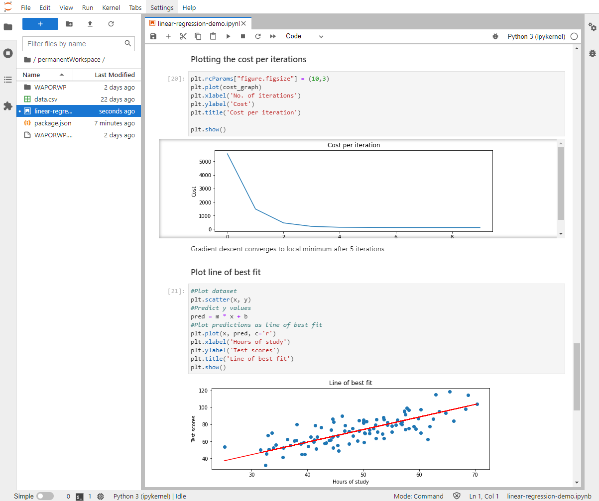

Introduction
============

JupyterLab is great way to start with data science, scientific computing, computational journalism, and machine learning.
It is a web interface for developing AI code and work with data.
Many online resources are available, explaining the usage of Jupyterlab in detail. One of them is the [official documentation](https://jupyterlab.readthedocs.io/en/stable/getting_started/overview.html "Official documentation").

In this course, we will learn how to build and use a WaziApp with JupyterLab.


 

<!-- add a bit more about what they can do with JupyterLab and this WaziApp -->

Jupyter Notebook provides an environment tailored to the needs and workflow of data science and simulation. In a single instance, you can write, document and run code, visualize data, perform calculations and examine the corresponding results. In the prototype phase in particular, they benefit from the fact that any code can be accommodated in independent cells: This makes it possible to test specific code blocks individually. Thanks to the numerous additional kernels, Jupyter is not limited to Python as a programming language, which means a lot of flexibility in coding and analysis.

Key features of Jupyter Notebook include:

**Data cleansing:** Distinguishing between important and unimportant data in big data analysis
 
**Statistical modelling:** Mathematical method for determining the estimated distribution probability of a specific characteristic
 
**Creation and training of machine learning models:** Design, programming and training of models based on machine learning
 
**Data visualization:** graphical representation of data to clarify patterns, trends, dependencies, etc.

Quick start
===========

Install via user interface
--------------------------

You can just download the build docker image from the Waziup Dockerhub directly on your RPI. All you have to do is, to navigate in the user interface of your WaziGate to App menu, which is located in the sidebar. Then you want to press the "plus" button, located in the right-hand side bottom of the webpage, illustrated below.


After you pressed the button you will see a menu, where you can type a name of an image. The image has to be available on dockerhub.


Type the name of the image you want to install, in this case you have to type:

```
waziup/wazigate-jupyterlab
```

Now you can press the "DOWNLOAD AND INSTALL" button, after the install routine is finished, press the "LAUNCH THE APP" button.

Install via docker
------------------

You can also connect to via ssh to your Raspberry Pi and issue the following command, to pull the image from [dockerhub](https://hub.docker.com/r/waziup/wazigate-jupyterlab)

```
docker pull waziup/wazigate-jupyterlab
```

Afterwards you have to start the app, you can either do this via the following command:

```
wget -O docker-compose.yml https://raw.githubusercontent.com/Waziup/wazigate-jupyterlab/main/docker-compose.yml

docker-compose up   (docker-compose file has to be in the same location)
```

Building the application
------------------------

The WaziApp is available at [Github](https://github.com/Waziup/wazigate-jupyterlab_armv7l.git).

Let's build it from source:

1. Download the repository to your local machine:

```
git clone https://github.com/Waziup/wazigate-jupyterlab_armv7l.git
```

2. Install docker and issue the following commands:

```
docker buildx create --name rpibuilder --platform linux/arm/v7
docker buildx use rpibuilder 
docker buildx inspect –bootstrap
docker run --rm --privileged multiarch/qemu-user-static --reset -p yes
```

3. Navigate to the repository:

```
cd wazigate-jupyterlab_armv7l
```

4. Issue the following command to build the docker image from the [Dockerfile](https://github.com/Waziup/wazigate-jupyterlab_armv7l/blob/main/Dockerfile "Dockerfile"):

```
docker buildx build –platform linux/arm/v7 -t waziup/wazigate-jupyterlab_armv7l:latest –load .
```

5. To copy the image via SSH to the raspberry pi with the following command:

```
docker save <id_of_build_image> | gzip | pv | ssh pi@<ip_of_pi_in_local_network> docker load
```

6. It can occur that the name of the repository is lost, so tag the image appropriate to the docker-compose.yml

```
docker tag <id_of_build_image> waziup/wazigate-jupyterlab_armv7l:latest
```

7. Afterwards, start the application with via the UI of the WaziGate or run the following command, to see the logs in console:

```
docker-compose up
```

<!-- how to access the app? -->

Usage
=============

<!-- How to use the app? add some screenshots, explainations -->

How to start the Waziapp
------------------------

After you installed the app, with one of the previous steps. It should be visible in the user interface, in the sidebar. Like shown below:


Click on "wazigate-jupyterlab" in the sidebar to start the application. If the application does not start, go into the Apps menu and click on "wazigate-jupyterlab" card and press the "START" button.

A new tab or window in your browser will start, showing jupyterlab. Now you can create a new notebook file or upload an existing one from your filesystem.

Retrieve values from WaziCloud
------------------------------

Now that your WaziApp is running, let's use it!

All steps, how to retrieve values from WaziCloud, is also explained in a notebook, you can find it [here](https://github.com/Waziup/wazigate-jupyterlab_armv7l/blob/main/notebooks/get_values.ipynb "jupyterlab get_values.ipynb").

1. Get desired values via the **curl** command. 

You can get an overview about the possible queries from WaziCloud by visiting [Swagger](https://api.waziup.io/docs/#/Sensors/get_devices__device_id__sensors__sensor_id__values "Swagger").
All you need is your **device_id** and the **sensor_id**, you can find them by visiting the [WaziCloud](https://dashboard.waziup.io/ "WaziCloud").

Here is an example:

```
response = !curl -s -X GET "https://api.waziup.io/api/v2/devices/0242ac1200023852/sensors/temperatureSensor_0/values" -H "accept: application/json;charset=utf-8"
print ("This is the response: \n\n", response)
````

2. We can create a **list** from the **JSON** to organize our values:

```
import json
# Opening JSON file

print(type(response))
rep_str = str(response).replace("'",'')
print(type(rep_str))

# create JSON list
response_list = json.loads(rep_str)

# Print first value
print(response_list[0][0])
```

3. Or an **NumPy ndarray**:

```
import numpy as np

temp_vals = np.array([])

for n in range(len(response_list[0])):
    temp_vals = np.append(temp_vals, response_list[0][n]["value"], axis=None)

print("Temperature values: ", temp_vals)
```

4. Plot the values, with **Matplotlib**:

````
import matplotlib.pyplot as plt

plt.plot(temp_vals)
plt.show()
````


Some other example notebooks are shipped with the git, you can find them [here](https://github.com/Waziup/wazigate-jupyterlab_armv7l/blob/main/notebooks).
They are also inside the image, located inside the "permanentStorage" folder.
For example the "simple-linear-regression-notebook.ipynb" from Phillip Bauch [1]. 

There is a persistent storage directory in the home directory of Jupyterlab, named "permanentWorkspace" use it to save all notebooks and files you want to keep.
Due to the fact that jupyterlab runs in a docker container on your RPI and there can be updates to the docker image, this is the folder to keep your files.


Going further
=============

Install useful packages
-----------------------

One of the example notebooks shows how to install some useful packages.
You can find it [here](https://github.com/Waziup/wazigate-jupyterlab_armv7l/blob/main/notebooks/install_ml_packages.ipynb "jupyterlab install_ml_packages.ipynb").

Contained packages
------------------

Currently the container is shipped with "python:3.9.9-slim-buster" as base image. Due to the fact that there is no version of miniconda and the conda-forge channel, it will be downgraded to 3.7.12 or 3.6. 

As a package manager **pip** is recommended, for non-python packages use **apt-get** .

Here is an overview of the included pip-packages:

```
# pip freeze
anyio==3.4.0
argon2-cffi==21.3.0
argon2-cffi-bindings==21.2.0
attrs==21.2.0
Babel==2.9.1
backcall==0.2.0
bleach==4.1.0
certifi==2021.10.8
cffi==1.15.0
charset-normalizer==2.0.9
cycler==0.11.0
debugpy==1.5.1
decorator==5.1.0
defusedxml==0.7.1
entrypoints==0.3
fonttools==4.28.3
glibc==0.6.1
idna==3.3
ipykernel==6.6.0
ipython==7.30.1
ipython-genutils==0.2.0
jedi==0.18.1
Jinja2==3.0.3
json5==0.9.6
jsonschema==4.2.1
jupyter-client==7.1.0
jupyter-core==4.9.1
jupyter-server==1.13.1
jupyterlab @ file:///wheels/jupyterlab-4.0.0a15-py3-none-any.whl
jupyterlab-pygments==0.1.2
jupyterlab-server==2.9.0
kiwisolver==1.3.2
MarkupSafe==2.0.1
matplotlib==3.5.1
matplotlib-inline==0.1.3
mistune==0.8.4
nbclassic==0.3.4
nbclient==0.5.9
nbconvert==6.3.0
nbformat==5.1.3
nest-asyncio==1.5.4
notebook==6.4.6
numpy==1.21.4
packaging==21.3
pandas==1.3.5
pandocfilters==1.5.0
parso==0.8.3
pexpect==4.8.0
pickleshare==0.7.5
Pillow==8.4.0
prometheus-client==0.12.0
prompt-toolkit==3.0.24
ptyprocess==0.7.0
pycparser==2.21
Pygments==2.10.0
pyparsing==3.0.6
pyrsistent==0.18.0
python-dateutil==2.8.2
pytz==2021.3
pyzmq==22.3.0
requests==2.26.0
scipy @ file:///wheels/scipy-1.7.2-cp39-cp39-linux_armv7l.whl
Send2Trash==1.8.0
six==1.16.0
sniffio==1.2.0
terminado==0.12.1
testpath==0.5.0
tornado==6.1
traitlets==5.1.1
urllib3==1.26.7
wcwidth==0.2.5
webencodings==0.5.1
websocket-client==1.2.3
```

New packages can be installed via the terminal, included in jupyterlab, for example:

```
pip install <name_of_package>
apt-get install <name_of_package>
```

Or inside a cell of a notebook, don't forget to put an exclamation mark in front:

```
!pip install <name_of_package>
!apt-get install <name_of_package> -y
```

Annexes
=======

Cavehats
--------

There is no login needed for this jupyterlab, so it is not recommended to deploy the Application in public networks. In the future it will run on Unix sockets, to solve this problem.

Till now the container is still on 32-bit (armv7l), this platform is deprecated and not well maintained in 2021. Later it will be upgraded to 64-bit (armv8), which is well maintained.

References
-----------

[1] https://github.com/philippbauch/simple-linear-regression-notebook
