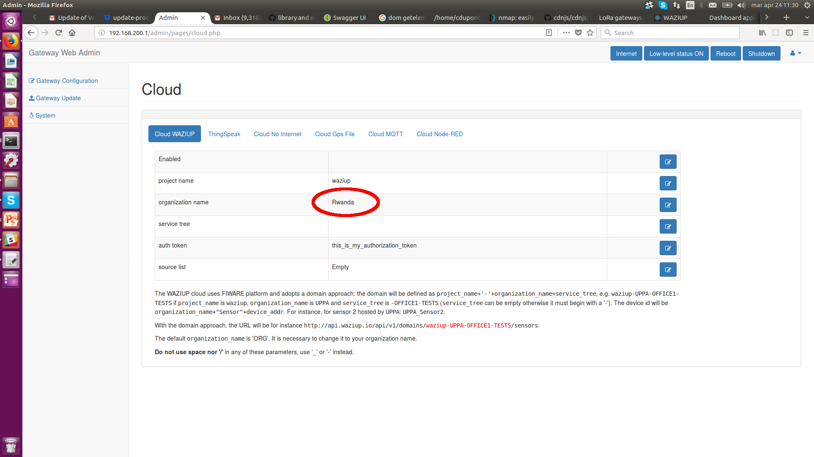
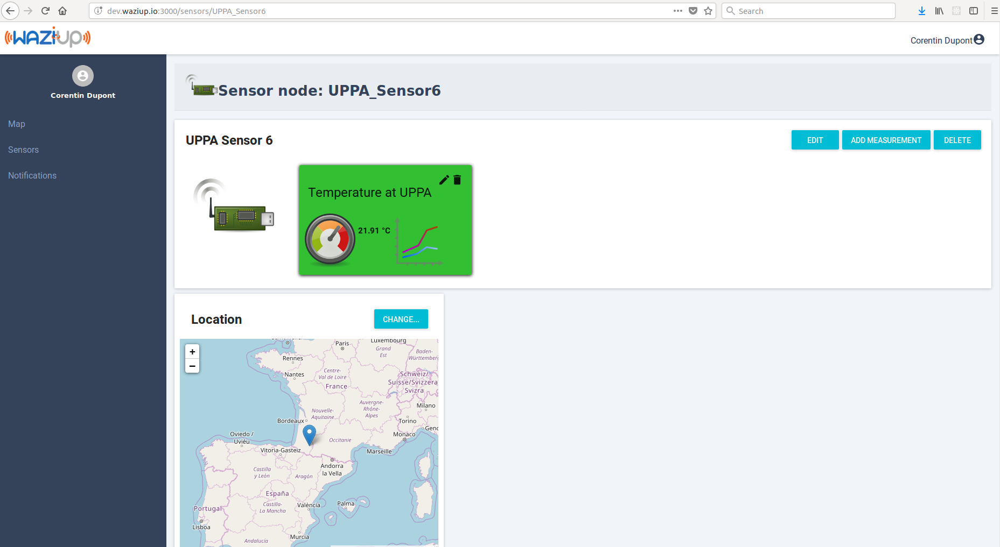
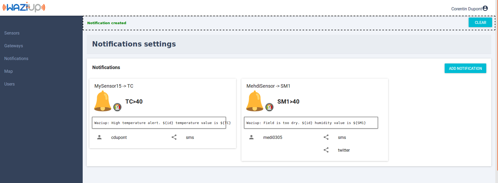
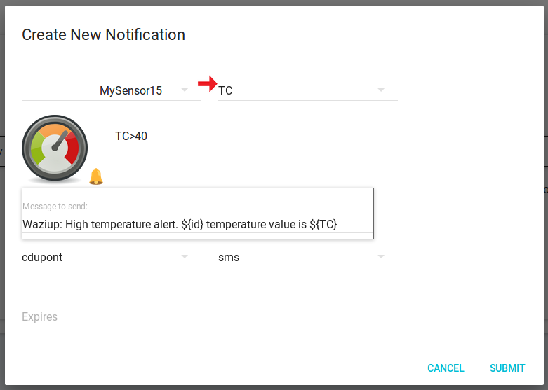
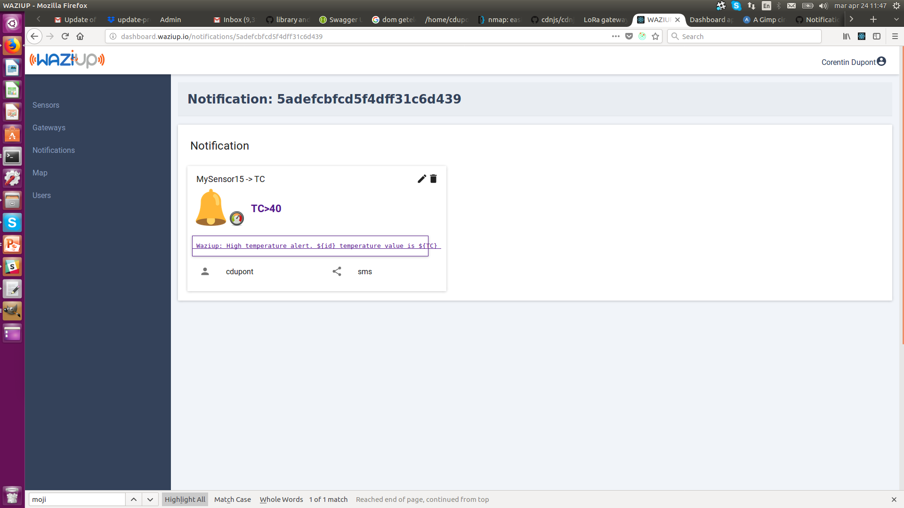

You can build a full application with Waziup, without programming!
In this tutorial, we'll learn how to build a soil monitoring application able to display the soil moisture and to send notifications on SMS, twitter and voice messages.
More advanced dashboards can be created with [Kibana](kibana_tutorial.pdf).

Prerequisistes
--------------
You should already have a gateway and a sensor node ready and configured.
If not, please check [this section](../../hardware).
Your gateway should be configured with your name for the organisation:

Switch on your gateway and sensor, and let's exploit your data in the Waziup dashboard!

Create a user
-------------
The first thing you need to do is to create a login and a password.
Click on the “Go to dashboard” button on top of this page.
This will lead you to a page as shown below.
 

You can create a new account by clicking on “Register” of by using a social network OpenId procedure.
All communications will be secured by SSL. 

Your sensor
-----------

Clicking on the “Sensors” menu entry will lead you to the sensors page.
 

In this list, active sensors are displayed in green, and unactive sensors are in red.
A sensor is deemed unactive if it doesn't send data after 12 hours.
The sensors are sorted by domains, which regroup sensors from the same application domain: for example sensors from a specific farm.

If you configured your gateway correctly, you should be able to find your sensor in this page!
Press CTRL-F and enter part of your name, in order to find your sensor in the page.
Your data is already here!
Click on the sensor icon to access to the details.

Setting up you sensor
---------------------

Without any configuration, you can already see your sensor value and historic.
Click on the graph icon to consult the graphics.

However, we need to "enrich" our sensor by providing some metadata.
Click on the "Change" button on the map in order to set up the sensor location.
Click on the little pen icon to input the sensor name.
This operation will allow you to recognize your sensor more easily.

Click on the pen icon in the measurement box.
This will allow to set up:

- a measurement name
- a sensing device. This is the kind of physical sensor used: a temperature sensor, a soil moisture sensor...
- a quantity kind. This is what you are really measuring with the sensor. For example, air temperature or water temperature?
- a unit of measurement.

Setting up this metadata is not mandatory, however is it much better to get if you want to exploit yuor data on the long term.
It will also allow you to create nicer graphics.

Notifications
-------------

The notifications allow you to program SMS messages triggered by events on the sensors.
For instance, if a sensor value becomes too high, an SMS will be sent to the user.
The notification view is shown below.
 

Let's create a notification for your new sensor.
Click on the “Add notification” button, as shown in the figure.

You need to select your sensor id in the list, and then the measurement id.
For instance, select *MySensor* and *TC*, to make a notification on the temperature measured by MySensor.

The next field contains the condition for sending the message.
Examples of expressions include “TC==10”, “TC==10..30”, “TC>30”, “Color==orange,red”.
The list of operators is: “==”, “!=”, “>”, “<”, “>=”, “<=”.
Several conditions can be concatenated with “;”, for example: “TC>30; HUM<20”.
The Message field contains the message to be sent to the user.
It can contain variables, which will be replaced by their values when the message is sent.
For example, you can include the current value of a sensor in the message with “Field sensor value is ${TC}”.

The next step is to select the users you want to send it to.
Select your own username here.
Finaly, select the social media to send one.
Remember, your account need to be configured with your phone number and Twitter account to receive messages.

Once this is done, you can validate.
You should be able to see your notification in the list.

Did you receive anything?
To check if any message was sent to you, hoover with your mouse over the notification.
You should see the number of times this notification was sent, and the time for the last sending.

Your simple application is ready!
To make more complex dashboards, head to the [Kibana](kibana_tutorial.pdf) tutorial.
