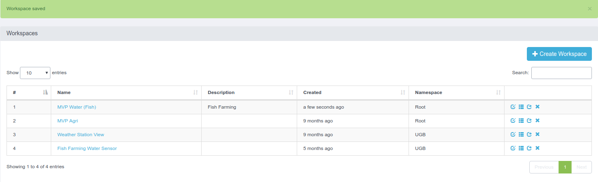
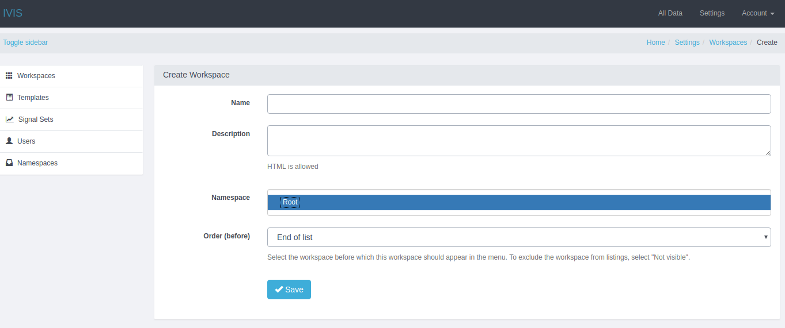
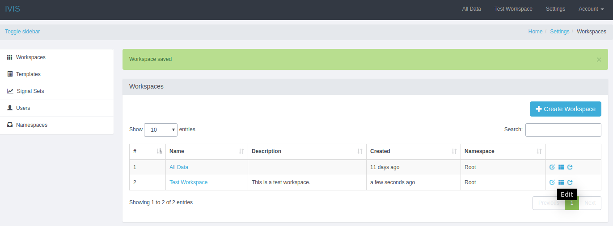
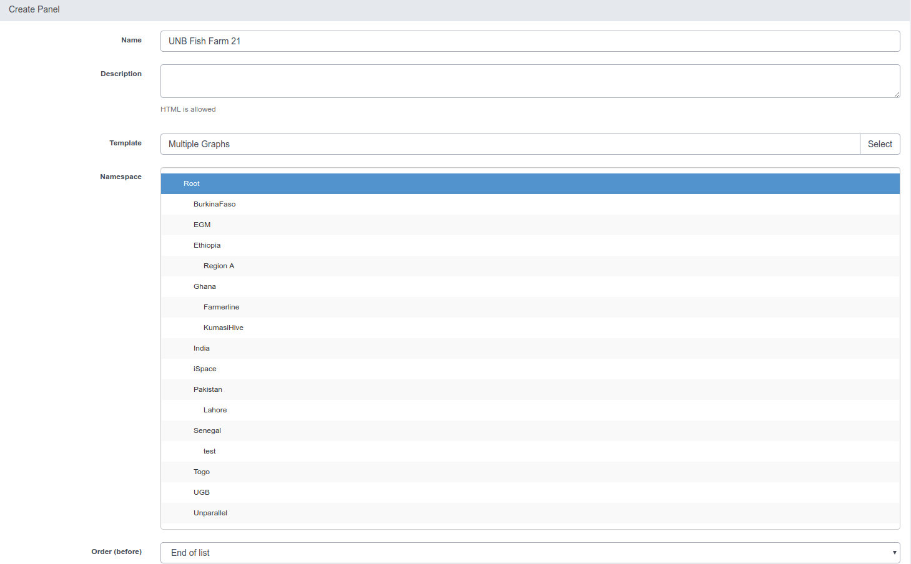
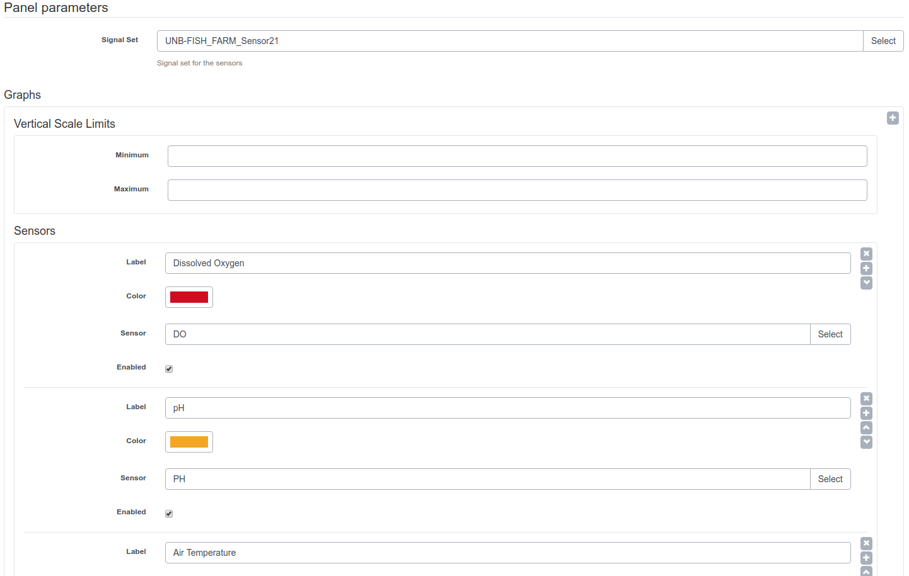
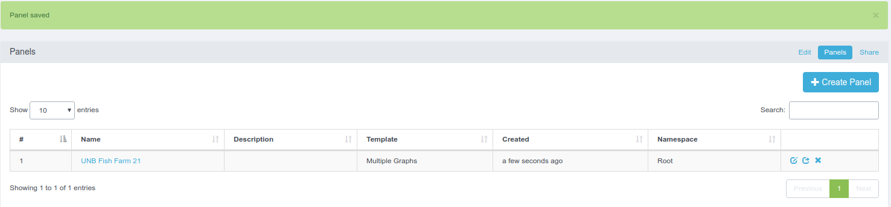
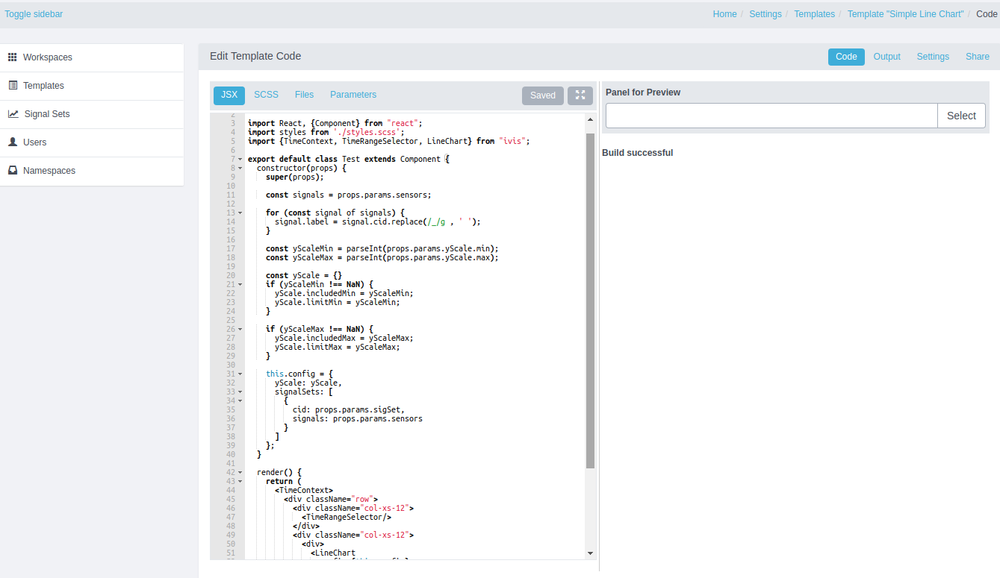
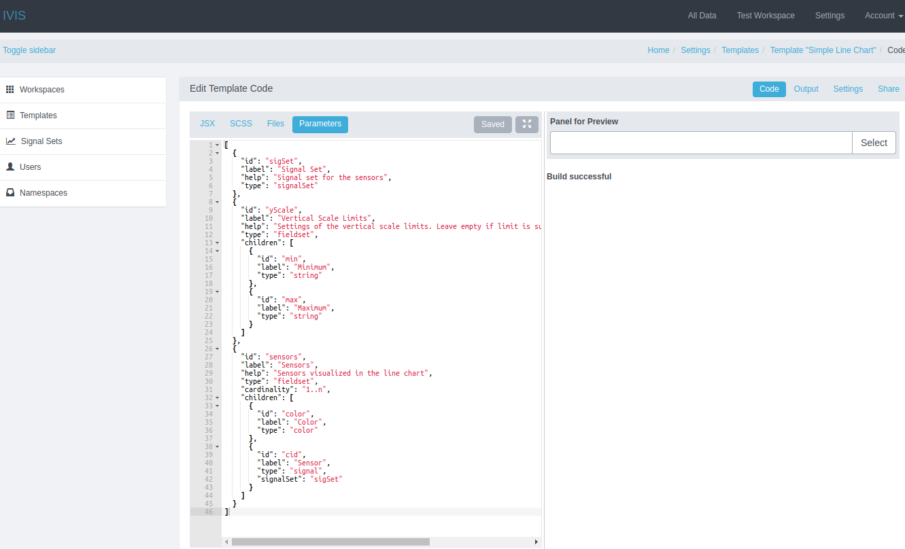
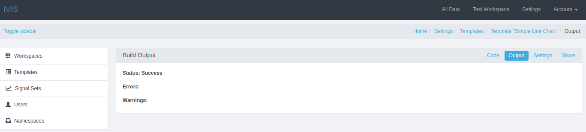

 .RelPermalink

WAZIFARM is a platform, and framework for realization of advanced visualization, and data analytics applications for various use cases such as in agriculture.
It is a Web-based framework for creating agriculture application. WAZIFARM is an easy to use framework based on the concept of visualization templates, workspaces, and panels.
In next sections, we explain WAZIFARM entities.



The Users and Admin Guides and Manual are available at [WAZIFARM: Users and Admin Guides and Manual](wazifarm.pdf)

## Workspaces and panels
A workspace is container to present different things in UI.
A workspace can contain several panels in order to present different things.
hus, a panel is part of a workspace that has a special purpose to present UI parts, e.g. visualizations, lists, tables.
As a result, the UI is organized into workspaces and panels with these concepts.

For creation of UI elements, an admin first should create a workspace.
An admin can click on Setting menu, then click on Workspaces in sidebar menu in order to see the list of Workspaces, and create a new one.
In addition to name, and description of a workspace, admin should specify to which namespace the workspace will belong, and what should be its order in the list of workspaces (as part of Workspaces menu in admin UI). 



After creating a workspace, an admin needs to:
- create its panels by clicking on Panels that is part of breadcrumb menu,
- select a default panel, if the workspace has several panels, by clicking on Edit that is part of breadcrumb menu

After admin creates a workspace, she should edit the workspace, then click on Panels breadcrumb menu in order to create or edit panels of the workspace. 



During panel creation, admin should specify the visualization template of the panel, specifying a desired template for the panel (e.g. a line chart, area chart, data table), a sensor node, its sensors, and some other parameters; the full explanation of templates is presented in template section.





## Visualization templates
A visualization template allows admins to create data visualization charts, and graphs through dashboard.
An admin can create these templates, and they can be used for different panels, and workspaces.
Admin does not need to be a JavaScript developer to be able to define these templates.
WAZIFARM provides user and admin guideline in order to create visualization templates based on WAZIFARM visualization components.
With that, WAZIFARM realizes the concept of fully customized visualizations that are provided to technical experts.
Customized visualizations can be instantiated for different sensors using the UI by an administrator who is not a developer.



### Administration of visualization templates
In this section, we describe admin UI to define templates. It overviews all the tabs under templates, but leaves the meaning of JSX, SCSS, Params to next section.
Figure shows the first part of admin UI to define a template, here admin provides name, description, namespace, and type of template that is JSX.

After the first phase, admin requires to edit the template, and click on Code breadcrumb menu in order to provide JSX code, SCSS style, and Parameters.
In the JSX section, admin needs to write template code based on WAZIFARM visualization components. WAZIFARM Admin Guideline provides several template codes for different visualization components, thus admins can adopt those for their own.

In the Parameters section, admin needs to write parameters specification for WAZIFARM visualization components to define data, and graph options.



By going to Output breadcrumb menu, admin can see the status of JSX code compilation.



### Development of visualization templates
In this section, we provide a few code examples of what can be written to JSX, SCSS, Params sections of template definition.
This is not an exhaustive API reference, but a set of recipes for common cases we had so far in WAZIFARM.
For more information, one can refer to ES6, D3, SCSS and the source code of WAZIFARM under WAZIFARM-core/client/src/WAZIFARM.
The following JavaScript code based on ReactJS, and JSX develops a Line Chart visualization based on WAZIFARM visualization components.

```
'use strict';
import React, {Component} from "react";
import styles from './styles.scss';
import {TimeContext, TimeRangeSelector, LineChart} from "WAZIFARM";
export default class Test extends Component {
  constructor(props) {
    super(props);
    const sensors = props.params.sensors;
    for (const signal of sensors) {
      signal.label = signal.cid.replace(/_/g , ' ');
    }  
    const yScaleMin = parseInt(props.params.yScale.min);
    const yScaleMax = parseInt(props.params.yScale.max);
     const yScale = {}
    if (yScaleMin !== NaN) {
      yScale.includedMin = yScaleMin;
      yScale.limitMin = yScaleMin;
    }

    if (yScaleMax !== NaN) {
      yScale.includedMax = yScaleMax;
      yScale.limitMax = yScaleMax;
    }

    this.config = {
      yScale: yScale,
      sensorsets: [
        {
          cid: props.params.sigSet,
          sensors: props.params.sensors
        }
      ]
    };
  }

  render() {
    return (
      <TimeContext>
        <div className="row">
          <div className="col-xs-12">
            <TimeRangeSelector/>
          </div>
          <div className="col-xs-12">
            <div>
              <LineChart
                config={this.config}
                height={500}
                margin={{ left: 40, right: 5, top: 5, bottom: 20 }}
                withTooltip
              />
            </div>
          </div>
        </div>
      </TimeContext>
    );
  }
}
```

In addition, the following code defines input parameters to visualization template code.

```
[
  {
    "id": "sigSet",
    "label": "Signal Set",
    "help": "Signal set for the sensors",
    "type": "sensorset"
  },
  {
    "id": "yScale",
    "label": "Vertical Scale Limits",
    "help": "Settings of the vertical scale limits. Leave empty if limit is supposed to be calculated automatically",
    "type": "fieldset",
    "children": [
      {
        "id": "min",
        "label": "Minimum",
        "type": "string"
      },
      {
        "id": "max",
        "label": "Maximum",
        "type": "string"
      }
    ]
  },
  {
    "id": "sensors",
    "label": "Sensors",
    "help": "Sensors visualized in the line chart",
    "type": "fieldset",
    "cardinality": "1..n",
    "children": [
      {
        "id": "color",
        "label": "Color",
        "type": "color"
      },
      {
        "id": "cid",
        "label": "Sensor",
        "type": "signal",
        "sensorset": "sigSet"
      }
    ]
  }
]
```
