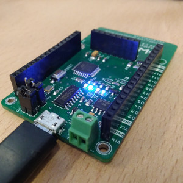

WaziDev is an integrated IoT LoRa device which provides an energy-efficient and integrated board.

Specification
-------------------------
|           |                  |                             |
| ----------------------|:-----------------------|:------------------------------------|
| Processor System      | MCU    RAM    FLASH      | ATmega328p 8Mhz  2 KB  32 KB                      |
| Wireless Network      | Standard   Frequency Band   Channels   Transmit Power   Receiver Sensitivity   RF Data Rate      Modulation      Function   Antenna connector  |   LoRa   863-870MHz for Europe/Africa   1   +20dBm -100mW constant RF output   -148dBm   300kbps     FSK, GFSK, GMSK, MSK, OOK      Sensor Node   Integrated PCB antenna / External UFL     |
| Indicator and Button  | LED      Button   On/OFF switch   Regulator Switch     | 4, PWR LED, Indicator LED, Charging/Full battery     1, Reset button   1, two pins for on/off switch + a jumper to keep the board always on   1, A jumper that can be used to bypass the regulator for low power applications |
| I/O | UART   ICSP   I2C   Analog input   Digital I/O   Extra GND   High Current output   USB   Input power | 1   1   1   8 (Arduino standard pins: A0-A7)   9  (Arduino pins, some are used by LoRa)   8 (a Ground Rail)   2 (max 500mA): M8, M9   1, USB micro Type for programming and power   1, LiPo/Regular Battery |
| Power | Supply voltage   Battery support   Battery charger   Power Consumption   Battery Level monitor    Optimization Jumpers  | 3.3V - 5V   3v (max 3.6v DIRECT and 6v Regulated)   Max 1A input current (through Micro USB port)   -   LOW active on pin D7 and read BAT level on A7    2, Disabling: Status LEDs, Charger LEDs   |
| Environment | Operational Temperature    Operating Humidity | -20 ~ 70° C    5% ~ 95% Relative Humidity, non-condensing |
| Mechanical | Dimensions | 70 x 40 mm |
| Programming | IDE | Arduino compatible (Select **Pro Mini 3.3V 8Mhz**) |

Pinout description
-------------------------

1. **ON/OFF switch**: This jumper can be used as on/off switch for the board. It is ON by default.
 
2. **Regulator Activation**: The jumper indicated by **DIRECT / REG** sets the board to use a regulated voltage or direct. The direct setting is only if you use an input battery of maximum 3.6V any voltage higher than that can damage the LoRa module. 
**Please note that to always keep this config in REG mode when programming the board.**
 
3. **Analog Pins**: Arduino standard analog pins A0-A7. Please note that **A7** is connected to the battery voltage level monitoring circuit which can be activated by setting the digital pin **D7** to **LOW**, so **D7** should be set to **HIGH** always.
 
4. **External Antenna (UFL)**: The board has an embedded PCB antenna which is activated by default and optimized for 868Mhz frequency. If you want to use your own antenna instead you need to deactivate the PCB antenna by cutting its jumper on the back of the board indicated by **JA** then you can connect your antenna to the UFL connector.
 
6. **High current pins** ( *max 500mA* ): **M8** and **M9** are high current/voltage programmable output pins. 
They can be programmed through digital pins **D8** and **D9** respectively. 
It can be used to activate high current/voltage devices/sensors. 
The maximum current which can be drained is **500mA** and the maximum voltage is **12v**. 
The wiring is as follows: The Ground wire of the external high current/voltage source is connected to the same ground of the board (GND), and the positive wire of the power source is connected to the high current device that needs to be controlled by our board. 
One of the pins of **M8** or **M9** is connected to the Ground of the high current device, then we can turn it on and off by writing **HIGH** and **LOW** to the digital pins **D8** or **D9** respectively.
 
7. **Digital Pins**: Arduino standard digital pins **D2-D12**. Please note that **D13** is situated on the opposite side of **D12**.
 
8. **VCC** ( *3.3v* ): WaziDev board operates with **3.3v**, VCC pins provide 3.3v as output, they can be used as input voltage as well.

9. *Lipo/regular battery*: This port is designed to be used as input for Lithium Ion rechargeable battery or just a regular battery. There is an onboard charger which enables the board to use a solar panel. 
Please note that the solar panel must be connected to either Micro *USB port* or *VIN* pin.
**Warning**: your rechargeable battery must have its own protection circuit otherwise it might gets overcharged and cause fire. (usually good quality batteries have it)
 
10. **Micro USB port**: This port is used to power the board on through USB cable and program the board via Arduino IDE. Please note that you need to first install the driver on your computer:
	- Windows: https://cdn.sparkfun.com/assets/learn_tutorials/5/9/7/Windows-CH340-Driver.zip
	- Linux: https://github.com/juliagoda/CH341SER
	- Mac: https://cdn.sparkfun.com/assets/learn_tutorials/5/9/7/CH341SER_MAC.ZIP

To programm the board, in Arduino IDE, on the boards menu, you need to select **Arduino Pro or Mini, ATMega328p 3.3v @ 8MHz**.

Jumpers
-------------------------

| Indicator  | Function                         | Default   |
| ---------- |:---------------------------------|:----------|
| JL         | LED13 and PWR LEDs               | Connected |
| JC         | Charger status LEDs (CHG, FULL)  | Connected |
| JB         | Battery level read               | Connected |
| JA         | Embedded Antenna                 | Connected |
| JS         | Power Switch                     | Open      |
| JR*        | Radio Interrupt                  | Open      |

\*When connected, connects the LoRa interrupt pin to **D2**

An wxample wiring diagram for WaziDev with sensors and a relay.
---------------------------------------------------------------

Have fun with Waziup.