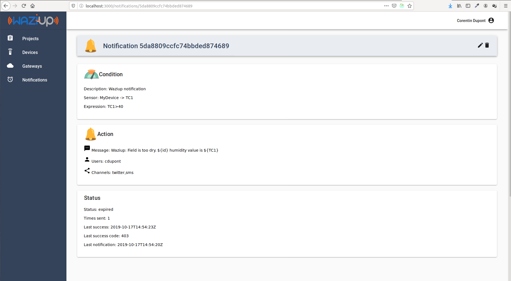

Notifications
-------------

The notifications allow you to program SMS messages triggered by events on the sensors.
For instance, if a sensor value becomes too high, an SMS will be sent to the user.
The notification view is shown below.
 

Let's create a notification for your new sensor.
Click on the “Add notification” button, as shown in the figure.

You need to select your sensor id in the list, and then the measurement id.
For instance, select *MySensor* and *TC*, to make a notification on the temperature measured by MySensor.

The next field contains the condition for sending the message.
Examples of expressions include “TC==10”, “TC==10..30”, “TC>30”, “Color==orange,red”.
The list of operators is: “==”, “!=”, “>”, “<”, “>=”, “<=”.
Several conditions can be concatenated with “;”, for example: “TC>30; HUM<20”.
The Message field contains the message to be sent to the user.
It can contain variables, which will be replaced by their values when the message is sent.
For example, you can include the current value of a sensor in the message with “Field sensor value is ${TC}”.

The next step is to select the users you want to send it to.
Select your own username here.
Finaly, select the social media to send one.
Remember, your account need to be configured with your phone number and Twitter account to receive messages.

Once this is done, you can validate.
You should be able to see your notification in the list.

Did you receive anything?
To check if any message was sent to you, hoover with your mouse over the notification.
You should see the number of times this notification was sent, and the time for the last sending.

Your simple application is ready!
To make more complex dashboards, head to the [Kibana](kibana_tutorial.pdf) tutorial.
