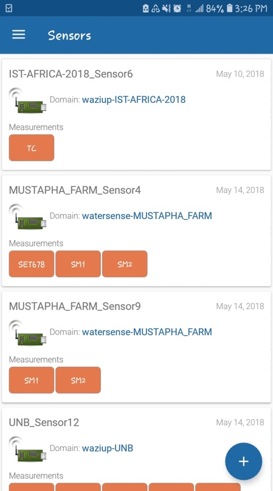
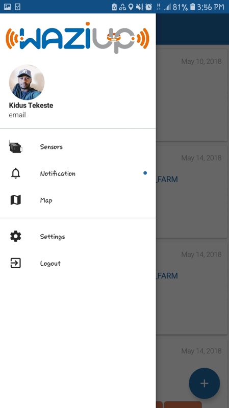

The idea of the deployment assistant is to guide the engineering team in the deployment process when installing sensors.
The application will collect metadata information about the sensors deployed:

- Sensor details (name, owner, domain and gateway ID, deployment status, measurements details and last values)
- Geo-localization of the sensor
- Setting of the ownership

WAZIUP customer gateways and sensor nodes come with a barcode/QR code.
The deployment team will then use the deployment assistant to scan the bar codes.
This would permit to do the pairing more easily.
The list of features that will be developed are:

- Login to the application
- See my sensor list
- See a particular sensor status: sensor ID, name, owner, domain and gateway ID, deployment status, measurements details and last values
- Register a new sensor: ID, sensor name, owner, domain and gateway ID
- Register measurements: type and unit of measurement
- Deploy a sensor
- Undeploy a sensor
- Geolocalize a deployed sensor
- Scan a QR code to ease the sensor registration.
- Calibrate the sensor

