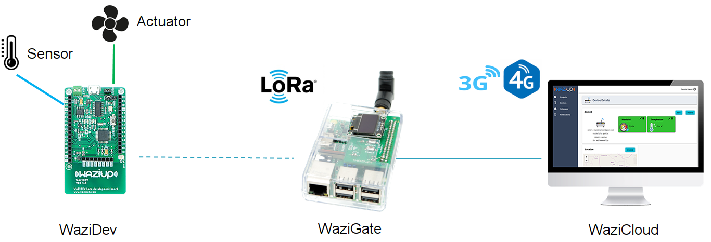

An Introduction
===============

The Waziup Platform has three elements:

**WaziDev** is a [Sensing](/documentation/wazidev/sensors/) and [Actuation](/documentation/wazidev/actuators/) platform for your applications!
It can send your data up to 7 Km using the LoRa technology.
It is easily programmable and customizable, using Arduino technology.
It is an ideal solution for start-ups and entrepreneurs who want to rapidly prototype an IoT application.
Its has:
- Arduino Pro Mini compatible CPU
- RFM95W LoRa module
- Fully compatible with the Arduino development environment
- Embedded Lipo battery charger for solar panels and low power options
- Two pins with high current support (500mA)

The WaziDev can send LoRaWAN messages to *any* LoRaWAN gateways (not just WaziGate).
Don't have a WaziDev? No problem! You can use any [Arduino-compatible platform](/documentation/wazidev/other_boards/), such as MKR 1300.

**WaziGate** is a [LoRaWAN](/documentation/wazigate/v2/lorawan/) Gateway, ideal for all your remote IoT applications.
The Gateway can cover up to 100 IoT [sensing nodes](/documentation/wazigate/v2/lorawan/#sensing) using LoRaWAN radio network: Weather stations, soil monitoring, GPS applications...
The Gateway can also control [your actuators](/documentation/wazigate/v2/lorawan/#actuation), such as electro-valves.
You can [host your own applications](/documentation/wazigate/v2/waziapps/) directly in the gateway, and connect to it through WiFi.
The gateway can easily work *without Internet connectivity* and still provides data to end-users through its embedded database and web-based visualization module.
The WaziGate features:
- Edge capacity to host your applications
- LoRa communication up to 10-12 Km
- Permanent Wifi hotspot
- Wifi/3G/Ethernet internet connection
- Low power consumption
- Automation
- Remote management

The WaziGate is connected and can be controlled from the WaziCloud, when Internet is available.

**WaziCloud** allows you to [manage your sensors, actuators and IoT data](/documentation/wazicloud/dashboard/).
WAZIUP Cloud platform offers everything that you need for your application:
- Remote connection of your sensors and actuators
- Send, receive, collect, store and analyze the data they generate
- Manage your users and their privacy
- Turn that data into actionable insights, in real time
- Using SMS or mobile application for notification
- Standard IoT protocols (HTTP and MQTT).
- Open REST API for application development
- Control your gateways from remote

