The objective is to develop a low-cost and sustainable solution capable of reading real-time data typical of a Weather Station, using different sensors, and capable of communicating via LoRa.
The following steps provide a Getting Started tutorial. Detailed documentation, such as the complete Assembly guide and the Technical guide, can be found <a href="https://github.com/Waziup/WAZIUP-WeatherStation/tree/master/extra/documents" target="_blank">here</a>.

The following hardware is required to develop the LoRa Weather Station and can be found in <a href="https://www.iot-catalogue.com/products/59b1797c763cfc066f6d092b" target="_blank">IoT-Catalogue</a> as well.

  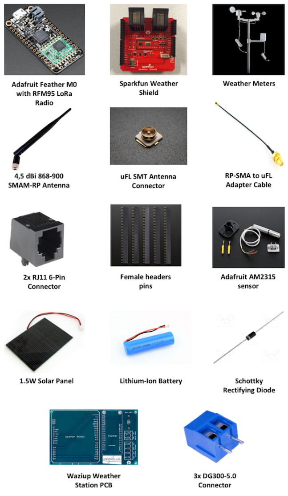

Assembly
========

Follow the next steps to build the LoRa Weather Station. In the initial steps is necessary to solder some components. To help in the solder task can be consulted this <a href="https://learn.adafruit.com/adafruit-guide-excellent-soldering" target="_blank">guide</a>.

{}
1. Solder Adafruit Feather M0
{}

Solder the Female Header pins and the uFL SMT Antenna Connector in Feather.

  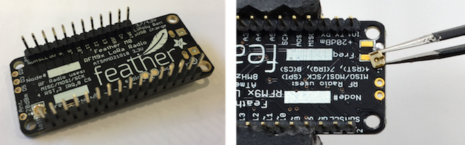

Once soldered the uFL SMT Antenna Connector can be connected the 868MHZ Antenna.

  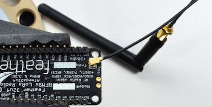

{}
Solder Sparkfun Weather Shield
{}

Solder the female header pins and the two RJ11 connectors in the Sparkfun Weather Shield.

  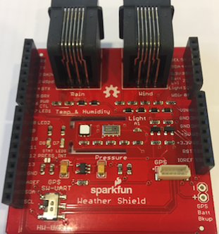

{}
Waziup Weather Station PCB
{}

The Waziup Weather Station PCB is open-source, and open-hardware and facilitate the integration of all the components with a plug-and-play approach. All necessary files to build the PCB are hosted in the Waziup GitHub repository and a tutorial with all the step to ordering the PCB is available in Annex A of the Assembly guide.

After ordering and receiving the PCB solder the female header pins, three DG300-5.0 Connectors and a Schottky Diode with the grey terminal placed up in the PCB.

  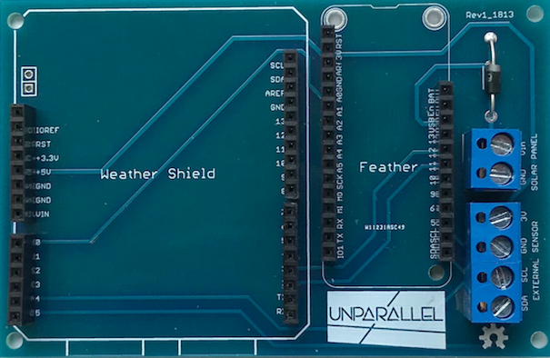

If is not possible to use the Waziup Weather Station PCB, can be used a breadboard and cables to make the connections between the components. as suggested in the Annex B of the Assembly guide.

{}
Plug Weather Shield and Feather
{}

  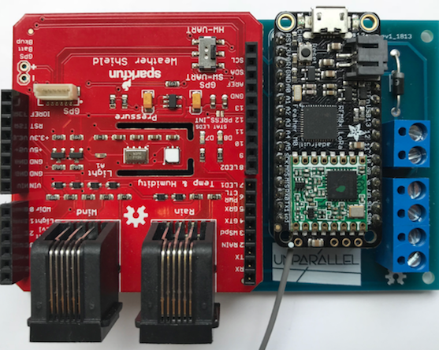

{}
Screw External Sensor
{}

  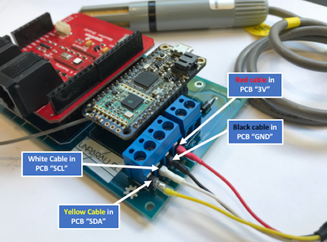

{}
Screw Solar Panel
{}

  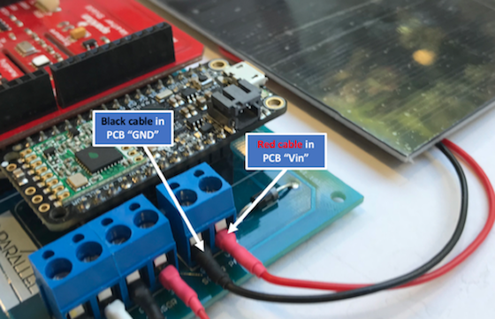

{}
Connect the Battery
{}

  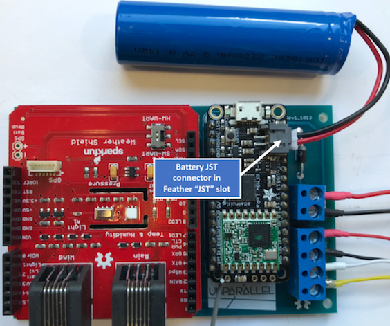

{}
Connect Weather Meters
{}

Pay attention and connect the Rain and Wind RJ11 cables in the respective places as shown in the following figure.

  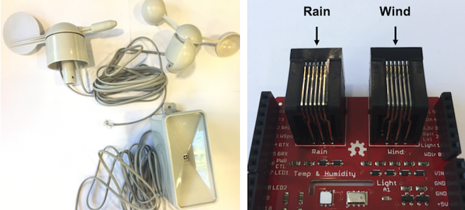

Software
========

{}
Download & Install Arduino
{}

To download the Arduino IDE 1.6.6 or later go to the Arduino <a href="https://www.arduino.cc/en/Main/Software" target="_blank">website</a>.

{}
Add Adafruit Boards to Arduino
{}

To add the Adafruit Boards in the Arduino IDE go to “Arduino”, “Preferences” and include the link for Adafruit boards in the "Additional Boards Manager URLs".
This link can be found in the official Adafruit <a href="https://learn.adafruit.com/adafruit-feather-m0-radio-with-lora-radio-module/setup" target="_blank">guide</a>.

{}
Install Adafruit Boards in Arduino
{}

To install the Adafruit Boards in Arduino IDE go to  “Tools”, “Board”, access the “Board Manager” and follow the steps in the official Adafruit <a href="https://learn.adafruit.com/adafruit-feather-m0-radio-with-lora-radio-module/using-with-arduino-ide" target="_blank">guide</a>.

{}
Download & Install Weather Station library
{}

To download the Weather Station library go the <a href="https://github.com/Waziup/WAZIUP-WeatherStation" target="_blank">Waziup Github</a>, click on “Clone or download” green button located in the right side and choose “Download Zip” option to download the “WAZIUP-WeatherStation-master.zip” file.
To install the Weather Station library go to, in Arduino IDE, “Sketch”, “Include Library” and click in the “Add .ZIP Library” option. Will appear a window where need to be added the zip file.

{}
Open Weather Station example code
{}

To open the Waziup Weather Station code go to “File”, “Examples”, “Waziup Weather Station” and click in the “WaziupWeatherStation” example.

{}
Choose Board & USB Port in Arduino
{}

After connecting the micro-USB cable from the computer to the Feather, it is necessary to choose the correct Adafruit Feather Board in the Arduino IDE. To do that go to “Tools”, “Board” and click in the “Adafruit Feather M0”.
To define the USB port go to "Tools”, “Port” and click in the “Adafruit Feather M0”.

{}
Upload the Weather Station software
{}

To upload the software in the Adafruit Feather M0 just need to click in the “Upload” button presented in the upper left side of the Arduino IDE.
After concluding the upload with success, a message will appear in the lower left side.
To open the Arduino Serial Monitor and visualize the LoRa Weather Station workflow click in upper right side button.

Deployment
==========

{}
Assembly Weather Station in a Box
{}

It is recommended to use a box to place the assembly Weather Station in the desired location. The following figures show, as an example, the Waziup Weather Station in a box that not needs to be the same. Pay attention to the material that the box is made. To place the Weather Station in locations under the rain, it is convenient to use a waterproof box.

  

{}
External Sensor outside the box
{}

Make sure that the external sensor is slightly out of the box, as shown in the box of Figure, and preferably in a shadow location without sun.

  

{}
Assembly Weather Meters sensors
{}

The Weather Meters come with material components, to allow their assembly in an auxiliary structure. To mount it is recommended to perform the suggested steps in the Sparkfun's <a href="https://learn.sparkfun.com/tutorials/weather-meter-hookup-guide" target="_blank">guide</a>.

{}
Solar Panel outside the box
{}

Place the Solar Panel outside the box in a place where it is possible to guarantee the conditions of implementation. To realize and ensure a correct Solar Panel implementation it is recommended to consult the "Solar Panel Deployment" document that is available in folder “documents” in the Waziup Weather Station <a href="https://github.com/Waziup/WAZIUP-WeatherStation" target="_blank">Github</a>.

  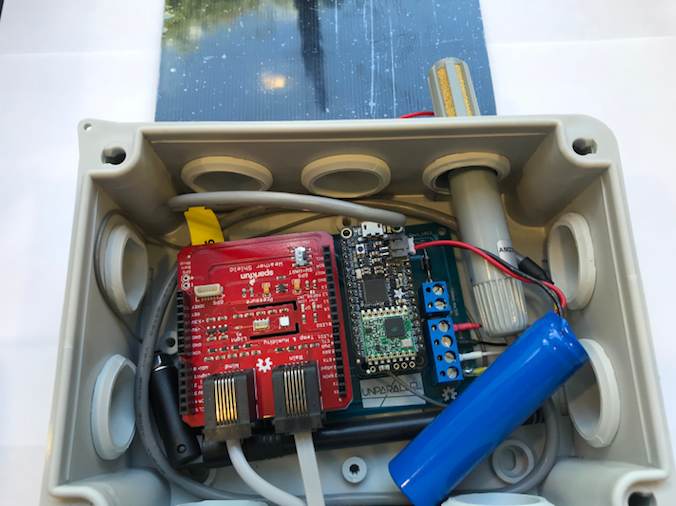

The hole created for the external sensor can be used to route the Solar Panel cables as well as the RJ11 Rain and Wind sensor cables.

After complete these steps, the Waziup LoRa Weather Station is ready to receive the measurements and send the information to the LoRa gateway.
