You can build a full application with Waziup, without programming!
In this tutorial, we'll learn how to build a soil monitoring application able to display the soil moisture and to send notifications on SMS, twitter and voice messages.
This documentation is available in [PDF format](/docs/WaziCloud_User_Manual-V2.1.pdf).

Login
=====

You should already have a gateway and a sensor node ready and configured.
If not, please check [this section](/documentation/wazigate/).

Create a user
-------------
The first thing you need to do is to create a login and a password.
Click on the “Go to dashboard” button on top of this page.
This will lead you to a page as shown below.
 
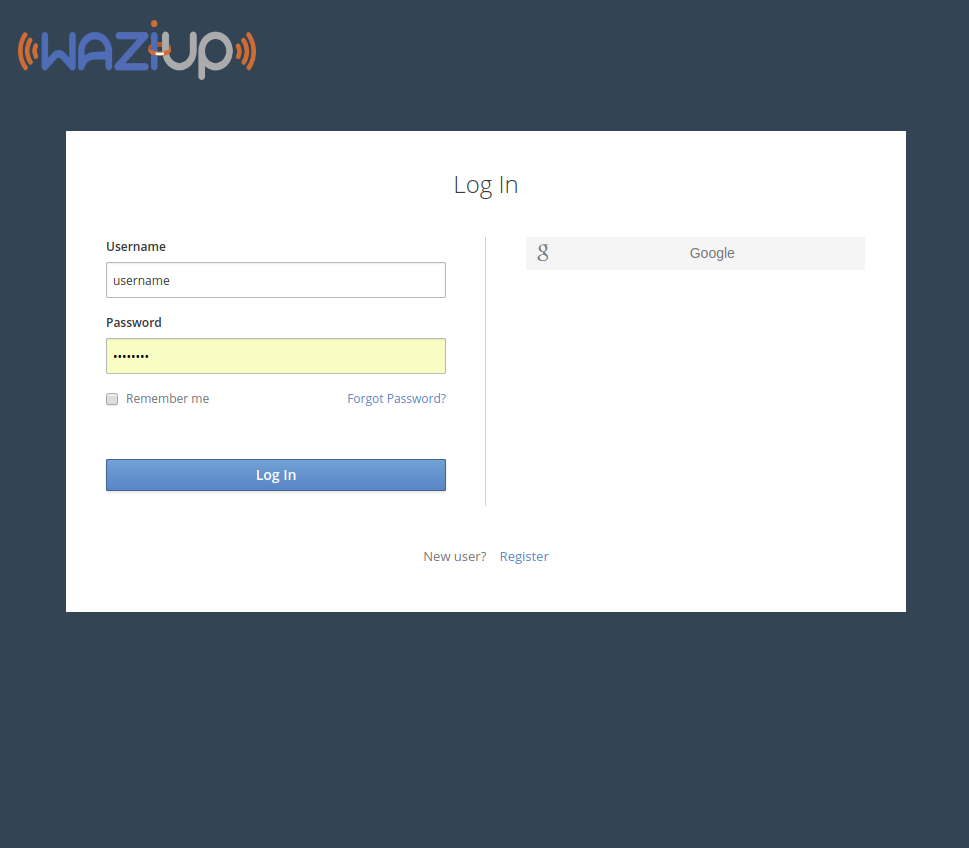

You can create a new account by clicking on “Register” of by using a social network OpenId procedure.
All communications will be secured by SSL. 

**IMPORTANT: Once created your login and password, [you need to insert them in your gateway](/documentation/wazigate)!**

Projects
========

A project allows you to get all your assets in the same place: gateways, devices, notifications, maps, graphics...
The first thing to do is to connect your [gateways](/documentation/wazigate/) and [devices](/documentation/wazidev/).
Once they are connected, you can click on the button "Create a project".

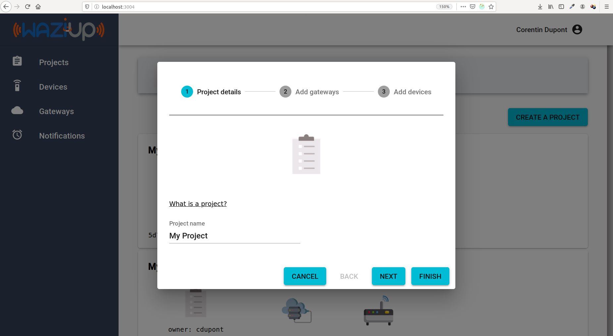

After completing all the steps, your project is ready!
You can see on this screen the status of your devices and gateways.

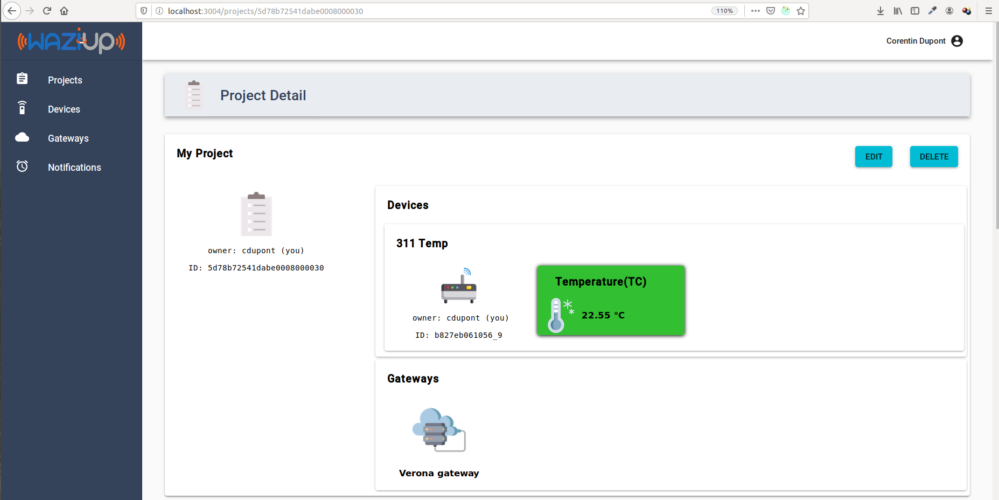

If your devices are positionned, you should see them on the map.
Finally, all devices and sensor values are displayed on the graph.

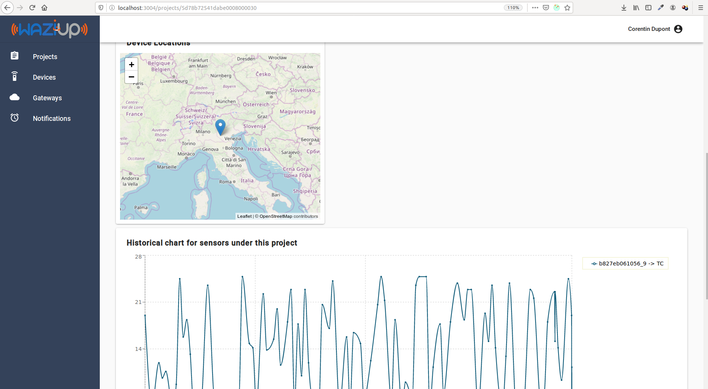

Devices
=======

Clicking on the “Devices” menu entry will lead you to the devices page.
If you configured your gateway correctly, you should be able to find your devices in this page!
For example, your [WaziDev](/documentation/wazidev/) should be listed here.

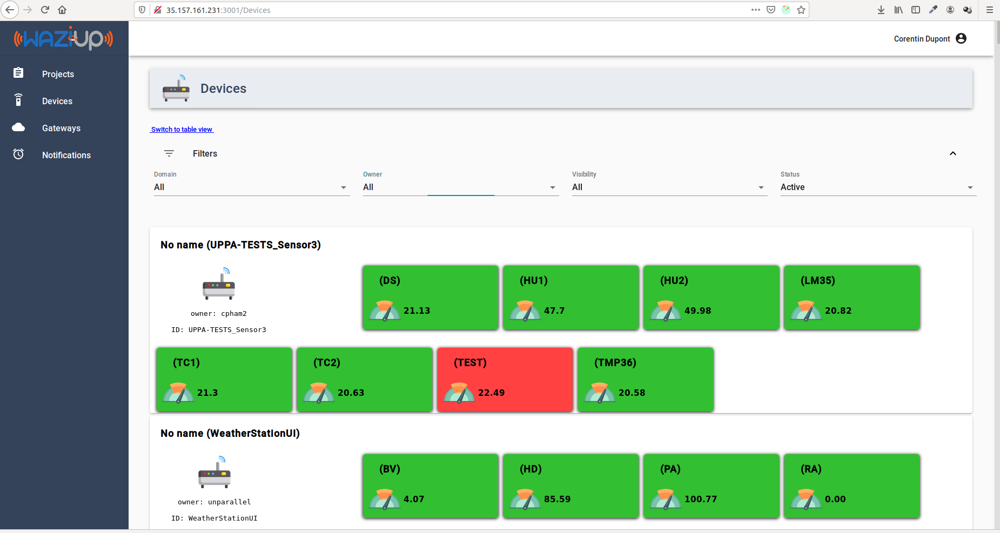

Each device contains a certain number of sensors and actuators (that are often connected to the device board with some wires).
Active sensors are displayed in green, and unactive sensors are in red.
A sensor is deemed unactive if it doesn't send data after 12 hours.

You can filter the list by domain, visibility or status.
If you have a lot of devices, you can often find the one you are looking for by filtering by "Active" or "New".
A device is showed as "New" if it has been created in the last 24 hours.

Device details
--------------

Click on one of your devices.
The following page will show you more details.

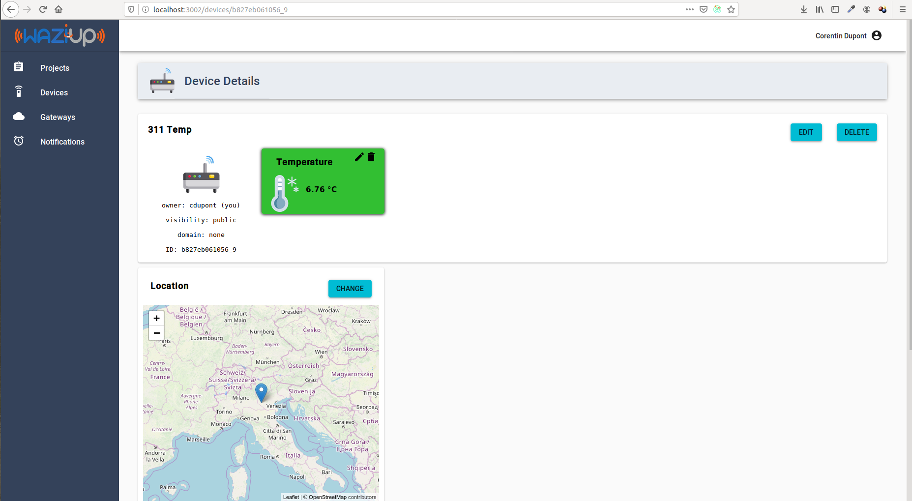

In this screen, you can see the details of your device, with its sensors and actuators.
You can edit your device, input the following:

- Name
- Domain
- Visibility 
- Gateway

The name of you device is important. You should change it as soon as you can, to something significant such as "My weather station".
The domain allows you to group your devices by topics, such as "Agriculture".
You can also set the gateway that is associated with your device. You normally don't need to do that, since your gateway will do it automatically.
Finally, using the map you can change the location of your device.

Sensor details page
-------------------

Click on one of the sensors to open the sensors details page.

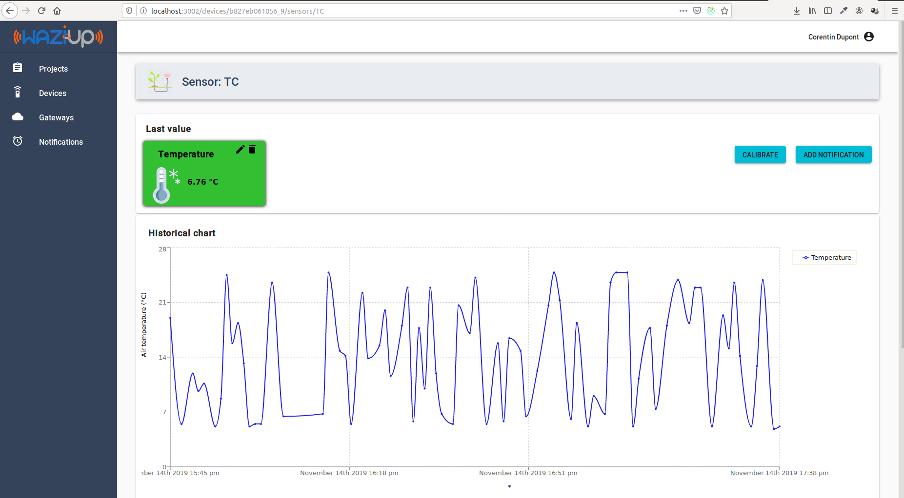

Remember that the sensors are automatically created by the gateway.
However, we need to "enrich" our sensor by providing some metadata.
Click on the little pen icon next to the sensor.
This will allow to set up:

- a sensor name
- a sensing device. This is the kind of physical sensor used: a temperature sensor, a soil moisture sensor...
- a quantity kind. This is what you are really measuring with the sensor. For example, air temperature or water temperature?
- a unit of measurement.

Setting up this metadata is not mandatory, however is it much better to get if you want to exploit yuor data on the long term.
It will also allow you to create nicer graphics.

Gateways
========

In this section, we'll learn how to connect and configure your gateway on the Waziup Dashboard.
If you install the [WaziGate](/documentation/wazigate/), it should already appear in this page.

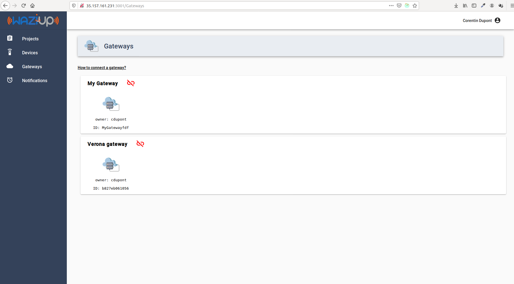

The small symbol next to the gateway icon shows if your gateway is currently connected. It should appear green if connected.
Now click on your gateway to open the details page.

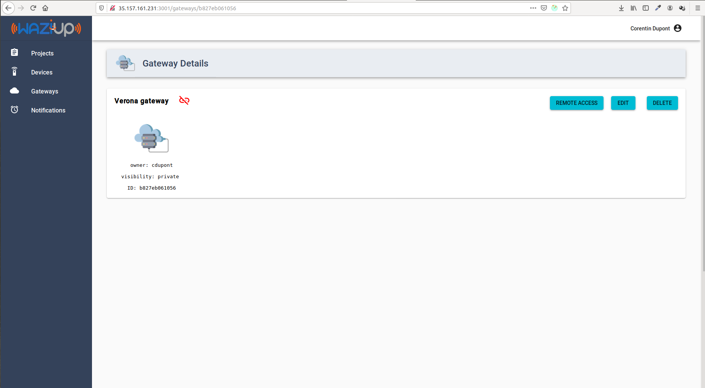

The details page shows the name, privacy and ID of your gateway.
It also shows all the devices that are connected to that gateway.
You can click a device to navigate to that device.

You can open the own Gateway UI by clicking on the "Remote access" button.
This will open the [login screen for your gateway UI](/documentation/wazigate).

Finally, you can edit the paramters of your gateway and delete it, using the corresponding buttons. 

Notifications
=============

The notifications allow you to program SMS or Twitter messages, triggered by events on your sensors.
For instance, if a sensor value becomes too high, a SMS will be sent to the user.
The notification list is shown below.
 
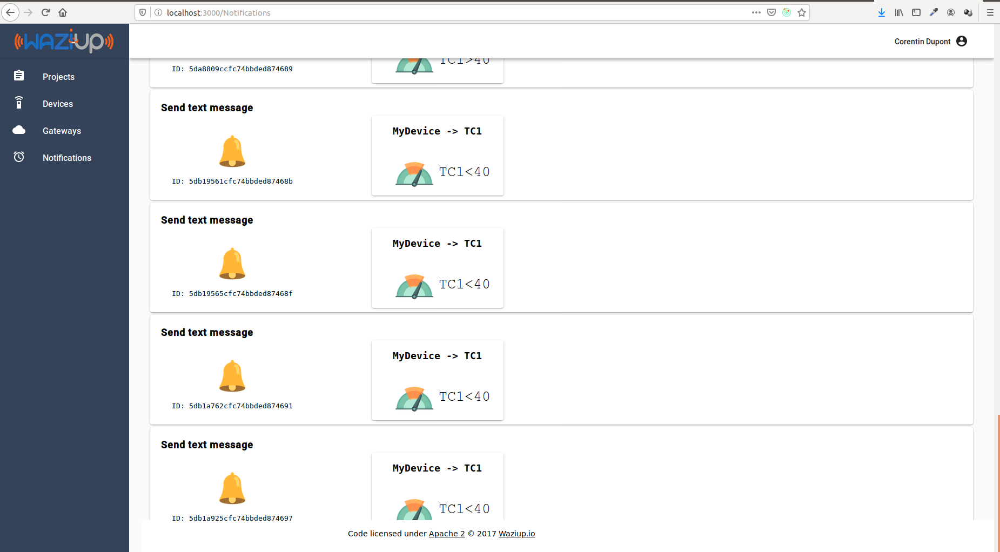

For each notification, you can see its name, ID, sensor name and condition.
Let's create a notification for your sensor!
Click on the “Add notification” button.

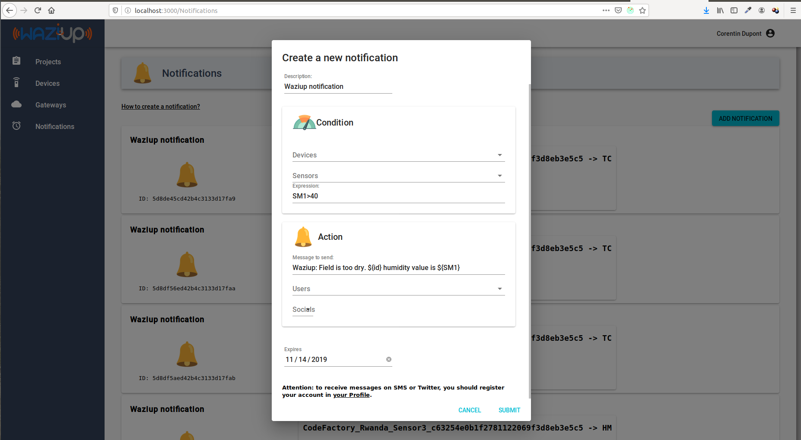

You need to select your sensor id in the list, and then the measurement id.
For instance, select *MySensor* and *TC*, to make a notification on the temperature measured by MySensor.

The next field contains the condition for sending the message.
Examples of expressions include “TC==10”, “TC==10..30”, “TC>30”, “Color==orange,red”.
The list of operators is: “==”, “!=”, “>”, “<”, “>=”, “<=”.
Several conditions can be concatenated with “;”, for example: “TC>30; HUM<20”.
The Message field contains the message to be sent to the user.
It can contain variables, which will be replaced by their values when the message is sent.
For example, you can include the current value of a sensor in the message with “Field sensor value is ${TC}”.

The next step is to select the users you want to send it to.
Select your own username here.
Finaly, select the social media to send one.
Remember, your account need to be configured with your phone number and Twitter account to receive messages.

Once this is done, you can validate.
You should be able to see your notification in the list.
You can click on that notification to view the details.

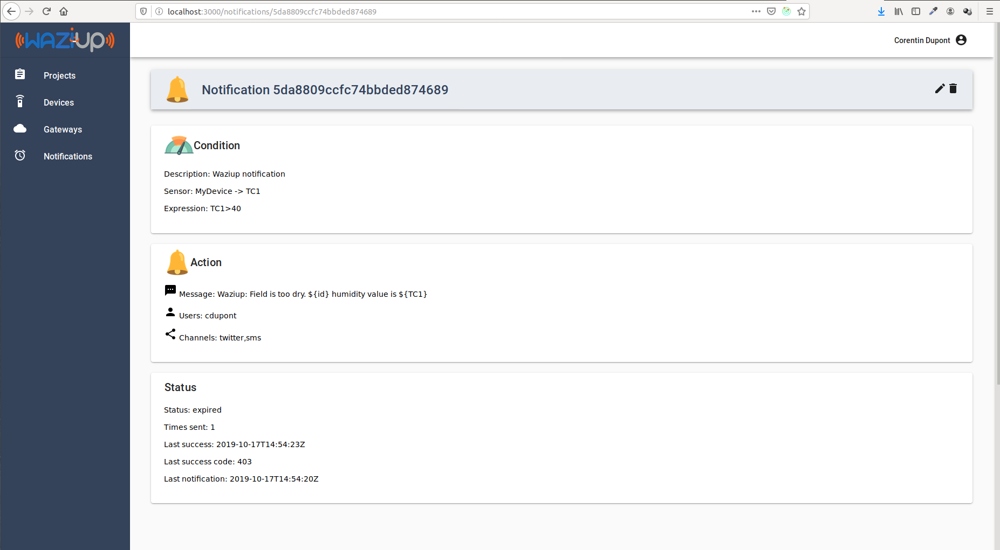

Did you receive anything?
You should see the number of times this notification was sent, and the time for the last sending in the box "Status".

