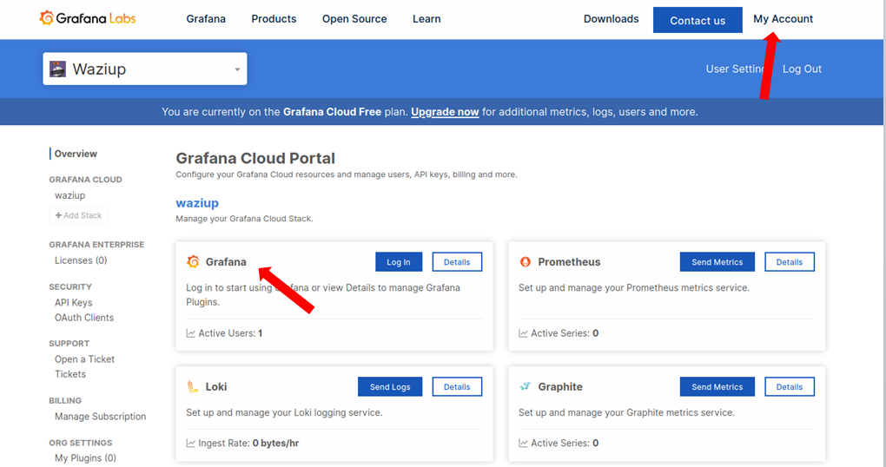
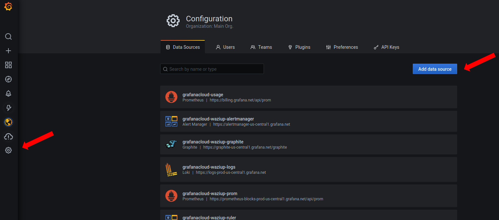
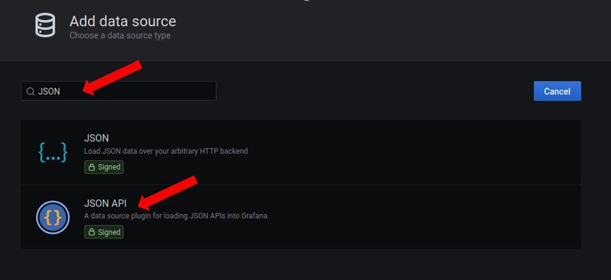
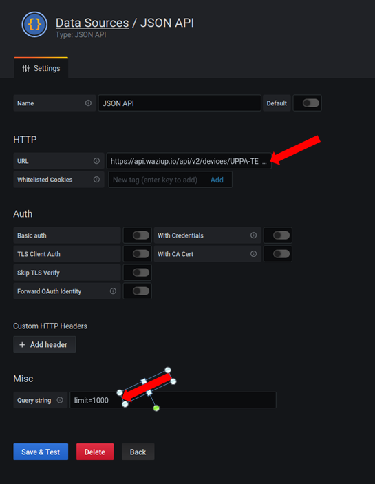
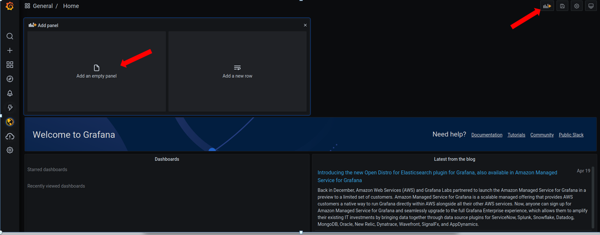
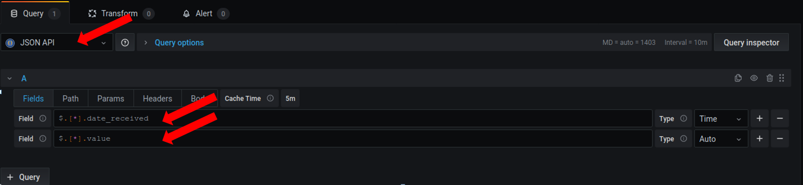
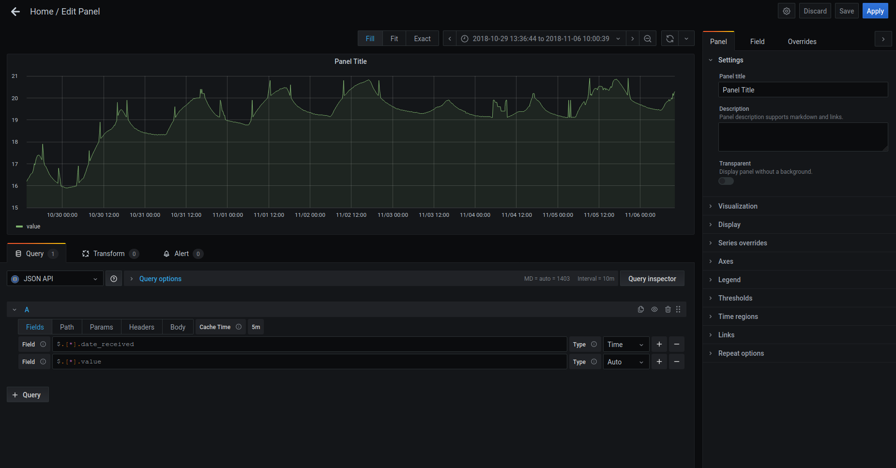
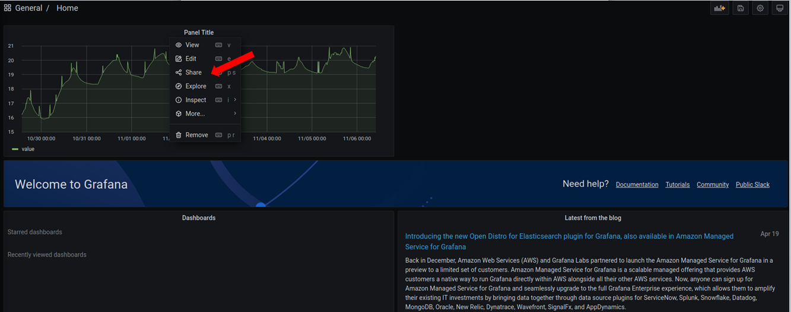
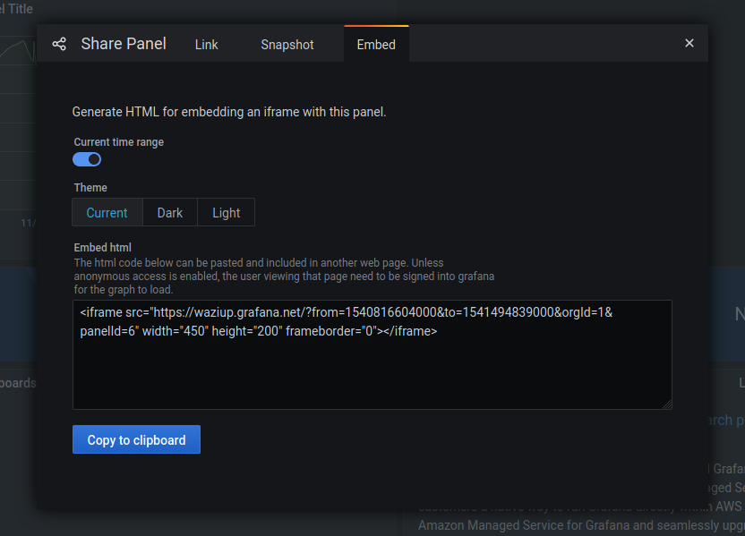

Create visualizations with Waziup

Grafana
=======

Data source
-----------

https://api.waziup.io/api/v2/devices/UPPA-TESTS_Sensor3/sensors/TC2/values

Panel
-----

Embbeding
---------

<iframe src="https://waziup.grafana.net/d-solo/QOlEnlXMk/home-copy?orgId=1&from=1618893206509&to=1618914806509&panelId=6" width="450" height="200" frameborder="0"></iframe>
