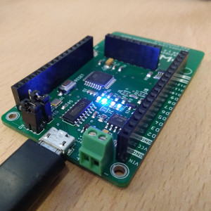

WaziDev is an integrated IoT LoRa device which provides an energy-efficient and integrated board.
In this section you will find:

- How to program your WaziDev 
- How to wire your WaziDev
- Detailed specification
