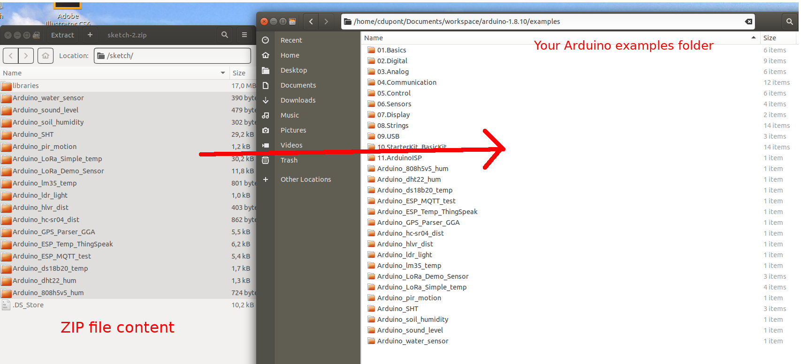
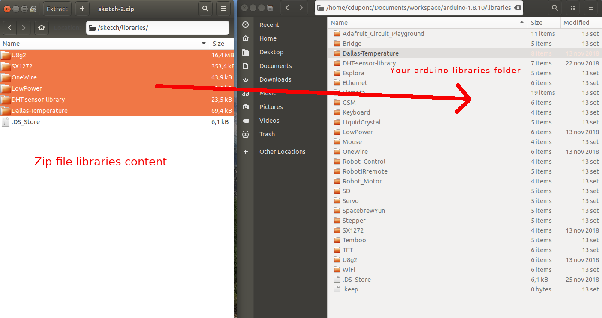
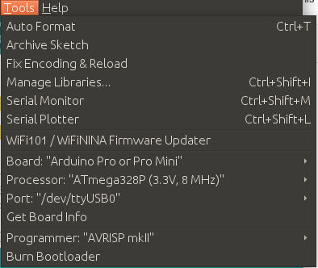
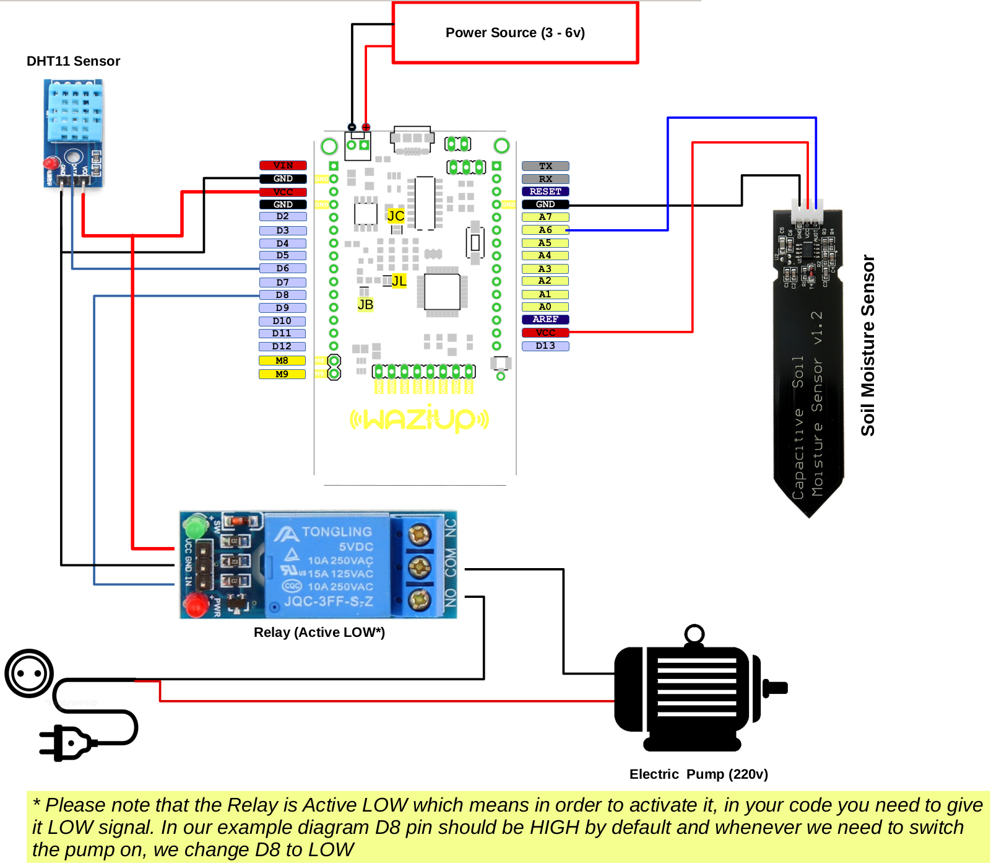
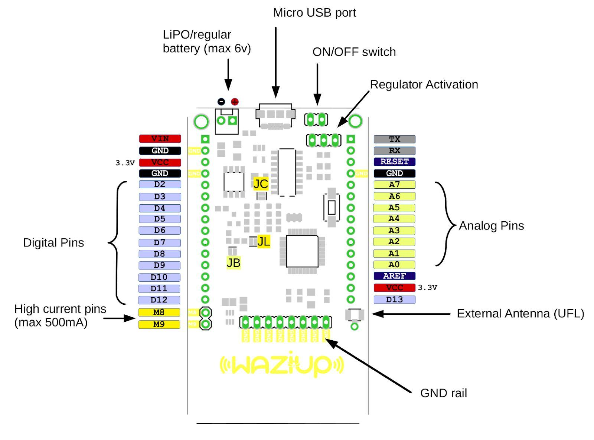

This documentation is available in [PDF format](/docs/WaziDev_User_Manual-V1.0.pdf)

Overview
========

WaziDev is a development board for prototyping IoT devices, using Arduino and LoRa radio network.
In this section you will find:

- How to program your WaziDev 
- How to wire your WaziDev
- Detailed specification

Configure
=========

This section will guide you through the installation of Arduino IDE and its configuration for the WaziDev.

Install Arduino IDE
-------------------

You can get different versions of Arduino IDE from the [Download page](http://diy.waziup.io/assets/src/sketch.zip) on the Arduino Official website.
You must select your software, which is compatible with your operating system (Windows, IOS, or Linux).
After your file download is complete, unzip the file to install the Arduino IDE.

Install the libraries and examples
----------------------------------

Download [this file](https://github.com/Waziup/iot-course/archive/master.zip).
Unzip the file and copy the content as follows. All examples from the zip should go in the "exemples" folder or Arduino:

The libraries of the zip should go in the "libraries" Arduino folder:

**Attention**: before proceeding, make sure that your Arduino folders contains all the files, as shown on the pictures above.
For instance, the folder "libraries" should contain a subfolder "SX1272".
Your programs will not compile if you don't make sure.

Configure the Arduino IDE
-------------------------

Next step is to start the arduino IDE. On Linux, you need to start it in root.
In the menu "Tools", you need to select:

- **Board**: `Arduino Pro or Mini`,
- **Processor**: `ATMega328p (3.3v, 8MHz)`.

The **port** depends on the system:

- Linux: **Port** `/dev/ttyUSB0`
- MacOS: **Port** `/dev/cu.usbserialXXXXX`
- Windows: **Port** `COM3` or higher.

When the WaziDev USB cable is connected to the laptop, the port should appear, and disappear when disconnected.

**Atention: If you don't see the corresponding port in the Port menu, [you need to install the drivers](https://learn.sparkfun.com/tutorials/how-to-install-ch340-drivers/)**

Your Arduino Tools menu should look like this:

Be **extra careful** when selecting the board, processor, and port.
You will not be able to program the board if something is wrong here.

Test your configuration
-----------------------

To test your configuration, select a program in the examples menu.
For example, Select "Files/Examples/01 Basic/Blink".
Then click on the arrow button.
This will compile and upload your program on the WaziDev.

If everything goes well, your WaziDev should display a blue blinking led!

For more informations on programming your board with Arduino IDE, go to http://diy.waziup.io.

Wiring
======

In this section you will find out to wire your WaziDev to your sensors.

Example wiring diagram
----------------------

The example below show how to wire WaziDev with two sensors and a relay.
The sensors are the DHT11 (humidity and temperature), and a soil moisture sensor.
The relay commands an electric engine.

Programming
===========

In this section we will explain how to program your WaziDev. 
First of all, connect your Arduino to your laptop via cable.

In the Arduino IDE, select the following program in the menu: `File/Examples/Arduino_LoRa_Demo_Sensor`.
Then hit "upload" (the arrow button).
You should see the message "Done uploading.".
That's it!
The program will start immediately on the WeziDev and upload data to [the dashboard](http://dashboard.waziup.io/Devices).
If you [configured your gateway](/documentation/wazigate/) correctly, you should see your device appear under your account.

To go further with arduino programming, open our DIY website)[diy.waziup.io). You can find all the sketchs for the various sensors there!

Specifications
==============

You can find below the specification of the WaziDev.

Pinout description
------------------

1. **ON/OFF switch**: This jumper can be used as on/off switch for the board. It is ON by default.
 
2. **Regulator Activation**: The jumper indicated by **DIRECT / REG** sets the board to use a regulated voltage or direct. The direct setting is only if you use an input battery of maximum 3.6V any voltage higher than that can damage the LoRa module. 
**Please note that to always keep this config in REG mode when programming the board.**
 
3. **Analog Pins**: Arduino standard analog pins A0-A7. Please note that **A7** is connected to the battery voltage level monitoring circuit which can be activated by setting the digital pin **D7** to **LOW**, so **D7** should be set to **HIGH** always.
 
4. **External Antenna (UFL)**: The board has an embedded PCB antenna which is activated by default and optimized for 868Mhz frequency. If you want to use your own antenna instead you need to deactivate the PCB antenna by cutting its jumper on the back of the board indicated by **JA** then you can connect your antenna to the UFL connector.
 
6. **High current pins** ( *max 500mA* ): **M8** and **M9** are high current/voltage programmable output pins. 
They can be programmed through digital pins **D8** and **D9** respectively. 
It can be used to activate high current/voltage devices/sensors. 
The maximum current which can be drained is **500mA** and the maximum voltage is **12v**. 
The wiring is as follows: The Ground wire of the external high current/voltage source is connected to the same ground of the board (GND), and the positive wire of the power source is connected to the high current device that needs to be controlled by our board. 
One of the pins of **M8** or **M9** is connected to the Ground of the high current device, then we can turn it on and off by writing **HIGH** and **LOW** to the digital pins **D8** or **D9** respectively.
 
7. **Digital Pins**: Arduino standard digital pins **D2-D12**. Please note that **D13** is situated on the opposite side of **D12**.
 
8. **VCC** ( *3.3v* ): WaziDev board operates with **3.3v**, VCC pins provide 3.3v as output, they can be used as input voltage as well.

9. *Lipo/regular battery*: This port is designed to be used as input for Lithium Ion rechargeable battery or just a regular battery. There is an onboard charger which enables the board to use a solar panel. 
Please note that the solar panel must be connected to either Micro *USB port* or *VIN* pin.
**Warning**: your rechargeable battery must have its own protection circuit otherwise it might gets overcharged and cause fire. (usually good quality batteries have it)
 
10. **Micro USB port**: This port is used to power the board on through USB cable and program the board via Arduino IDE.

Jumpers
-------

| Indicator  | Function                         | Default   |
| ---------- |:---------------------------------|:----------|
| JL         | LED13 and PWR LEDs               | Connected |
| JC         | Charger status LEDs (CHG, FULL)  | Connected |
| JB         | Battery level read               | Connected |
| JA         | Embedded Antenna                 | Connected |
| JS         | Power Switch                     | Open      |
| JR*        | Radio Interrupt                  | Open      |

When connected, connects the LoRa interrupt pin to **D2**

Characteristics
---------------

**Processor System**

- MCU:  ATmega328p 8Mhz
- RAM: 2 KB
- FLASH: 32 KB

**Wireless Network**

- Standard: LoRa
- Frequency Band: 863-870MHz for Europe/Africa
- Channelsi: 1
- Transmit Power: +20dBm -100mW constant RF output
- Receiver Sensitivity: -148dBm
- RF Data Rate: 300kbps
- Modulation: FSK, GFSK, GMSK, MSK, OOK
- Function: Sensor Node
- Antenna connector: Integrated PCB antenna / External UFL

**Indicator and Button**

- LED: PWR LED, Indicator LED, Charging/Full battery
- Button: 1 reset button 
- On/OFF switch: 1, two pins for on/off switch + a jumper to keep the board always on
- Regulator Switch: 1, A jumper that can be used to bypass the regulator for low power applications

**I/O**
- UART: 1
- ICSP: 1
- I2C: 1
- Analog input: 8 (Arduino standard pins: A0-A7)
- Digital I/O: 9  (Arduino pins, some are used by LoRa) 
- Extra GND
- High Current output
- USB
- Input power
| 1   1   1   8      8 (a Ground Rail)   2 (max 500mA): M8, M9   1, USB micro Type for programming and power   1, LiPo/Regular Battery |
| Power | Supply voltage   Battery support   Battery charger   Power Consumption   Battery Level monitor    Optimization Jumpers  | 3.3V - 5V   3v (max 3.6v DIRECT and 6v Regulated)   Max 1A input current (through Micro USB port)   -   LOW active on pin D7 and read BAT level on A7    2, Disabling: Status LEDs, Charger LEDs   |
| Environment | Operational Temperature    Operating Humidity | -20 ~ 70 C    5% ~ 95% Relative Humidity, non-condensing |
| Mechanical | Dimensions | 70 x 40 mm |
| Programming | IDE | Arduino compatible (Select **Pro Mini 3.3V 8Mhz**) |
