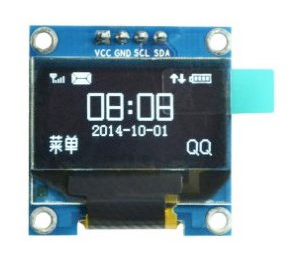
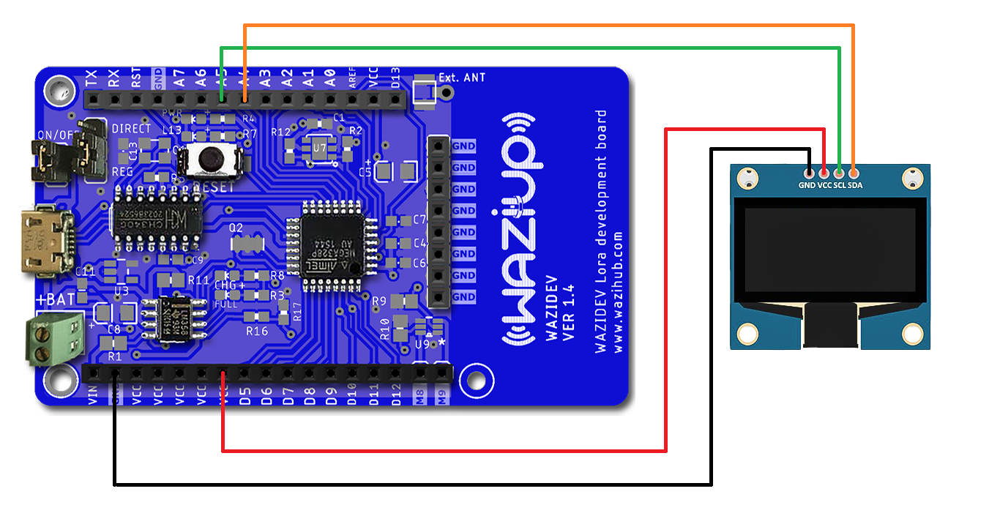
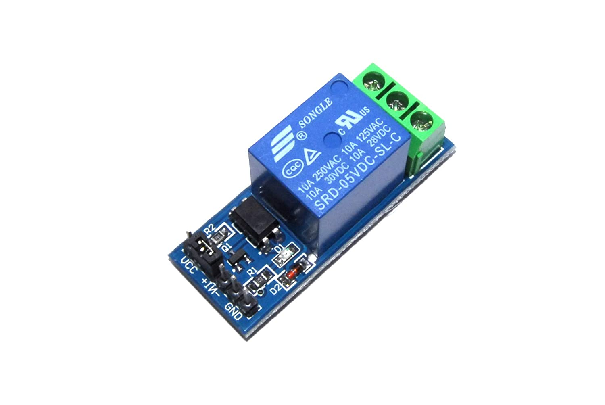
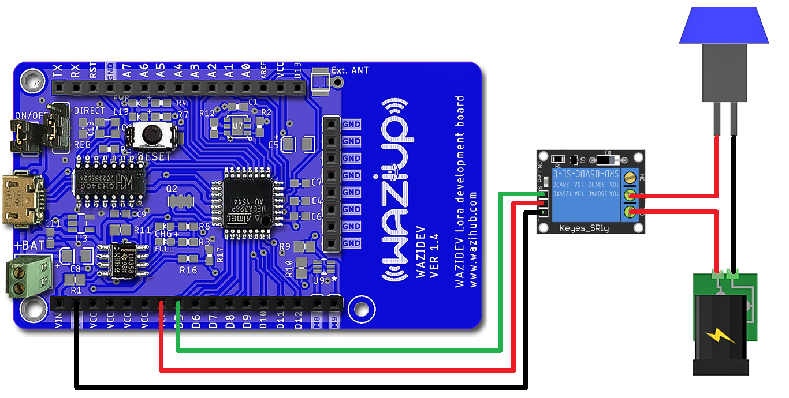

Overview
========

An actuator is a device that moves or controls some mechanism. An actuator turns a control signal into mechanical action such as an electric motor. Actuators may be based on hydraulic, pneumatic, electric, thermal or mechanical means, but are increasingly being driven by software. An actuator ties a control system to its environment.

OLED Screen
===========

An organic light-emitting diode (OLED or Organic LED), also known as an organic EL (organic electroluminescent) diode, is a light-emitting diode (LED) in which the emissive electroluminescent layer is a film of organic compound that emits light in response to an electric current. This organic layer is situated between two electrodes; typically, at least one of these electrodes is transparent. OLEDs are used to create digital displays in devices such as television screens, computer monitors, portable systems such as smartphones, handheld game consoles and PDAs. A major area of research is the development of white OLED devices for use in solid-state lighting applications

SHT
---

For connecting a small OLED screen to an Arduino, we will take the example of SHT (Sensirion) sensor and adapt the program for connecting and displaying the result on the screen.



**CONNECT TO WAZIDEV**

| **SHT Pins**        | **Wazidev pins**|
|---------------------|-----------------|
| VCC                 | VCC             |
| GND                 | GND             |
| SDA                 | A4              |
| SCL                 | A5              |



**EXAMPLE CODE**

```
#include "Sensirion.h"

#define SHTD_PIN 2
#define SHTC_PIN 3
#define SHT2x

//we can also power the SHT with a digital pin, here pin 6
#define PIN_POWER 6

#ifdef SHT2x
Sensirion sht = Sensirion(SHTD_PIN, SHTC_PIN, 0x40);
#else
Sensirion sht = Sensirion(SHTD_PIN, SHTC_PIN);
#endif

#define OLED
#ifdef OLED
#include <U8x8lib.h>
// connection may depend on the board. Use A5/A4 for most Arduino boards. 
//On ESP8266-based board we use GPI05 and GPI04. Heltec ESP32 has embedded OLED.
#if defined ARDUINO_Heltec_WIFI_LoRa_32 || defined ARDUINO_WIFI_LoRa_32 || defined HELTEC_LORA
U8X8_SSD1306_128X64_NONAME_SW_I2C u8x8(/* clock=*/ 15, /* data=*/ 4, /* reset=*/ 16);
#elif defined ESP8266 || defined ARDUINO_ESP8266_ESP01
U8X8_SSD1306_128X64_NONAME_SW_I2C u8x8(/* clock=*/ 12, /* data=*/ 14, /* reset=*/ U8X8_PIN_NONE);
#else
//reset is not used
U8X8_SSD1306_128X64_NONAME_SW_I2C u8x8(/* clock=*/ A5, /* data=*/ A4, /* reset=*/ U8X8_PIN_NONE);

//you can also power the OLED screen with a digital pin, here pin 8
#define OLED_PWR_PIN 8
#endif
char oled_msg[20];
#endif

float h;
float t;
int ret;
int retry=0;
    
void setup() {

  delay(3000);
  Serial.begin(38400);
  //and to power the temperature sensor
  pinMode(PIN_POWER,OUTPUT);
    
#ifdef OLED_PWR_PIN
  pinMode(OLED_PWR_PIN, OUTPUT);
  digitalWrite(OLED_PWR_PIN, HIGH);
#endif

#ifdef OLED
  u8x8.begin();
  u8x8.setFont(u8x8_font_chroma48medium8_r);
  u8x8.drawString(0, 1, "Arduino SHT"); 
#endif   
}

void loop() {

    digitalWrite(PIN_POWER,HIGH);
    delay(1000);
    
    while ( (ret != S_Meas_Rdy) ) {
      ret=sht.measure(&t, &h);
      retry++;
      Serial.print("[");
      Serial.print(ret);
      Serial.print(":");
      Serial.print(retry);
      Serial.print("] ");      
    }

    if (ret != S_Meas_Rdy) {
    Serial.println("Failed to read from SHT sensor!"); 
    
#ifdef OLED
        u8x8.clearLine(4);
        u8x8.clearLine(5);
        u8x8.drawString(0, 4, "error SHT...");  
#endif 
    }
    else {         
        Serial.print("Temperature: ");
        Serial.print(t);
        Serial.print(" degrees Celcius Humidity: ");
        Serial.print(h);
        Serial.println("%"); 

#ifdef OLED
        String tString=String(t);
        String hString=String(h);
        u8x8.clearLine(4);
        sprintf(oled_msg, "t=%s h=%s", tString.c_str(), hString.c_str()); 
        u8x8.drawString(0, 4, oled_msg); 
#endif      
    }
    
    digitalWrite(PIN_POWER,LOW);
    ret=0;
    retry=0;
    delay(5000);
}
```

RELAY
=====
A relay is an electrically operated switch. It consists of a set of input terminals for a single or multiple control signals, and a set of operating contact terminals. The switch may have any number of contacts in multiple contact forms, such as make contacts, break contacts, or combinations thereof.Relays are used where it is necessary to control a circuit by an independent low-power signal, or where several circuits must be controlled by one signal. 

SRD-05VDC-SLC actuator
----------------------

Simple relay magnetic circuit to meet low cost of mass production.Switching capacity available by 10A in spite of small size design for highdensity P.C. board mounting technique.Selection of plastic material for high temperature and better chemical solution performance.




**CONNECT TO WAZIDEV**



**EXAMPLE CODE**

```
/*This program allows the switching on of a lamp at regular intervals, through a relay*/
int relay1 = 5;                 // PIN to which the relay is connected to the Arduino
int t = 5000;                   // Set the time interval for turning the lamp on and off
void setup()
{
  pinMode(relay1, OUTPUT);      // Set the PIN output
  Serial.begin(9600);
}

void loop()
{
  digitalWrite(relay1, HIGH);   // close the relay switch
  Serial.println("HIGH n");
  delay(t);                     // Waiting time
  digitalWrite(relay1, LOW);    // open the ralay switch
  Serial.println("LOW n");
  delay(t);                     // Waiting time
}
```