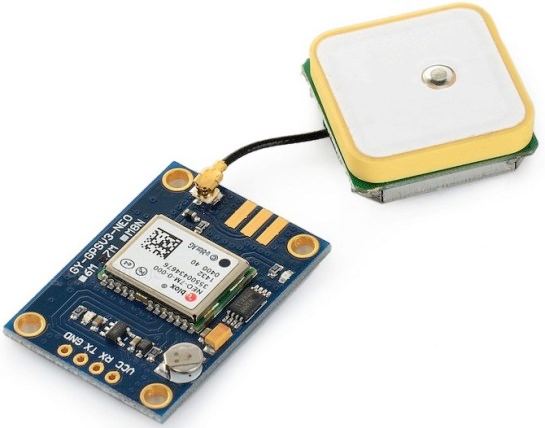

Overview
========

A device that detects the changes in electrical or physical or other quantities and thereby produces an output as an acknowledgement of change in the quantity is called as a Sensor. Generally, this sensor output will be in the form of electrical or optical signal.
The world is full of sensors and the variety of sensor applications is remarkable. Thanks to the proliferation of mobile devices, sensors are now remarkably affordable, meaning you can combine inexpensive sensors and microcontroller boards to make your own devices.

Temperature Sensor
==================

A temperature sensor is an electronic device that measures the temperature of its environment and converts the input data into electronic data to record, monitor, or signal temperature changes.

LM35 sensor
-----------

The LM35DZ is an integrated circuit analog sensor that can be used to measure temperature with an electrical output proportional to the temperature (this is why it is an analog sensor). It can measure temperature more accurately than a thermistor. The sensor circuitry is sealed and not subject to oxidation. The LM35DZ generates a higher output voltage than thermocouples and may not require that the output voltage be amplified. The LM35 has an output voltage that is proportional to the temperature.The scale factor is .01V/°C (Celcius).

LM35DZ sensor is typical of many other analog temperature sensors. If you have another analog sensor then read the data sheet to know how to calculate the real temperature from the analog value read from the input analog pin.


Technical information of this sensor is available [here](https://www.ti.com/lit/ds/symlink/lm35.pdf)

**CONNECT TO ARDUINO**


**EXAMPLE CODE**

```
/********************
 *  Program:  LM35 sensor tester
 *
 *  Description: Reads the voltage from a LM35 temperature
 *  sensor on pin A0 of the Arduino. Converts the voltage to 
 *  a temperature and sends it out of the serial port for 
 *  display on the serial monitor.
 ********************/

// Use analog pin 0 (A0) to read the output of the sensor
#define TEMP_PIN_READ A0
 
void setup(){
  Serial.begin(38400); // initialize the serial port
}

// Define a new function that reads and converts the raw reading to temperature
float temperature_celcius() { 
  return analogRead(TEMP_PIN_READ) * (5.0 / 1023.0 * 100.0); 
}

void loop(){
  Serial.print(temperature_celcius());
  Serial.println("°C");
  delay(250);
}
```

The raw source of the sketch example is visible [here](https://github.com/Waziup/WaziDev/blob/master/examples/sensors/Temperature/LM35/LM35.ino)

DS18B20 Sensor
--------------

The DS18B20 digital temperature sensor is a 1-Wire sensor. So it communicates with a master card via a 1-Wire bus. Several sensors can be connected to the same 1-Wire bus. In addition, each sensor has a unique address, so there is no risk of conflict.
A 1-Wire bus is conventionally composed of the three wires: a ground, a power (5V) and a data. A single external component is required to operate a 1-Wire bus: a simple 4.7K ohm resistor in pull-resistance to the power supply on the data pin.
n the second figure, you can see a water proof version of this sensor for outdoor deployment.

  

Documentation for this sensor is available [here](https://datasheets.maximintegrated.com/en/ds/DS18B20.pdf)

**CONNECT TO ARDUINO**


**EXAMPLE CODE**

To use a 1-Wire sensor, you need to include the [OneWire library](https://github.com/PaulStoffregen/OneWire). In addition, using the [Dallas Temperature](https://github.com/milesburton/Arduino-Temperature-Control-Library/blob/master/DallasTemperature.h) library makes getting the temperature easy.

```
  /********************
 * DS18B20 temperature sensor tester
 * https://create.arduino.cc/projecthub/TheGadgetBoy/ds18b20-digital-temperature-sensor-and-arduino-9cc806
 ********************/

// First we include the libraries
#include <OneWire.h>
#include <DallasTemperature.h>
 
// Data wire is plugged into pin 2 on the Arduino 
#define ONE_WIRE_BUS 2 

// Setup a oneWire instance to communicate with any OneWire devices  
// (not just Maxim/Dallas temperature ICs) 
OneWire oneWire(ONE_WIRE_BUS); 

// Pass our oneWire reference to Dallas Temperature. 
DallasTemperature sensors(&oneWire);

void setup() 
{ 
 // start serial port 
 Serial.begin(38400); 
 Serial.println("Dallas Temperature IC Control Library Demo"); 
 // Start up the library 
 sensors.begin(); 
} 

void loop() 
{ 
 // call sensors.requestTemperatures() to issue a global temperature 
 // request to all devices on the bus 

 Serial.print(" Requesting temperatures..."); 
 sensors.requestTemperatures(); // Send the command to get temperature readings 
 Serial.println("DONE"); 

 Serial.print("Temperature is: "); 
 Serial.print(sensors.getTempCByIndex(0)); // Why "byIndex"?  
   // You can have more than one DS18B20 on the same bus.  
   // 0 refers to the first IC on the wire 
 delay(1000); 
}
```

The raw source of the sketch example is visible [here](https://github.com/Waziup/WaziDev/blob/master/examples/sensors/Temperature/DS18B20/DS18B20.ino).

Proximity Sensor
===============

A proximity sensor is a sensor able to detect the presence of nearby objects without any physical contact. A proximity sensor often emits an electromagnetic field or a beam of electromagnetic radiation (infrared, for instance), and looks for changes in the field or return signal.

HC_SR04 sensor
-----------

The HC-SR04 is a low-cost ultrasonic ranging sensor for measuring distance. The principle of ultrasonic sensor is similar to sonar or radar in which interpretation of echoes from radio or sound waves to evaluate the attributes of a target by generating the high-frequency-sound waves (around 40kHz). The transducer used for converting energy into ultrasound or sound waves with ranges above human hearing range is called an ultrasonic transducer. Each HC-SR04 module includes an ultrasonic transmitter, a receiver and a control circuit.

There are only four pins that you need to worry about on the HC-SR04:

| **HC_SR04 pins**    | **Description**                                                                                       |
|------------------   |-------------------------------------------------------------------------------------------------------|
| VCC                 | Power Supply: 5V (warning: it may not work properly on 3.3V boards such as WaziDev)                   |
| Trig                | Trigger input of sensor: the Trig pin triggers sound                                                  |
| Echo                | Echo output of sensor: the echo pin returns the elapsed time during the reading of the reflected echo |
| GND                 | Echo output of sensor: the echo pin returns the elapsed time during the reading of the reflected echo |


Documentation for this sensor is available [here](https://cdn.sparkfun.com/datasheets/Sensors/Proximity/HCSR04.pdf). If you want to understand the details of how an ultra-sonic sensor for measuring distance works, you can have a look at this [page](https://howtomechatronics.com/tutorials/arduino/ultrasonic-sensor-hc-sr04/)

**CONNECT TO ARDUINO**


**EXAMPLE CODE**

```
/********************
 *  Program:  HC-SR04 sensor tester
 *  Description: print distance to serial
 ********************/

#define ECHO_PIN 6 	
#define TRIG_PIN 7 

void setup(){
  Serial.begin(38400); // initialize the serial port
  pinMode(TRIG_PIN, OUTPUT);
  digitalWrite(TRIG_PIN, LOW);
  pinMode(ECHO_PIN, INPUT);
}

// Define a new function that reads and converts the raw reading to distance (cm)
float distance_centimetre() {
  // Send sound pulse
  digitalWrite(TRIG_PIN, HIGH); // pulse started
  delayMicroseconds(12);
  digitalWrite(TRIG_PIN, LOW); // pulse stopped

  // listen for echo 
  float tUs = pulseIn(ECHO_PIN, HIGH); // microseconds
  float distance = tUs / 58; // cm 
  return distance;
}

void loop(){
  Serial.print(distance_centimetre());
  Serial.println(" cm");
  delay(1000); // ms 
}
```
The raw source of the sketch example is visible [here](https://github.com/Waziup/WaziDev/blob/master/examples/sensors/Distance/HC_SR04/HC_SR04.ino)

HRLV-MAXSONAR-EZ sensor
-----------

The high resolution HRLV‑MaxSonar‑EZ senors are high performance ultrasonic sensors with noise rejection, improved automatic calibration, and factory calibrated beam patterns. The HRLV‑MaxSonar‑EZ sensors have three outputs: Analog Voltage, Pulse Width, RS232 or TTL serial data.


Documentation for this sensor is available [here](https://www.maxbotix.com/documents/HRLV-MaxSonar-EZ_Datasheet.pdf).

**CONNECT TO ARDUINO**

| **HRLV pins**    | **Arduino pins** |
|------------------|------------------|
| GND              | GND              |
| AN               | AO               |
| +5V              | 5V               |


**EXAMPLE CODE**

```
/********************
* HRLV EZ Max sonar 
* Reading analog voltage
* http://www.maxbotix.com
****************/

int sonarPin = A0;
float mm = 0.0;

void setup() {
  Serial.begin(38400);
}

void loop() {
  mm = analogRead(sonarPin) * 5;
  Serial.print(mm);
  Serial.println("mm");
  delay(100);
}
```
The raw source of the sketch example is visible [here](https://github.com/Waziup/WaziDev/blob/master/examples/sensors/Distance/HRLV-MAXSONAR-EZ/HRLV-MAXSONAR-EZ.ino)

Humidity Sensor
===============

Humidity sensors are commonly used in the meteorology, medical, automobile, HVAC and manufacturing industries. ( Getty Images) A humidity sensor is an electronic device that measures the humidity in its environment and converts its findings into a corresponding electrical signal.

DHT11 sensor
-----------

The DHT11 is a basic, ultra low-cost digital temperature and humidity sensor. It uses a capacitive humidity sensor and a thermistor to measure the surrounding air, and spits out a digital signal on the data pin (no analog input pins needed). Its fairly simple to use, but requires careful timing to grab data. The only real downside of this sensor is you can only get new data from it once every 2 seconds, so when using our library, sensor readings can be up to 2 seconds old.

Compared to the DHT22, this sensor is less precise, less accurate and works in a smaller range of temperature/humidity, but its smaller and less expensive


Documentation for this sensor is available [here](https://www.mouser.com/datasheet/2/758/DHT11-Technical-Data-Sheet-Translated-Version-1143054.pdf).

**CONNECT TO ARDUINO**


**EXAMPLE CODE**

```
/********************
 * Program:  DHT11 sensor tester
 * Description: print humidity and temperature to serial
 ********************/
 
#include <DHT.h>

//Constants
#define DHTPIN 2     // what pin on the arduino is the DHT22 data line connected to
#define DHTTYPE DHT11   // DHT 11
DHT dht(DHTPIN, DHTTYPE); // Initialize DHT sensor for normal Arduino

void setup() { // to run once
  Serial.begin(38400); // Initialize the serial port
  Serial.println("DHT11 Humidity - Temperature Sensor");
  Serial.println("RH\t Temp (C)");

//  pinMode(5, OUTPUT);  digitalWrite(5, LOW);
  pinMode(3, OUTPUT);  digitalWrite(3, HIGH);
  
  dht.begin();
  delay(2000);
}

void loop() {
  // Reading temperature or humidity takes about 250 milliseconds!
  // Sensor readings may also be up to 2 seconds 'old' (its a very slow sensor)
  float h = dht.readHumidity();
  float t = dht.readTemperature();
  // Check if any reads failed and exit early (to try again).
  if (isnan(h) || isnan(t)) {
    Serial.println("Failed to read from DHT11 sensor!");
    return;
  }

  Serial.print(h); 
  Serial.print(" %\t\t");
  Serial.print(t); 
  Serial.println(" °C");
  // Wait a few seconds between measurements. The DHT11 should not be read at a higher frequency of
  // about once every 2 seconds. So we add a 3 second delay to cover this.
  delay(3000);
}
```
The raw source of the sketch example is visible [here](https://github.com/Waziup/WaziDev/blob/master/examples/sensors/Temperature/DHT11/DHT11.ino)

DHT22 sensor
-----------

The DHT-22 is a low cost device for measuring humidity and temperature. The DHT sensors are made of two parts, a capacitive humidity sensor and a thermistor. The device requires a 3 to 5V power supply. It uses a single data wire to communicate back to the Arduino. It has a fairly slow update rate and should only be sampled every 2 seconds.
In the second figure, you can see an AM2305 sensor. These sensors are compatible with DHT22 and have exactly the same code.

 

Documentation for this sensor is available [here](http://static.cactus.io/docs/sensors/temp-humidity/dht22/dht22-datasheet.pdf).

**CONNECT TO ARDUINO**

| **DHT22 pins** | **Arduino pins**         |
|----------------|--------------------------|
| Pin 1          | 5V                       |
| Pin 2          | 10K resistor Arduino  Digital Pin 2|
| Pin 3          | Not used                 |
| Pin 4          | GND                      |


You can find the DHT22 (like the one shown in the figure below) on a small PCB which already has the resistor, in which case you don't need to connect the resistor.


**EXAMPLE CODE**

To use a DHT sensor model, you need to include the [DHT](https://github.com/adafruit/DHT-sensor-library) library. If you have the DHT11 sensor instead of the DHT22, comment DHTTYPE DHT22 and uncomment DHTTYPE DHT11 lines.

```
/********************
 * Program:  DHT22 sensor tester
 * Description: print humidity and temperature to serial
 ********************/
 
#include <DHT.h>

//Constants
#define DHTPIN 2     // what pin on the arduino is the DHT22 data line connected to
#define DHTTYPE DHT22   // DHT 22  (AM2302)
//#define DHTTYPE DHT11   // DHT 11
DHT dht(DHTPIN, DHTTYPE); // Initialize DHT sensor for normal 16mhz Arduino

void setup() { // to run once
  Serial.begin(38400); // Initialize the serial port
  Serial.println("DHT22 Humidity - Temperature Sensor");
  Serial.println("RH\t Temp (C)");
  dht.begin();
}

void loop() {
  // Reading temperature or humidity takes about 250 milliseconds!
  // Sensor readings may also be up to 2 seconds 'old' (its a very slow sensor)
  float h = dht.readHumidity();
  float t = dht.readTemperature();
  // Check if any reads failed and exit early (to try again).
  if (isnan(h) || isnan(t)) {
    Serial.println("Failed to read from DHT22 sensor!");
    return;
  }

  Serial.print(h); 
  Serial.print(" %\t\t");
  Serial.print(t); 
  Serial.print(" °C");
  // Wait a few seconds between measurements. The DHT22 should not be read at a higher frequency of
  // about once every 2 seconds. So we add a 3 second delay to cover this.
  delay(3000);
}
```
The raw source of the sketch example is visible [here](https://github.com/Waziup/WaziDev/blob/master/examples/sensors/Temperature/DHT11/DHT11.ino)

SOIL HUMIDITY sensor
-----------

Soil moisture sensors measures the amount of water in the soil to maintain consistent and ideal soil conditions for plants. They can be used to detect the moisture of soil or judge if there is water around the sensor. They can be very easy to use, just insert it into the soil and then read it.


Documentation for this sensor is available [here](https://www.mouser.com/datasheet/2/744/Seeed_101020008-838655.pdf).

**CONNECT TO ARDUINO**

There are only three pins that you need to worry about on the soil humidity sensor:

| **SOIL SENSOR pins** | **Arduino pins**         |
|----------------------|--------------------------|
| VCC                  | 5V                       |
| GND                  | GND                      |
| A0                   | A0                       |


**EXAMPLE CODE**

```
/********************
 * Soil humidity sensor tester
 * Read soil humidity by measuring its resistance.
 ********************/

int sensorPin = A0;
int soilHumidity = -1;

void setup() {
  Serial.begin(38400);  
}

void loop() {
  soilHumidity = analogRead(sensorPin);
  Serial.println(soilHumidity);
  delay(100);
}
```
The raw source of the sketch example is visible [here]https://github.com/Waziup/WaziDev/blob/master/examples/sensors/Humidity/SOIL_MOISTURE/SOIL_MOISTURE.ino)

WATER LEVEL sensor
-----------

Level sensors are used to detect the level of substances that can flow. Such substances include liquids, granular material and can also be used to measure powdered substances.

Level sensors are widely used industrially, as level acts as an important monitoring parameter. This is a low cost easy to use sensor. The water level sensor module has a series of parallel exposed traces to measure droplets/water volume in order to determine the water level. Very Easy to monitor water level as the output to an analog signal is directly proportional to the water level.


This is a probe type water level sensor. Point Probe sensors are mostly Capacitive type or Resistive. It measures change in the value of capacitance when the sensor is dipped into the liquid. The change corresponds to Level variation.
The same code can be used for a rain drop sensor as well, as the principle is similar.

If the board has water or another fluid covering all the wire, then it will output a maximum analog value reading. Since analog values read by an Arduino range from 0 (lowest reading) to 1023 (highest reading), a board completely submerged with a liquid will have a reading of 1023 by an Arduino And if its not submerged into liquid, then a near 0 reading is obtained.

 

Documentation for this sensor is available [here](https://scidle.com/how-to-use-a-water-level-sensor-module-with-arduino/).

**CONNECT TO ARDUINO**

There are only three pins on the water level sensor:

| **Water level pins**   | **Arduino pins**         |
|----------------------  |--------------------------|
| +                      | 5V or 3.3V               |
| -                      | GND                      |
| S                      | 0                        |


**EXAMPLE CODE**

```
/********************
 * Water level sensor tester
 * measuring the capacitance of water and hence the water level.
 ********************/
int sensorPin = A0; 
int sensorValue = 0;
 
void setup() {
 Serial.begin(9600); 
}
 
void loop() {
 sensorValue = analogRead(sensorPin); 
 
 Serial.print("Sensor = " ); 
 Serial.print(sensorValue*100/1024); 
 Serial.println("%");
 
 delay(1000); 
} 
```
The raw source of the sketch example is visible [here](https://diy.waziup.io/assets/src/sketch/Arduino_water_sensor/Arduino_water_sensor.ino)

Motion sensor
=============

A motion sensor (or motion detector) is the linchpin of your security system, because it's the main device that detects when someone is in your home when they shouldn't be. A motion sensor uses one or multiple technologies to detect movement in an area

Passive infrared (PIR) sensor
-----------

PIR sensors allow you to sense motion, almost always used to detect whether a human has moved in or out of the sensors range. They are small, inexpensive, low-power, easy to use and don't wear out. For that reason they are commonly found in appliances and gadgets used in homes or businesses. They are often referred to as PIR, "Passive Infrared", "Pyroelectric", or "IR motion" sensors.

 

Documentation for this sensor is available [here](https://learn.adafruit.com/pir-passive-infrared-proximity-motion-sensor/how-pirs-work).

**CONNECT TO ARDUINO**


**EXAMPLE CODE**

```
/********************
 *  Program:  PIR sensor tester
 ********************/
    
int ledPin = 13;               // choose the pin for the LED
int inputPin = 2;               // choose the input pin (for PIR sensor)
int pirState = LOW;             // we start, assuming no motion detected
int val = 0;                    // variable for reading the pin status

void setup(){
  pinMode(ledPin, OUTPUT);      // declare LED as output
  pinMode(inputPin, INPUT);     // declare sensor as input

  Serial.begin(38400);
}

void loop(){
  val = digitalRead(inputPin);  // read input value
  if (val == HIGH) {            // check if the input is HIGH
    digitalWrite(ledPin, HIGH);  // turn LED ON
    if (pirState ==  LOW){
      // we have just turned on
      Serial.println("Motion detected!");
      // We only want to print on the output change, not state
      pirState = HIGH;
   }
  } else {
    digitalWrite(ledPin,LOW); // turn LED OFF
    if (pirState == HIGH){
      // we have just turned of
      Serial.println("Motion ended!");
      // We only want to print on the output change, not state
      pirState = LOW;
    }
  }
}
```
The raw source of the sketch example is visible [here](https://github.com/Waziup/WaziDev/blob/master/examples/sensors/Motion/PIR/PIR.ino)

Light sensor
============

The light sensor is a passive devices that convert this “light energy” whether visible or in the infra-red parts of the spectrum into an electrical signal output. Light sensors are more commonly known as “Photoelectric Devices” or “Photo Sensors” because the convert light energy (photons) into electricity (electrons).

Photoresistor sensor (LDR)
-----------

Photoresistors, also known as light dependent resistors (LDR), are light sensitive devices most often used to indicate the presence or absence of light, or to measure the light intensity. In the dark, their resistance is very high, sometimes up to 1MΩ, but when the LDR sensor is exposed to light, the resistance drops dramatically, even down to a few ohms, depending on the light intensity. LDRs have a sensitivity that varies with the wavelength of the light applied and are nonlinear devices.

 

Documentation for this sensor is available [here](http://www.resistorguide.com/photoresistor/).

**CONNECT TO ARDUINO**


The typical reistor is 10kOhms but you can also find the LDRs (like the one shown in the figure below) that already contains the resistor, in which case you don't need to connect the resistor.


**EXAMPLE CODE**

```
/********************
 * Program:  Photocell simple testing sketch.
 * Connect one end of the photocell to 5V, the other end to Analog 0.
 * Then connect one end of a 10K resistor from Analog 0 to ground
 * For more information see http://learn.adafruit.com/photocells
 ********************/

int photocellPin = A0; // the cell and 10K pulldown are connected to A0
int photocellReading; // the analog reading from the analog resistor divider

void setup() {
  // We'll send debugging information via the Serial monitor
  Serial.begin(38400);
}

void loop() {
  photocellReading = analogRead(photocellPin);
  Serial.print("Analog reading = ");
  Serial.print(photocellReading); // the raw analog reading
  // We'll have a few threshholds, qualitatively determined
  if (photocellReading < 10) {
    Serial.println(" - Black");
  } else if (photocellReading < 200) {
    Serial.println(" - Dark");
  } else if (photocellReading < 500) {
    Serial.println(" - Light");
  } else if (photocellReading < 800) {
    Serial.println(" - Luminous");
  } else {
    Serial.println(" - Bright");
  }
  delay(2000);
}

```
The raw source of the sketch example is visible [here](https://github.com/Waziup/WaziDev/blob/master/examples/sensors/Light/LDR/LDR.ino)

Sound sensor 
============

A sound sensor is defined as a module that detects sound waves through its intensity and converting it to electrical signals.

MIC sensor
-----------

The BOB-09964 breakout board couples a small electret microphone (100Hz-10kHz) with a 60x mic preamplifier to amplify the sounds of voice, claps, door knocks or any loud enough to be picked up by a microcontroller's analog-to-digital converter.

The Electret Mic Breakout translates amplitude (not volume) by capturing sound waves between two conducting plates (one a vibrating diaphragm and the other fixed) in the microphone and converting them into electrical waves. These electrical signals are then amplified and picked up by your microcontroller’s ADC.

 

Documentation for this sensor is available [here](http://cdn.sparkfun.com/datasheets/Sensors/Sound/CEM-C9745JAD462P2.54R.pdf/).

**CONNECT TO ARDUINO**

There are only three pins that you need to worry about on the MIC sensor. Wired as follows:

| **MIC pins**   | **Arduino pins**         |
|----------------|--------------------------|
| AUD            | A0                       |
| GDN            | GND                      |
| VCC            | 3.3V                     |


**EXAMPLE CODE**

This sketch reads and displays sound level to serial. It prints "Sound" on loud sound.

```
/********************
 *  Program:  MIC Sensor tester
 *  Description: print audio volume level to serial. Print "Sound" on loud sound.
 ********************/

#define AUDIO_READ_PIN A0 // Analog pin 0 to read the output of the sensor
#define SENSITIVITY 850  

void setup(){
  Serial.begin(115200); // initialize the serial port
}

void loop(){
  int sound_wave =   analogRead(AUDIO_READ_PIN);
  Serial.print(sound_wave);
  
  if (sound_wave > SENSITIVITY) {  // On loud sound
    Serial.println("Sound!");
    delay(500);
  }  
  delay(100); // ms
}
```
The raw source of the sketch example is visible [here](https://github.com/Waziup/WaziDev/blob/master/examples/sensors/Sound/MIC/MIC.ino)

Radio frequency sensor
======================

A radio frequency identification reader (RFID reader) is a device used to gather information from an RFID tag, which is used to track individual objects. Radio waves are used to transfer data from the tag to a reader. RFID is a technology similar in theory to bar codes.

RFID and RC522 Module
-----------

RFID means radio-frequency identification. RFID uses electromagnetic fields to transfer data over short distances. The RFID module detects the badges or magnetic cards within 10cm.

RFID or Radio Frequency Identification system consists of two main components, a transponder/tag attached to an object to be identified, and a Transceiver also known as interrogator/Reader. A Reader consists of a Radio Frequency module and an antenna which generates high frequency electromagnetic field. On the other hand, the tag is usually a passive device, meaning it doesn’t contain a battery. Instead it contains a microchip that stores and processes information, and an antenna to receive and transmit a signal.

Passing the tag near the reader, makes it possible to read the Unique Identifier (UID) of the card as well as the recorded data. One of the most commonly found low-cost RFID is the RC522.

Documentation for this sensor is available [here](https://diy.waziup.io/assets/src/sketch/libraries/MFRC522/doc/rfidmifare.pdf).

**CONNECT TO ARDUINO**

There are only three pins that you need to worry about on the MIC sensor. Wired as follows:

| **RFID pins**  | **Arduino pins**                           |
|----------------|--------------------------------------------|
| SDA            | Digital 10                                 |
| SCK            | Digital 13                                 |
| MOSI           | Digital 11                                 |
| MISO           | Digital 12                                 |
| IRQ            | Unconnected                                |
| GDN            | GDN                                        |
| RST            | Digital 9                                  |
| 3.3V           | 3.3V (caution: must use 3.3V and not 5V)   |

 

**EXAMPLE CODE**

### Example 1

We will use the MFRC522 [library](https://github.com/miguelbalboa/rfid)

```
* This is a MFRC522 library example; for further details and other examples see: https://github.com/miguelbalboa/rfid
 * 
 * Example sketch/program showing how to read data from a PICC (that is: a RFID Tag or Card) using a MFRC522 based RFID
 * Reader on the Arduino SPI interface.
 * 
 * When the Arduino and the MFRC522 module are connected (see the pin layout below), load this sketch into Arduino IDE
 * then verify/compile and upload it. To see the output: use Tools, Serial Monitor of the IDE (hit Ctrl+Shft+M). When
 * you present a PICC (that is: a RFID Tag or Card) at reading distance of the MFRC522 Reader/PCD, the serial output
 * will show the ID/UID, type and any data blocks it can read. Note: you may see "Timeout in communication" messages
 * when removing the PICC from reading distance too early.
 * 
 * If your reader supports it, this sketch/program will read all the PICCs presented (that is: multiple tag reading).
 * So if you stack two or more PICCs on top of each other and present them to the reader, it will first output all
 * details of the first and then the next PICC. Note that this may take some time as all data blocks are dumped, so
 * keep the PICCs at reading distance until complete.
 *
* @license Released into the public domain.
 * 
 * Typical pin layout used:
 * -----------------------------------------------------------------------------------------
 *             MFRC522      Arduino       Arduino   Arduino    Arduino          Arduino
 *             Reader/PCD   Uno/101       Mega      Nano v3    Leonardo/Micro   Pro Micro
 * Signal      Pin          Pin           Pin       Pin        Pin              Pin
 * -----------------------------------------------------------------------------------------
 * RST/Reset   RST          9             5         D9         RESET/ICSP-5     RST
 * SPI SS      SDA(SS)      10            53        D10        10               10
 * SPI MOSI    MOSI         11 / ICSP-4   51        D11        ICSP-4           16
 * SPI MISO    MISO         12 / ICSP-1   50        D12        ICSP-1           14
 * SPI SCK     SCK          13 / ICSP-3   52        D13        ICSP-3           15
 * 
 * When using Arduino Pro Mini, use the pin layout of Arduino Nano
 * When using Heltec ESP32 WiFi LoRa see below
 * modified by C. Pham
 */
 
#include< SPI.h>
#include "MFRC522.h"

//#define ESP32  
//#define ARDUINO_Heltec_WIFI_LoRa_32  

#if ARDUINO_Heltec_WIFI_LoRa_32 || defined ESP32
#define SS_PIN 5
#define RFID_SCK 18
#define RFID_MOSI 23
#define RFID_MISO 19
#define RST_PIN 22
#else
#define RST_PIN  9   // Configurable, see typical pin layout above 
#define SS_PIN  10   // Configurable, see typical pin layout above 
#endif

MFRC522 mfrc522(SS_PIN, RST_PIN);     // Create MFRC522 instance

void setup() {

	Serial.begin(38400);

#ifdef ARDUINO_Heltec_WIFI_LoRa_32
	SPI.begin(RFID_SCK, RFID_MISO, RFID_MOSI);    // Initialize SPI bus
#else
	SPI.begin();     // Initialize SPI bus 
#endif

	mfrc522.PCD_Init();	      // Initialize MFRC522 
	delay(4);   // Optional delay. Some board do need more time after init to be ready, see Readme
	
	mfrc522.PCD_DumpVersionToSerial();     // Show details of PCD - MFRC522 Card Reader details 
	Serial.println(F("Scan PICC to see UID, SAK, type, and data blocks..."));
}	
void loop() {

	// Reset the loop if no new card present on the sensor/reader. This saves the entire process when idle.
	if ( ! mfrc522.PICC_IsNewCardPresent()) {
	return;
	}

	// Select one of the cards
	if ( ! mfrc522.PICC_ReadCardSerial()) {
	return;
	}

	// Dump debug info about the card; PICC_HaltA() is automatically called 
	mfrc522.PICC_DumpToSerial(&(mfrc522.uid));
}
```
The complete code for example 1 can be found [here](https://diy.waziup.io/assets/src/sketch/Arduino_MFRC522_DumpInfo/Arduino_MFRC522_DumpInfo.ino). Note that if you use an ESP32 such as the ESP32-WROOM or the Heltec ESP32 described later in "Use board with WiFi" to have WiFi Internet connectivity to handle/process your tag ID then you have to connect the RFID reader as defined in the code.

In the code, you can see the main 4 functions that are used: mfrc522.PCD_Init() to initialize the library and the reader to be executed once, then (1) mfrc522.PICC_IsNewCardPresent() to test whether an RFID tag is detected, (2) mfrc522.PICC_ReadCardSerial() to check whether data can be read from the RFID tag and, (3) mfrc522.PICC_DumpToSerial() to dump the RFID tag content. The last function is very specific to this example as dumping the RFID tag content is not something you do oftenly.

After flashing the Arduino_MFRC522_DumpInfo sketch, open the serial monitor and you should see something like the image below:

 

As the whole content of the card is dumped, When bringing the card near the RC522 module, you need to keep the card near the reader until all the information is completely read.


In the image above, you can see the UID number of the tag and also the 1kB of memory which is divided into 16 sectors (from 0 to 15). Each sector has 4 blocks (blocks are numbered sequenctially from 0 to 63) and each block can store 16 bytes of data (16 sectors x 4 blocks x 16 bytes of data = 1024 bytes = 1K memory). This information is highlighted in the image for sector 10.
The last block of each sector (for instance block 7 for sector 1) is called the ‘Sector Trailer’ and contains information called Access Bits to grant read and write access to remaining blocks in a sector. That means only the bottom 3 blocks (for instance block 4, 5 & 6 for sector 1) of each sector are actually available for data storage, meaning we have 48 bytes per 64-byte sector available for our own use. Also Block 0 of sector 0 is known as Manufacturer Block/Manufacturer Data and it contains the IC manufacturer data, and the Unique IDentifier (UID).

*WARNING: It is very risky to overwrite the Manufacturer Block and it may permanently lock the card*.

To write the information in a tag, it is necessary to define three things: the sector, address and the data. We can put any hexadecimal data.

Also remember never select last block of any sector. Writing into ‘Sector Trailer’ block can make the block unusable.

### Example 2

```
#include< SPI.h>
#include "MFRC522.h"

//#define ESP32  
//#define ARDUINO_Heltec_WIFI_LoRa_32  

#if ARDUINO_Heltec_WIFI_LoRa_32 || defined ESP32
#define SS_PIN 5
#define RFID_SCK 18
#define RFID_MOSI 23
#define RFID_MISO 19
#define RST_PIN 22
#else
#define RST_PIN  9   // Configurable, see typical pin layout above 
#define SS_PIN  10   // Configurable, see typical pin layout above 
#endif

MFRC522 mfrc522(SS_PIN, RST_PIN);     // Create MFRC522 instance

// Init array that will store new NUID
byte nuidPICC[4];

void setup() {

	Serial.begin(38400);

#ifdef ARDUINO_Heltec_WIFI_LoRa_32
	SPI.begin(RFID_SCK, RFID_MISO, RFID_MOSI);    // Initialize SPI bus
#else
	SPI.begin();     // Initialize SPI bus 
#endif

	rfid.PCD_Init();	      // Initialize MFRC522 
}

void loop() {

	// Reset the loop if no new card present on the sensor/reader. This saves the entire process when idle.
	if ( ! rfid.PICC_IsNewCardPresent()) {
		return;
	}

	// Verify if the NUID has been readed
	if ( ! rfid.PICC_ReadCardSerial()) {
		return;
	}

	Serial.print(F("PICC type: "));
	MFRC522::PICC_Type piccType = rfid.PICC_GetType(rfid.uid.sak);
	Serial.println(rfid.PICC_GetTypeName(piccType));

	// Check is the PICC of Classic MIFARE type
	if (piccType != MFRC522::PICC_TYPE_MIFARE_MINI &&  
    		piccType != MFRC522::PICC_TYPE_MIFARE_1K &&
    		piccType != MFRC522::PICC_TYPE_MIFARE_4K) {
    		Serial.println(F("Your tag is not of type MIFARE Classic."));
		return;
	}
	
	if (rfid.uid.uidByte[0] != nuidPICC[0] || 
    		rfid.uid.uidByte[1] != nuidPICC[1] || 
    		rfid.uid.uidByte[2] != nuidPICC[2] || 
    		rfid.uid.uidByte[3] != nuidPICC[3] ) {
    		Serial.println(F("A new card has been detected."));

		// Store NUID into nuidPICC array
		for(byte i = 0; i < 4; i++) {
			nuidPICC[i] = rfid.uid.uidByte[i];
		}

		Serial.println(F("The NUID tag is:"));
		Serial.print(F("In hex: "));
		printHex(rfid.uid.uidByte, rfid.uid.size);
		Serial.println();
 		Serial.print(F("In dec: "));   
    		printDec(rfid.uid.uidByte, rfid.uid.size);
    		Serial.println();
	}
	else Serial.println(F("Card read previously."));

	// Halt PICC
	rfid.PICC_HaltA();
	
	// Stop encryption on PCD	
	rfid.PCD_StopCrypto1();
}


/**
 * Helper routine to dump a byte array as hex values to Serial. 
 */	
void printHex(byte *buffer, byte bufferSize) {
	for(bytei = 0; i < bufferSize; i++) {
 	Serial.print(buffer[i], HEX); 
  }
}

/**
 * Helper routine to dump a byte array as hex values to Serial. 
 */
void printDec(byte *buffer, byte bufferSize) {
	for(bytei = 0; i < bufferSize; i++) {
 	Serial.print(buffer[i], DEC); 
  }
}
```
The complete code for example 2 can be found [here](https://diy.waziup.io/assets/src/sketch/Arduino_MFRC522_ReadNUID/Arduino_MFRC522_ReadNUID.ino). If you run the example, you can see that the processing task is much faster than the previous example. This is typically the operation you will perform in a real-world RFID-based application: read the card ID, then act according to the ID.

Once you run the example and bring the card near the RC522 module, you should see the card UID as shown in the image below.


### Example 3

For those of you who want to go further, there is another example which you can use and understand. The complete code for example 3 can be found here.

The image below shows the screen on opening serial monitor.


Once you move the card near the RFID RC522 module, the code in this example rewrites data in sector 1, block 4 as can be seen in the image below.


Remember that you should never select last block of any sector (here block 7 for sector 1) for write operations.

GPS sensor
==========

GPS sensor
----------

GPS modules usually use serial communication to transfer information back to the Arduino board. These information are text NMEA messages that are normalized text providing geolocalization information. More details on NMEA message format can be found here.

The program constantly reads data from the GPS serial (gps_serial) and will try to decode GPGGA messages. Once a fix is obtained, the GPGGA message will provide localization data and the program will convert the latitude and longitude into decimal degree that can directly be copied/pasted into GoogleMap for instance.



**CONNECT TO ARDUINO**


**EXAMPLE CODE**

```
/********************
 * Program: NEO 6M GPS sensor tester
 * Description: prints coordinates and date/time to serial
 * Connections:
 * NEO 6M GND -> GND
 * NEO 6M VCC -> VCC
 * NEO 6M TX -> D4
 * NEO 6M RX -> D3
 ********************/
#include <TinyGPS++.h>
#include <SoftwareSerial.h>

static const int RXPin = 4, TXPin = 3;
static const uint32_t GPSBaud = 9600;

// The TinyGPS++ object
TinyGPSPlus gps;
void displayInfo();

// The serial connection to the GPS device
SoftwareSerial ss(RXPin, TXPin);

void setup()
{
  Serial.begin(38400);
  ss.begin(GPSBaud);

  Serial.println(F("DeviceExample.ino"));
  Serial.println(F("A simple demonstration of TinyGPS++ with an attached GPS module"));
  Serial.print(F("Testing TinyGPS++ library v. ")); Serial.println(TinyGPSPlus::libraryVersion());
  Serial.println(F("by Mikal Hart"));
  Serial.println();
}

void loop()
{
  // This sketch displays information every time a new sentence is correctly encoded.
  while (ss.available() > 0)
    if (gps.encode(ss.read()))
      displayInfo();

  if (millis() > 5000 && gps.charsProcessed() < 10)
  {
    Serial.println(F("No GPS detected: check wiring."));
    while(true);
  }
}

void displayInfo()
{
  Serial.print(F("Location: ")); 
  if (gps.location.isValid())
  {
    Serial.print(gps.location.lat(), 6);
    Serial.print(F(","));
    Serial.print(gps.location.lng(), 6);
  }
  else
  {
    Serial.print(F("INVALID"));
  }

  Serial.print(F("  Date/Time: "));
  if (gps.date.isValid())
  {
    Serial.print(gps.date.month());
    Serial.print(F("/"));
    Serial.print(gps.date.day());
    Serial.print(F("/"));
    Serial.print(gps.date.year());
  }
  else
  {
    Serial.print(F("INVALID"));
  }

  Serial.print(F(" "));
  if (gps.time.isValid())
  {
    if (gps.time.hour() < 10) Serial.print(F("0"));
    Serial.print(gps.time.hour());
    Serial.print(F(":"));
    if (gps.time.minute() < 10) Serial.print(F("0"));
    Serial.print(gps.time.minute());
    Serial.print(F(":"));
    if (gps.time.second() < 10) Serial.print(F("0"));
    Serial.print(gps.time.second());
    Serial.print(F("."));
    if (gps.time.centisecond() < 10) Serial.print(F("0"));
    Serial.print(gps.time.centisecond());
  }
  else
  {
    Serial.print(F("INVALID"));
  }

  Serial.println();
}
```

The raw source of the sketch example is visible [here](https://github.com/Waziup/WaziDev/blob/master/examples/sensors/Position/NEO-6M/DeviceExample.ino)
