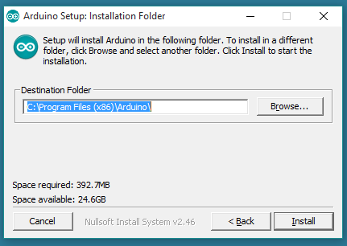

Overview
========

WaziDev is a powerful development board for creating IoT application.
It is based on Arduino and LoRa radio network.
This document guides through the preparation of programming environment for WaziDev.
It will also show step by step:

-   how to connect your sensors,
-   how to write the code,
-   how to compile and upload the code,
-   how to see and use your sensors in the cloud.

This documentation is available in [PDF format](/docs/WaziDev_User_Manual-V1.0.pdf).

What do you need to start?
==========================

To follow this user manual, one will need the following hardware:

-   a WaziDev board
-   a Micro USB cable
-   a DHT11 sensor


Note that the Micro USB cable must be a "data" cable.
Some cable sold on the market are just for power, and they won't work for the WaziDev.

In terms of software, you need:

-   [Arduino IDE](https://www.arduino.cc/en/Main/Software)
-   [Waziup examples, libraries and drivers](https://github.com/Waziup/WaziDev/archive/master.zip)

For the examples using the cloud, one also needs a configured [WaziGate](https://www.waziup.io/documentation/wazigate/).


Installation and configuration of your IDE
==========================================

This section will guide through the installation of Arduino IDE and its
configuration for the WaziDev.

Install Arduino IDE
-------------------

{}
**Step \#1:** Download Arduino IDE from here: [https://www.arduino.cc/en/Main/Software](https://www.arduino.cc/en/Main/Software)
{}


Download what suits your computer (Windows, MAC, Unix).
Here we have as an example some screenshots for Windows users.
When the download finished, one need to proceed with the installation and to allow the driver installation process in case a warning from the operating system is detected.
Choose the components to install:


{} **Step \#2:** Choose the installation directory (recommended: keep the default one){}



The process will extract and install all the required files to execute
properly the Arduino Software (IDE)


{} 
If you use Linux there is a guide here: [https://www.arduino.cc/en/Guide/Linux](https://www.arduino.cc/en/Guide/Linux).

If you use Mac there is a guide here: [https://www.arduino.cc/en/Guide/MacOSX](https://www.arduino.cc/en/Guide/MacOSX).
{} 


Install the WaziDev sketchbook
------------------------------

In this section one will configure the Arduino IDE to use the WaziDev sketchbook.

{}
**Step \#1:** Download the [WaziDev sketchbook](https://github.com/Waziup/WaziDev/archive/master.zip). Unzip the file to the location of your choice.        
{}


Let's say one unzipped the file to /home/cdupont/WaziDev-1.0 for example.
Next step is to configure Arduino IDE to use this sketchbook.

{}
**Step \#2:** In the Arduino IDE Preferences, change the "sketchbook location" to the WaziDev sketchbook folder.
{}


First, open "Preferences" in the Arduino IDE menu File -\> Preferences.


For example, change the "sketchbook location" to "/home/cdupont/WaziDev-1.0", if that's where you unzipped the file.

Configure the Arduino IDE
-------------------------

In this section, we will configure the various parameters of the Arduino IDE to work with WaziDev on you PC.

{}
**Step \#1:** Connect your WaziDev board to your PC via USB cable.
{}


If you see some lights turning on, that means your USB connection is working.

{}
**Step \#2:** Open your Arduino IDE.
{}

On Linux, you need to open it as an **administrator** (i.e. type "sudo arduino"). You should see something like this:


{}
**Step \#3:** Select the right port.
{}

In the **Tools** menu, click on the **Port** submenu. The **port**
depends on your Operating System. You should select a port similar to
these:

-   **Linux:** /dev/ttyUSB0
-   **MacOS:** /dev/cu.usbserialXXXXX
-   **Windows:** COM3 or higher.


**Attention:** If you don't see the corresponding port in the Port menu, then you need to install the required drivers.

{}
**Step \#4 (optional):** Install the drivers. **Skip this section** if you already see the right port in the port menu.
{}

Please follow the instructions on the page and install the corresponding driver on your computer.
After installing you should be able to see the port and the board information in your Arduino IDE under the **Tools** menu.

{}
**Step \#5:** Select the Board.
{}

Select the board "Arduino Pro or Pro Mini" in the Tools -\> Board menu.


{}
**Step \#6:** Select the Processor.
{}

Select the processor "ATmega328P (3.3V, 8 MHz)" in the Tools -\> Processor menu.


Finally, the Programmer needs to be "AVRISP mkll".

Example applications
====================

In this section we will go through several detailed examples to use your WaziDev:

-   WaziDev *Hello World*: a simple blink program,
-   how to plug in and use a sensor,
-   how to test the LoRa communication,
-   how to send sensor values to the Cloud.

Hello World: Blink a LED
------------------------

Let's try now the WaziDev! Upload the first program.

{}
**Step \#1:** Select the **blink** program in the examples menu.
{}

Select the menu File -\> Examples -\> 0.1 Basic -\> Blink.


Once this is done, the "Blink" program should appear in the editor.

{}
**Step \#3:** Compiling and uploading the code to WaziDev.
{}

Click on the arrow button to compile and upload your program.


If you see no errors on the status bar and see the message "Done uploading", you have successfully flashed your WaziDev.


If everything goes well, on the WaziDev a **blue LED** should blink every one second.

Congratulations!! WaziDev is working. :-)

One may play a bit with the source code and change the blinking frequency by changing the number 1000 behind the delay keyword to some other number.
It represents the delay time between status change of the LED measured in milliseconds.
Once values are changed upload again to WaziDev and check the change in blinking frequency.


Temperature and humidity sensor
-------------------------------

In this example, a temperature and humidity sensor: the DHT11, will be wired and programmed.

{}
**Step \#1:** Connect the DHT11 to the WaziDev.
{}

With the DHT11, the simplest wiring possible is: no wires!
DHT11 have a GND (ground) pin, a data pin, and a VCC pin.
Just plug the DHT11 directly into the WaziDev.
Be careful to align the pins:

-   DHT11 GND -\> WaziDev GND
-   DHT11 data -\> WaziDev D2
-   DHT11 VCC -\> WaziDev D3


{}
**Step \#1:** Connect the DHT11 to the WaziDev.
{}
{}
**Step \#2:** Select and tweak the DHT11 example.
{}


This example is located in File -\> Sketchbook -\> sensors -\> Temperature -\> DHT11.

We need to modify slightly this example to work for our wiring.


Since the DHT11 data pin is connected to the WaziDev pin 2, we need to change that fact in the code.
Locate the line:

```
#Define DHTPIN 6
```

And change the value from "6" to "2".


The next trick is to set the WaziDev pin \#3 to HIGH, in order to power the DHT11.
Locate the line:

```
pinMode(7, OUTPUT); digitalWrite(7, HIGH);
```

Uncomment that line, and change the two values to 3.

{}
**Step \#3:** Compile and upload the code.
{}

You just need to hit the arrow button.

{}
**Step \#4:** Open the Arduino IDE Serial Monitor.
{}

In the Tools menu open the serial monitor and then set the data rate to 38400 baud.


You should see both temperature and humidity displayed.

LoRa Ping Pong
--------------

We'll program our WaziDev to communicate with the WaziGate, using LoRa radio network.
Note that you need to have one [WaziGate](https://www.waziup.io/solutions/wazigate/) powered on (however it doesn't need Internet at this stage).

{}
**Step \#1:** Select the LoRa\_Ping\_Pong example.
{}

This example can be found in the menu File -\> Sketchbook -\> LoRa -\> LoRa\_Ping\_Pong.


After selecting, the example code should appear in the IDE.

{}
**Step \#2:** Compile and upload the code.
{}

You just need to hit the arrow button.

{}
**Step \#3:** Open the Arduino IDE Serial Monitor.
{}

The icon is located in the top right corner.


This will open a window like below.


If you see the message "Pong received from gateway": Congratulations!
The WaziDev is communicating with a WaziGate.

Cloud application
-----------------

We'll now reuse our DHT11 to upload data to the Cloud.
**Note that you need an active WaziGate close to you.**

{}
**Step \#1:** Plug in your DHT11 as shown in the previous example.
{}

{}
**Step \#2:** Select the LoRa\_DHT11 example.
{}

It is located in the menu File -\> LoRa -\> LoRa\_DHT.

{}
**Step \#3:** Adjust the source code.
{}

Verify that the Pins are correct in the file "my\_DHT\_sensor\_code.h" visible in the Arduino IDE.

In the file "LoRa\_DHT.ino" find "***\#define node\_addr 8***" then change the number **8** to your desired number (for example: the number written on the wazidev label).

{}
**Step \#4:** Compile and upload.
{}

You should obtain a successful upload.
At this stage, your device is already sending data to the Cloud!
Verify it by opening [http://dashboard.waziup.io/devices](http://dashboard.waziup.io/devices).

You should find your device right away:


You can click on that device and see the sensor values and history:


Reference
=========

You can find below the specification of the WaziDev.

Pinout description
------------------


*WaziDev Pinout*

1.  **ON/OFF switch**: This jumper can be used as on/off switch for the
    board. It is ON by default.

2.  **Regulator Activation**: The jumper indicated by **DIRECT / REG**
    sets the board to use a regulated voltage or direct. The direct
    setting is only if you use an input battery of maximum 3.6V any
    voltage higher than that can damage the LoRa module. **Please note
    that to always keep this config in REG mode when programming the
    board.**

3.  **Analog Pins**: Arduino standard analog pins A0-A7. Please note
    that **A7** is connected to the battery voltage level monitoring
    circuit which can be activated by setting the digital pin **D7** to
    **LOW**, so **D7** should be set to **HIGH** always.

4.  **External Antenna (UFL)**: The board has an embedded PCB antenna
    which is activated by default and optimized for 868MHz frequency. If
    you want to use your own antenna instead you need to deactivate the
    PCB antenna by cutting its jumper on the back of the board indicated
    by **JA** then you can connect your antenna to the UFL connector.

5.  **High current pins** ( *max 500mA* ): **M8** and **M9** are high
    current/voltage programmable output pins. They can be programmed
    through digital pins **D8** and **D9** respectively. It can be used
    to activate high current/voltage devices/sensors. The maximum
    current which can be drained is **500mA** and the maximum voltage is
    **12v**. The wiring is as follows: The Ground wire of the external
    high current/voltage source is connected to the same ground of the
    board (GND), and the positive wire of the power source is connected
    to the high current device that needs to be controlled by our board.
    One of the pins of **M8** or **M9** is connected to the Ground of
    the high current device, then we can turn it on and off by writing
    **HIGH** and **LOW** to the digital pins **D8** or **D9**
    respectively.

6.  **Digital Pins**: Arduino standard digital pins **D2-D12**. Please
    note that **D13** is situated on the opposite side of **D12**.

7.  **VCC** ( *3.3v* ): WaziDev board operates with **3.3v**, VCC pins
    provide 3.3v as output, they can be used as input voltage as well.

8.  *Lipo/regular battery*: This port is designed to be used as input
    for Lithium Ion rechargeable battery or just a regular battery.
    There is an onboard charger which enables the board to use a solar
    panel. Please note that the solar panel must be connected to either
    Micro *USB port* or *VIN* pin. **Warning**: your rechargeable
    battery must have its own protection circuit otherwise it might gets
    overcharged and cause fire. (usually good quality batteries have it)

9.  **Micro USB port**: This port is used to power the board on through
    USB cable and program the board via Arduino IDE.

Jumpers
-------

Below you can find the list of jumpers with their function:

-  JL: LED13 and PWR LEDs             
-  JC: Charger status LEDs (CHG, FULL)
-  JB: Battery level read             
-  JA: Embedded Antenna               
-  JS: Power Switch                  
-  JR: Radio Interrupt               

By default, Jumpers JL, JC, JB and JA are connected; JS and JR are open.
When connected, connects the LoRa interrupt pin to **D2**

Characteristics
---------------

***Processor System***

-   MCU: ATmega328p 8Mhz
-   RAM: 2 KB
-   FLASH: 32 KB

**Wireless Network**

-   Standard: LoRa
-   Frequency Band: 863-870MHz for Europe/Africa
-   Channelsi: 1
-   Transmit Power: +20dBm -100mW constant RF output
-   Receiver Sensitivity: -148dBm
-   RF Data Rate: 300kbps
-   Modulation: FSK, GFSK, GMSK, MSK, OOK
-   Function: Sensor Node
-   Antenna connector: Integrated PCB antenna / External UFL

**Indicator and Button**

-   LED: PWR LED, Indicator LED, Charging/Full battery
-   Button: 1 reset button
-   On/OFF switch: 1, two pins for on/off switch + a jumper to keep the
    board always on
-   Regulator Switch: 1, A jumper that can be used to bypass the
    regulator for low power applications

**I/O**

- UART: 1 
- ICSP: 1 
- I2C: 1 
- Analog input: 8 (Arduino standard pins: A0-A7)
- Digital I/O: 9 (Arduino pins, some are used by LoRa)
- Extra GND
- High Current output
- USB 

**Power**

- Supply voltage: 3.3V 3.3V - 5V 3v (max 3.6v DIRECT and 6v Regulated) Max 1A input current (through Micro USB port) 

**Environment**

- Operational Temperature Operating Humidity: -20 \~ 70 C, 5% \~ 95% Relative Humidity, non-condensing

**Mechanical**

- Dimensions: 70 x 40 mm

**Programming**

- IDE: Arduino compatible  (Select **Pro Mini 3.3V 8Mhz**)

Annex
=====

Use LoRaWAN with WaziDev V1.3
----------------------

If you have a WaziDev V1.3 device and want to use LoRaWAN some changes are needed. To do this you will need:
- A welder
- A connecting cable about 2/3 cm long


It is required to solder the cable in the D3 pin of the WaziDev and in the 2nd pin of the LoRa chip.
Then you have to give a welding point on the JR

The operation is quite simple, for more information see the image below below


