Overview
========

This document guides you to assemble your Wazigate and configure it in order to connect to the Waziup Cloud.

Prepare the Gateway Hardware
============================

{}
If you have a raspberry pi and want to setup your wazigate yourself this section is for you.
If you already have your Wazigate in a box, just [skip](#section-2) this section.
{}

What do you need to start?
--------------------------

You need the following hardware to start:

- A Raspberry Pi (Model 3B+ is recommended for this version)
- An SD card (minimum 8 GB)
- A power supply for the raspberry pi (usually 5.1V, 2+A)
- A LoRa antenna
- A LoRa Hat like WaziHat

Assemble the WaziGate
---------------------

{}
**Step \#1:** Attach the heatsink. It is always a good idea to attach a heatsink in order to avoid overheating.
{}

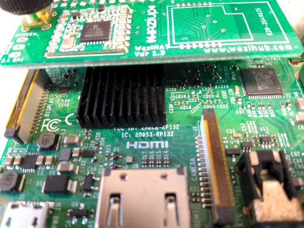

{}
**Step \#2:** Mount a Wazihat on the Raspberry pi
{}

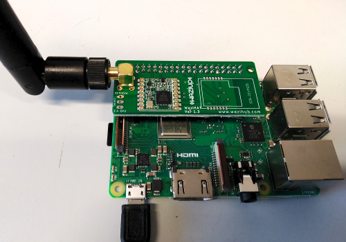

{}
**Note:** If you do not have a ***Wazihat*** board and want to use your own LoRa module, please refer to [this documentation](https://github.com/CongducPham/tutorials/blob/master/Low-cost-LoRa-GW-step-by-step.pdf)
{}

Flashing the WaziGate software image 
====================================

{}
**Step \#1:** Download the latest version of [Wazigate ISO image](https://www.waziup.io/downloads/WaziGate_V1.0.zip)
{}

{}
**Step \#2:** Download [Balena Etcher](https://www.balena.io/etcher/) and install it on your PC.
{}

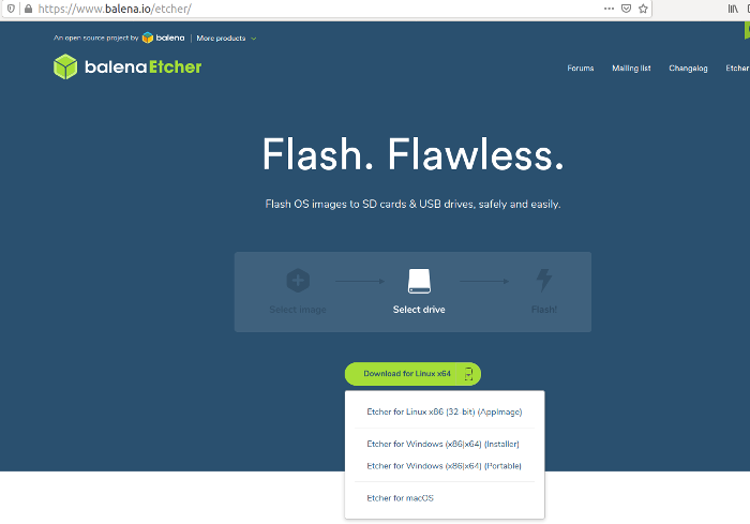

{}
**Step \#3:** Open the ***Balena Etcher*** tool and select the downloaded zip file
{}

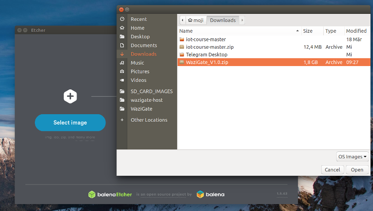

{}
**Step \#4:** Insert your SD card to your PC and when appear, select it in **Etcher**
{}

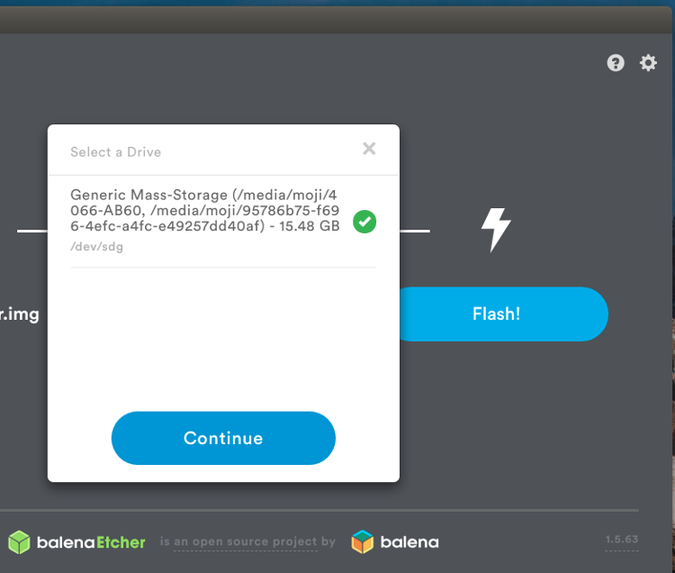

{}
 **Note 1:** Your Micro SD card must be at least **8 GB**.      
{}
          
{}
 **Note 2:** If your laptop does not have the SD card reader, you need a USB adapter to connect your Micro SD card to your PC.  
{}

{}
**Step \#5:** Click on **Flash** to start flashing.
{}

{}
**Step \#6:** When Flashing is done, remove your Micro SD card and insert it into your raspberry pi.
{}

Congratulations! Your hardware is now ready.

Powering up Wazigate
====================

{}
**Step \#1:** Attach the antenna
{}

{}
**Very Important**: always connect the antenna first, before powering up your device.
{}

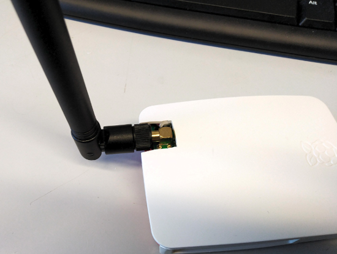

{}
**Step \#2:** Plug the power cable (micro usb) into the gateway and plug the adapter to the outlet.
{}

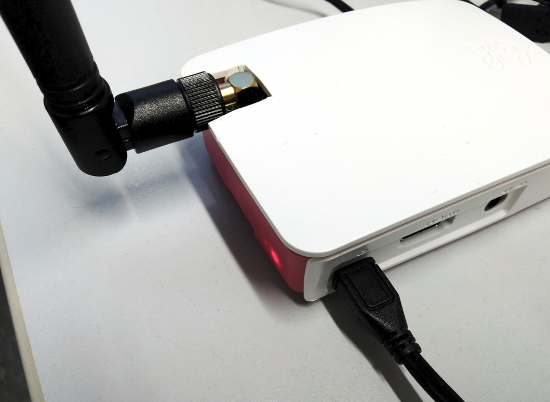

You should see a light is on and another light next to it is actively blinking.

Configuration
=============

Find the Wazigate Web UI
------------------------

{}
**Step \#1:** Find the wazigate hotspot to connect to
{}

When you power up Wazigate for the first time, it usually does some self-configs and reboots itself.
So, be patient, it might take a couple of minutes for you to see the Wazigate WiFi hotspot to connect to.                  
                                
The WiFi hotspot has a similar name of what you see in the photo: ***WAZIGATE\_XXXXX**. 
xxxxx usually is the ID of your gateway.                   

{}
**Step \#2:** Connect to the Wazigate WiFi hotspot
{}

**Note 1:** The default password for the hotspot is **loragateway**                 
                                
Enter the password and click on connect.                        
                                
**Note 2:** Depending on the operating system you use, the interface might be different.

{}
**Step \#3:** Opening the Wazigate Web UI
{}

Wazigate is configured through a web user interface.
When you connect to the Wazigate hotspot, you need to open your browser and go to one of the following addresses:

[http://192.168.200.1](http://192.168.200.1)

[http://wazigate.local/](http://wazigate.local/)

Then you should see something like this.

Please enter the default username and password and click on **Login**.

{}
**Note:** For security reasons, please change the default password as soon as you can see the profile page. This page can be found in the menu at the top-right corner of the screen.
{}

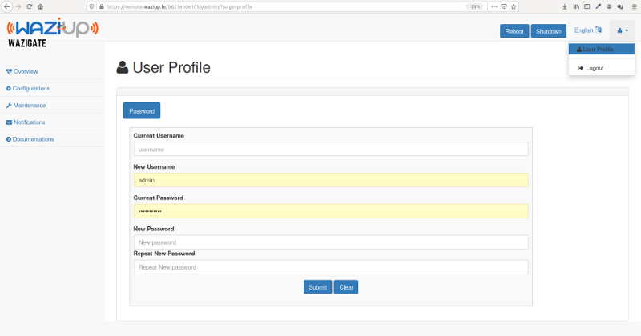

Gateway Registration to Cloud
-----------------------------

{}
**Step \#1:** Login for the first time
{}

When you login for the first time, you should see something like this.

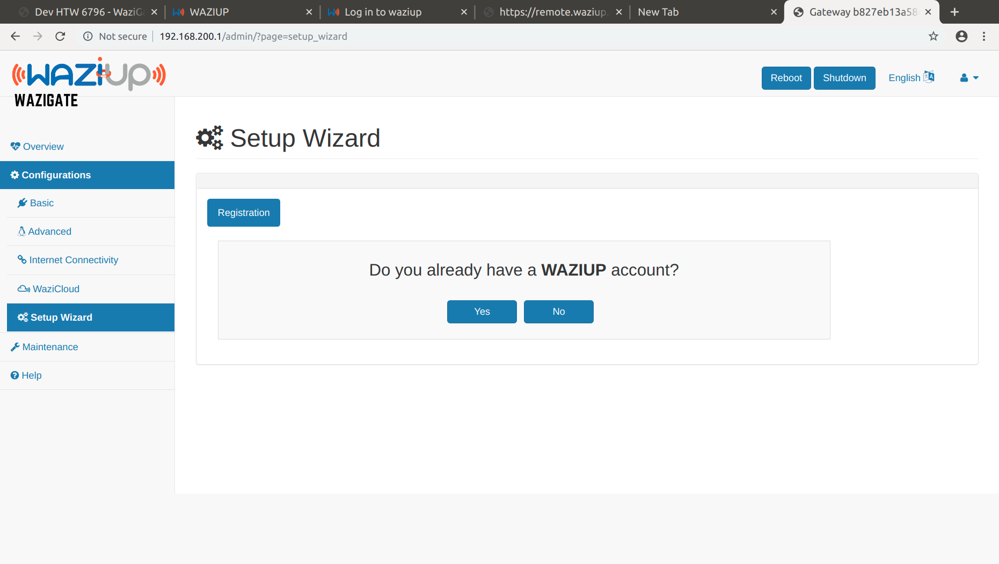

**Note:** Setup wizard is also accessible from the side menu.

**Note:** If you do not have an account on [Waziup dashboard](https://dashboard.waziup.io/), you need to create one first.
By clicking on **[Register]**, you can create an account.

A Waziup account enables you to receive all your sensor data in your dashboard and manage your Wazigate remotely.

{}
**Step \#2:** Configure Wazigate to be recognized by the cloud
{}

Once you click on Yes in the previous page, you should see something like this:

{}
**Step \#3:** Give a nice name to your gateway
{}

***Gateway Name*** is a custom name that you give to your gateway to be able to identify this particular gateway from your other gateways.
It can be anything like *Fish Farm gateway*, *Water Control Gateway*, *Ali's Field Gateway*, and so on.

**Note:** After writing, hit the **Enter** button on your keyboard or click on the  icon to save your values.

{}
**Step \#4:** Set WaziCloud credentials in Wazigate
{}

Click on the ***[Empty]*** value next to the *Email Address / Login* and enter your waziup dashboard email address and save it.

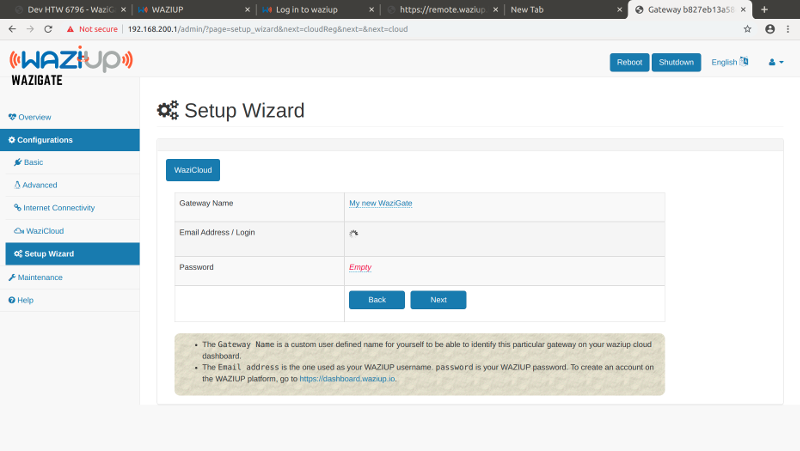

Do the same thing for password as well.

{}
**Step \#5:** Cloud credentials saved, going Next
{}

When you save successfully both login and password values, click on the **Next** button.

 
Connecting to the Internet
--------------------------

{}
**Step \#1:** WiFi Configuration
{}

If you plan to connect your Wazigate through another way like Ethernet cable or 3G/4G dongle, then just click on **Skip**.

{}
**Step \#2:** Connecting to WiFi
{}

One Wazigate finds all the available WiFi networks in its range, click on the network that you want to connect to and enter its password in the shown box.

{}
**Step \#3:** Click on Connect and Finish
{}

{}
**Warning:** Once you try to connect to a WiFi network, you will lose the control on Wazigate.
{}

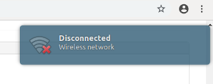

If you enter your WiFi password correctly and the internet is available, after a few minutes you will be able to see it in your WaziCloud dashboard.

{}
**Note:** If Wazigate does not manage to connect to your WiFi due to wrong credentials or not being in the range of the WiFi router, it will rollback to the hotspot mode and you need to connect to it again and start over. *This might take a few minutes depending on the router.*
{}

Verify Gateway Registration
---------------------------

{}
**Step \#1:** Open the waziup dashboard
{}

Go to the [Waziup](https://waziup.io) website.

{}
**Step \#2:** Click on "Go to Dashboard" and enter your credentials and Login.
{}

{}
**Step \#3:** Click on Gateways.
{}

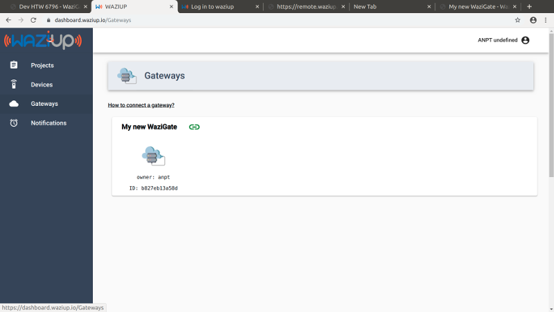

If everything went well so far, you should see your gateway in the list.

{}
**Step \#4:** Click on your gateway.
{}

{}
**Step \#5:** Then click on the "Remote access" button.
{}

{}
**Step \#5:** Logging into your Wazigate.
{}

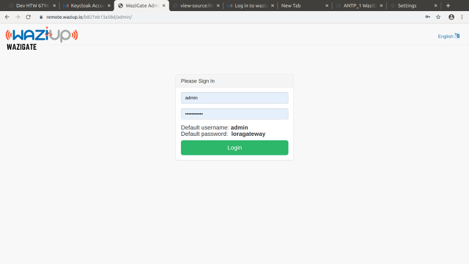

If you see something like this, then Congratulations! :) You made it.                   
Now you can simply manage your gateway remotely through your Waziup dashboard.
