Once your gateway is all setup, let's receive and send LoRaWAN messages!
You need a LoRa capable device, such as WaziDev.
With WaziDev, you need to install the WaziDev sketchbook, as instructed [here](/documentation/wazidev/user-manual/).

Device preparation
==================

In Arduino IDE, select the `File ▸ Sketchbook ▸ LoRaWAN ▸ Actuation` to open the LoRaWAN Actuation example sketch. You can find this and other Arduino example sketches on our public open-source [Wazidev GitHub repository](https://github.com/Waziup/WaziDev/tree/master/examples) too.

This sketch uses the following technologies and features:

- Creating compact payload from sensor data with XLPP
- Sending data with LoRaWAN encrypted
- Receiving data with LoRaWAN (for actuation)
- Reading LoRaWAN statistics (SNR, RSSI, Time-on-air)

LoRaWAN is a low-power wireless networking protocol with very long range. Sending and receiving data is encrypted, thus requiring you to generate (random) keys for your devices. The Wazidev has a LoRaWAN-chip and a LoRaWAN antenna build in. 

The code looks like this:

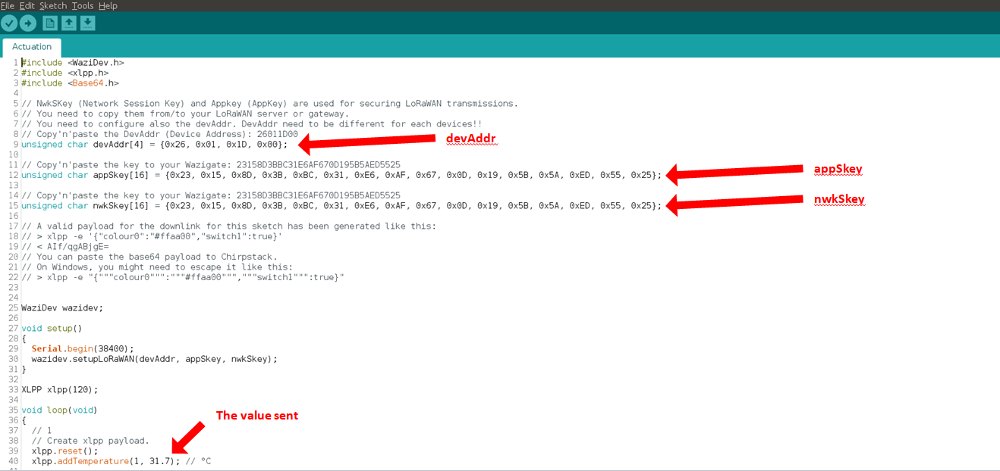

You can see 3 values: `DevAddr` (Device Address), `AppSkey` (Application Session Key), `NetSkey` (Network Session Key). They need to be copied in the WaziGate to be recognized.

⚠️ Every device needs to have it's unique `DevAddr` - two devices must not have the same. Change the `DevAddr` digits to a new value for each new device.

⚠️ `AppSkey` and `NetSkey` make your communication secure. Although both keys can be the same, you should select new random keys for each device. Use the Wazigate dashboard to generate new random keys.

Now you can flash this sketch on your Wazidev device.

Don't close the Arduino IDE yet, you will need to copy these 3 values to the Wazigate dashboard next.

Sensing
=======

Once flashed, open the WaziGate UI on http://wazigate.local and first select the "Dashboard" menu entry.
Click on the "Plus" icon at the bottom right:

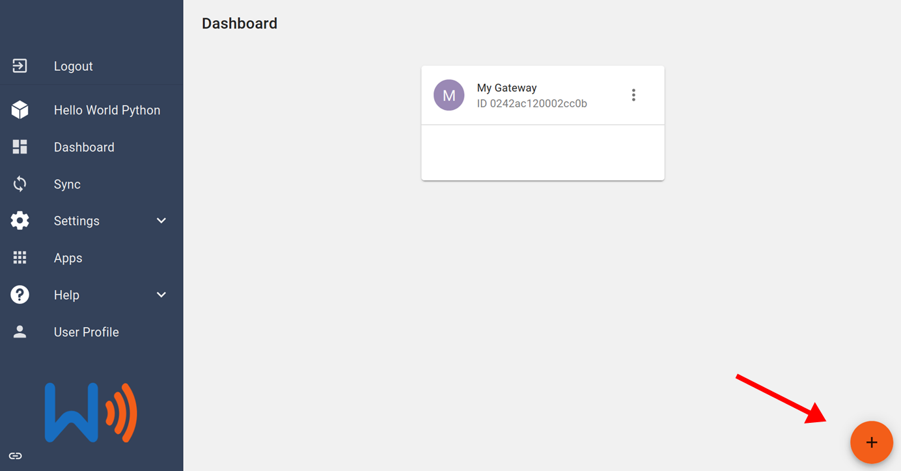

Enter a device name of your choice:

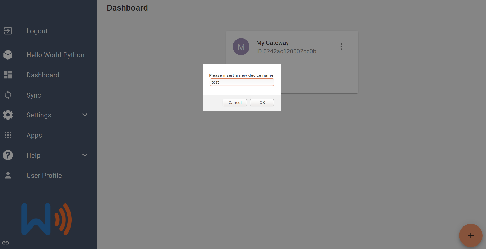

Once your device is created, click on it to enter that device.
We now need to tell WaziGate that this device is LoRaWAN-able.
Then click on the "three dots" at the top right of the screen, and select "Make LoRaWAN".

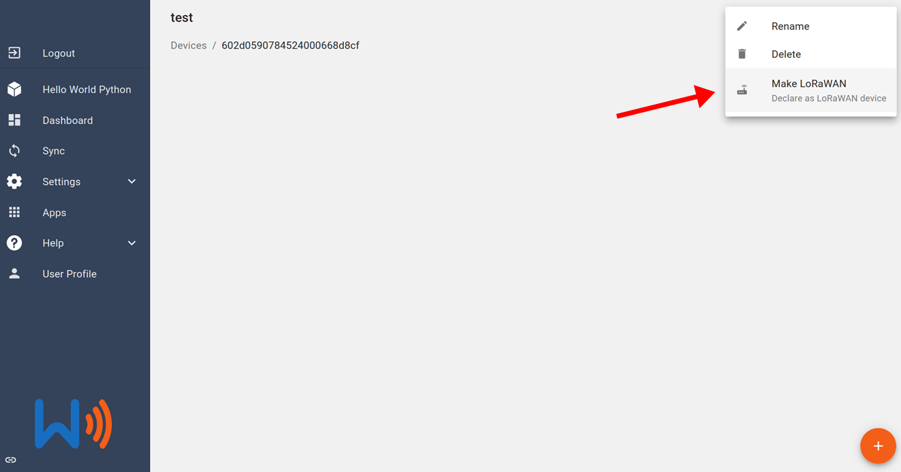

Once the device is converted, fill in the three keys, so they are identical with the keys in you sketch.
Once the keys filled in, save.

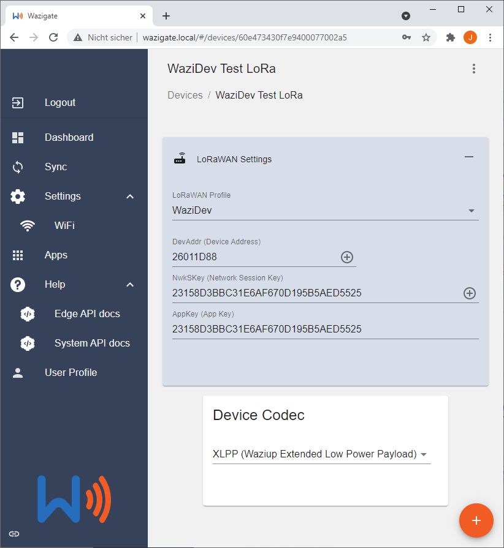

{}
You need to make 100% sure that the keys are equal. In particular, check that `AppSkey` and `NwkSkey` are not swapped.
{}
Please also make sure that the `DevAddr` is unique, i.e. you don't have two devices with the same `DevAddr`.

You should also select XLPP (or the older LPP) as the payload encoding, as we recommend these low-power payloads for use with the Wazidev. Have a look at our [Arduino XLPP library](https://github.com/Waziup/arduino-xlpp) for example sketches, or check out the [CayenneLPP Arduino library from TheThingsNetwork](https://www.thethingsnetwork.org/docs/devices/arduino/api/cayennelpp/).

Go back to the "Dashboard" main page.

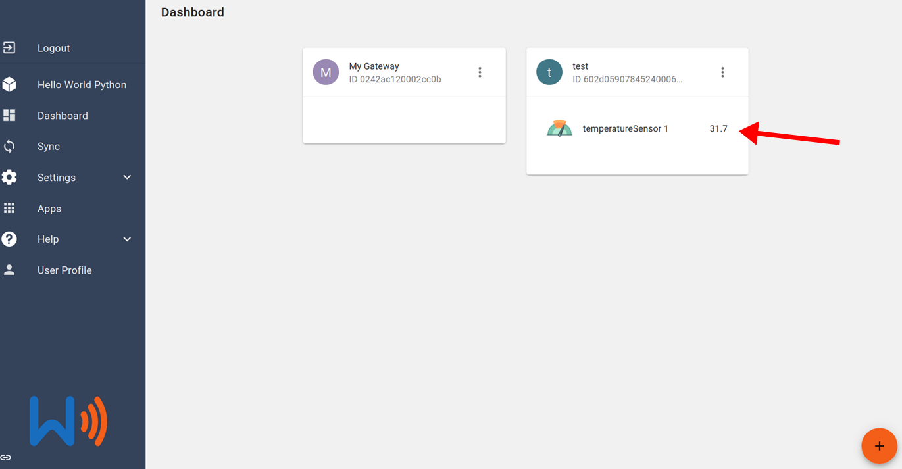

If you device sketch is running, you should already see the value there! Congratulations!

Let's now open the [Cloud dashboard](http://dashboard.waziup.io) and look for you device.
In the "Devices" menu entry, search for you device using the filters.

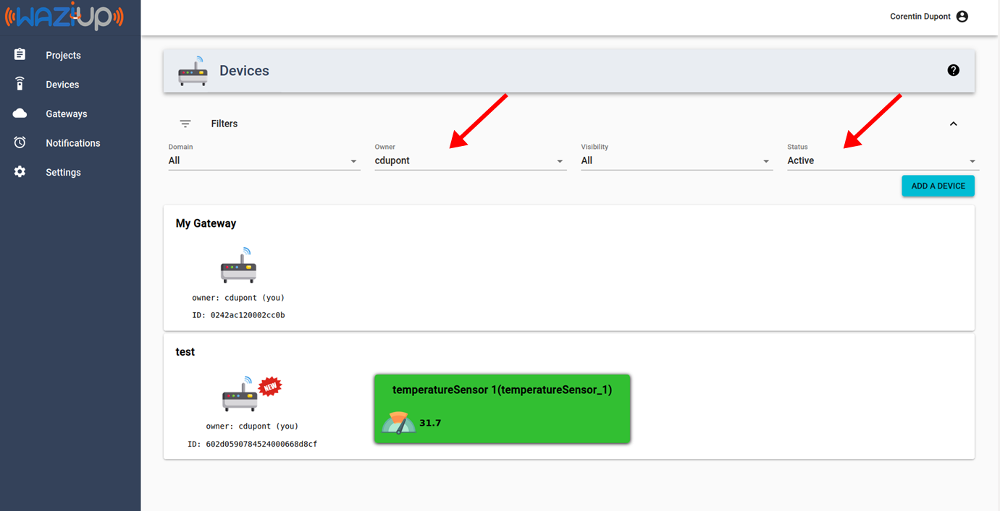

Here it is! Double congratulations! 
Next steps:
- [develop a Web app reading your sensor](/documentation/wazicloud/customapp/)
- [develop a gateway app](/documentation/wazigate/v2/waziapps/)
- try some actuation (keep reading).

Actuation
=========

Actuation with WaziGate is very easy.
On the WaziDev side, we can keep the same sketch.

First, come back on the device that wen added, click on the bottom right "plus" sign and click on "add actuator":
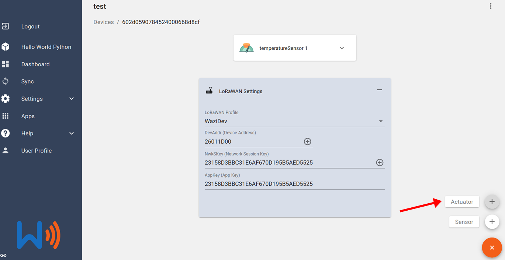

Select a name for your new actuator:

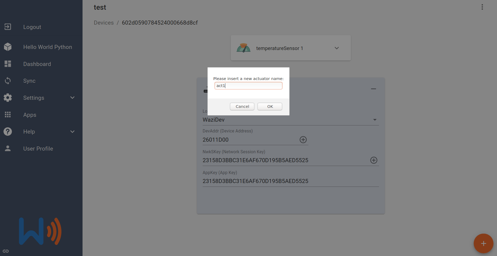

Your actuator is added, it has no value yet:

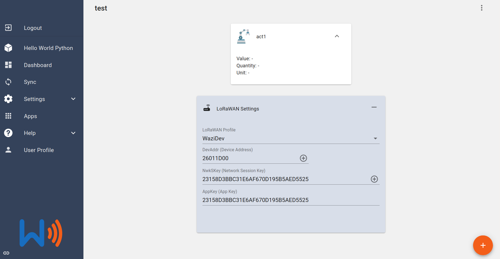

Let's go back on the [Cloud dashboard](http://dashboard.waziup.io).
Your actuator should already be there!

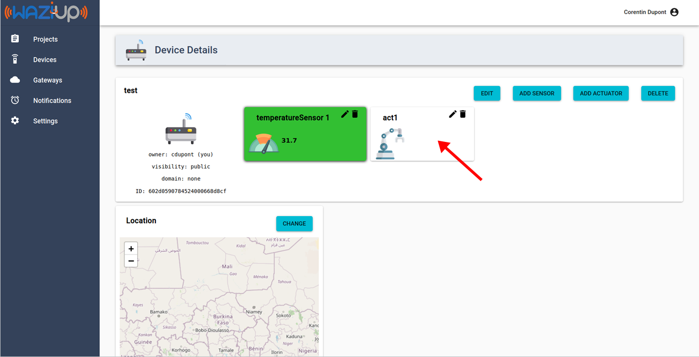

Click in and click on the "edit" symbol (a back pen):

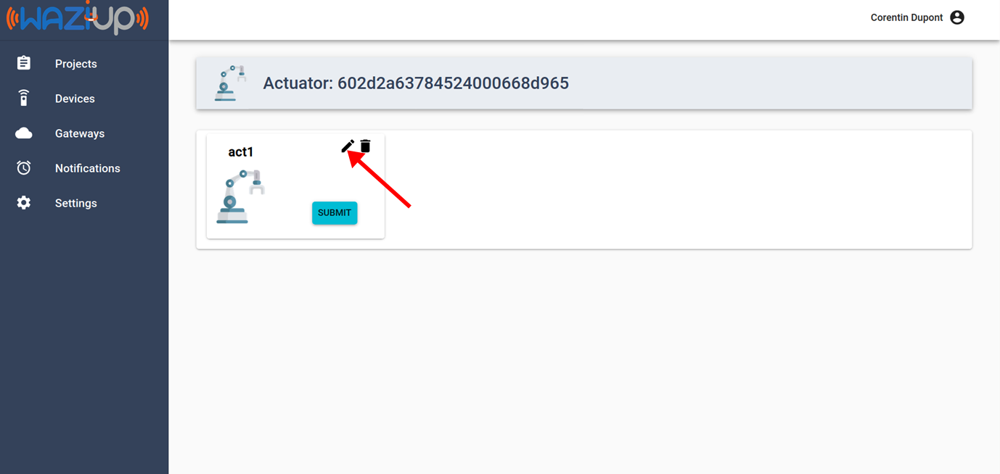

Select an actuation type:

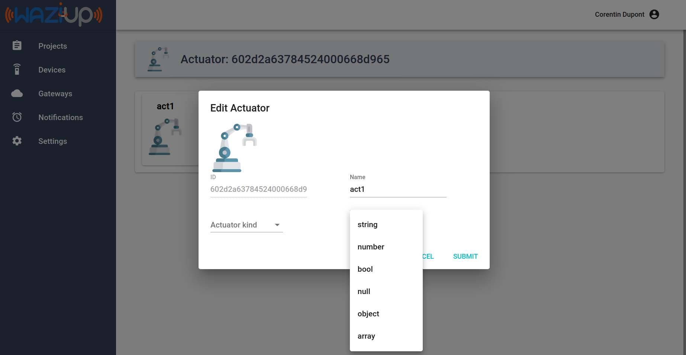

Coming back, you can see that the widget for the actuation trigger has changed based on the type that you selected:

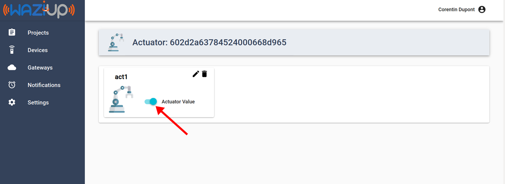

For instance here, we selected a "boolean" type, so a switch with two places appeared (true or false).
Go on and trigger it. You just did an actuation! Let's check it.

Come back on the WaziGate UI. Your actuation value came back at the WaziGate:

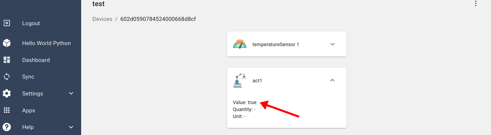

Finally, let's check your device.
Go back to Arduino IDE and open the serial monitor. 
Your actuation is there! That was quite a ride.

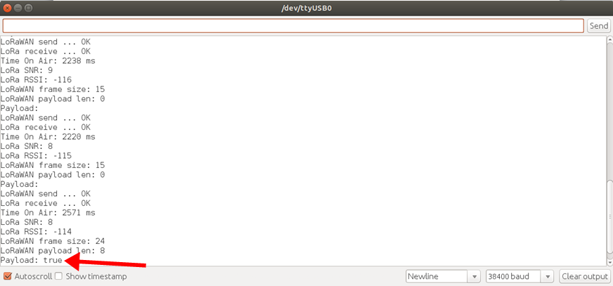

It is now up to you to really make some actuation by reading this value in your code and, for example, ring a buzzer.

**Next steps:**
- [connect a real actuator](/documentation/wazidev/actuators/)
- [trigger actuation from your own app](/documentation/wazicloud/customapp/)

