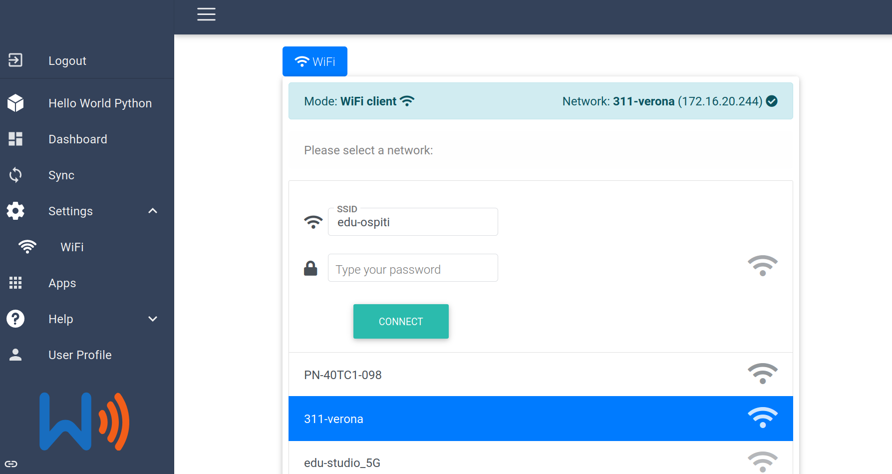
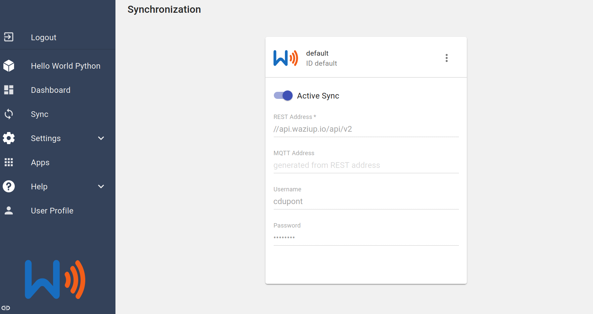

A short introduction...
=======================

...for the fast and the furious.

If you already have some experience with Raspberry PI, get your WaziGate started and running in a breeze!
You need also a LoRa Hat (WaziHat, RAK, or HT-M01) with the antenna attached.
If you are unsure, please follow our [step by step guide](/documentation/wazigate/v2/install/).

**Step \#1:** Download and flash the latest [Wazigate ISO image](https://downloads.waziup.io/WaziGate_latest.zip).

**Step \#2:** Once the WaziGate is flashed, boot it up and connect to its UI.
You can connect to the UI using:
- The WaziGate Hotspot.
- An ethernet cable connected to a local router.
- An HDMI screen (you need to connect it *before* switching on the RPI).

The WaziGate UI will be available in your browser at http://wazigate.local.
Please allow at least 10 min for the first boot, before connecting.

**Step \#3:** Once inside the UI, configure your Wifi:

**Step \#4:** Configure also your **Cloud** credentials in the Sync panel.
Your can get your Cloud credentials at http://dashboard.waziup.io.

You are ready to go!
Next, follow our [LoRaWAN tutorial](/documentation/wazigate/v2/lorawan/).
