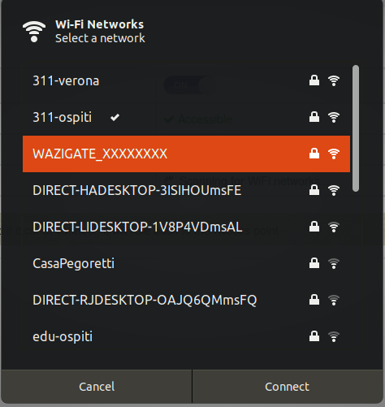
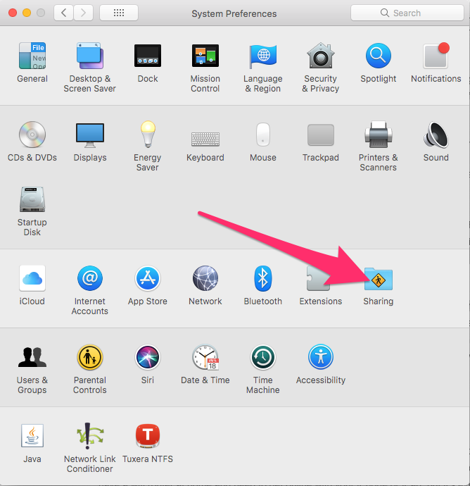
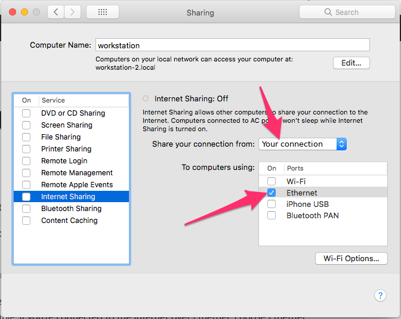
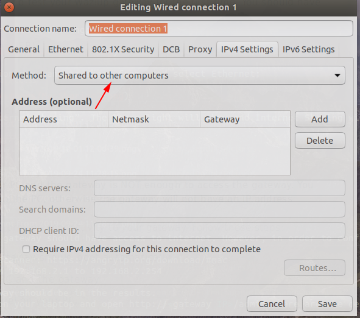
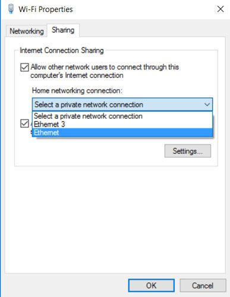
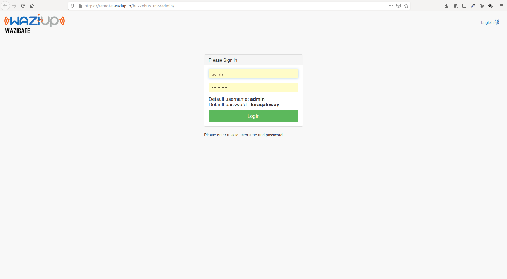
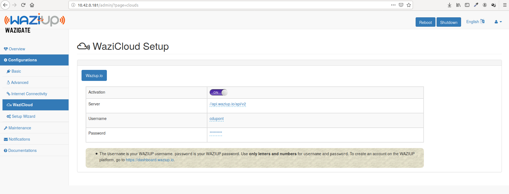
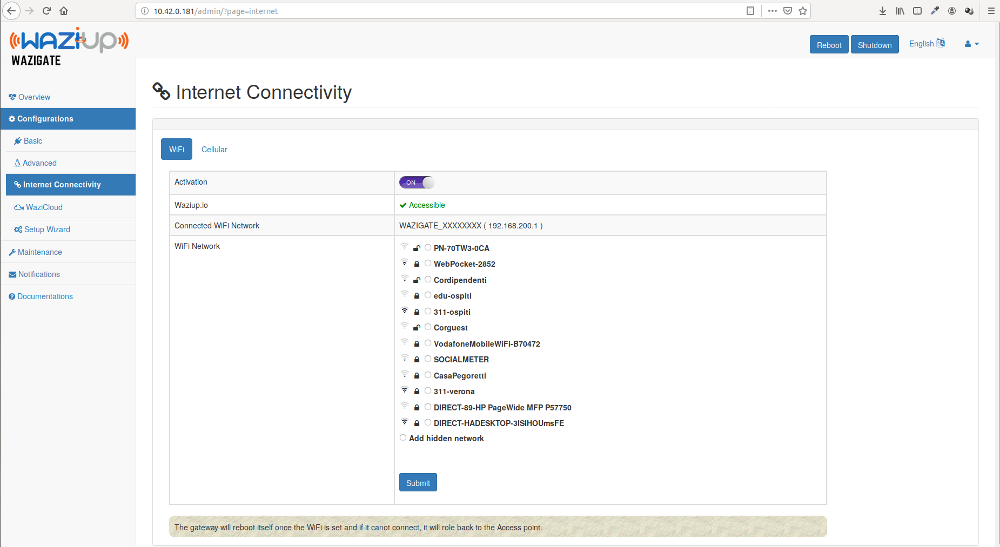

This documentation will show all the steps to get a WaziGate up and running.

WARNING: WaziGate is still under development and experimental.


Install
=======

In this section, we'll learn how to install the WaziGate.

Install with ISO
----------------

Installing your WaziGate with the ISO is simple and easy.
What you need: a Raspberry PI and a WaziHat. First of all, download the ISO image. 

You also need a tool such as [Balena etcher](https://www.balena.io/etcher/) to flash the ISO on your SD card.
Once flashed, you can insert the SD card in your Raspberry PI and power it.

Install from scratch
--------------------

This tutorial show you haw to install your WaziGate from scratch.
Installing your WaziGate will be performed in two steps:

- Install Raspbian OS
- Install the WaziGate software itself.

***Install Raspbian***

To install the Wazigate on a Raspberry PI, you need to do the following instructions:

1. Get latest Raspbian Strech image:
```
wget https://downloads.raspberrypi.org/raspbian_lite_latest
```

2. Flash it on an SD card. You can find the instructions here: https://www.raspberrypi.org/documentation/installation/installing-images/

3. After flashing the SD card, open it on you PC and create a file named **ssh** without extention on the SD card. If it has multiple partitions, just create it on anyone you are allowed to.

4. Connect the PI with an Ethernet cable to your PC and find it's IP address. You can use either **nmap** or [Angry IP Scanner](http://angryip.org/) which is available for Windows/Mac/Linux/Android to determine the assigned IP addresses.

5. SSH into the pi. Windows users can use https://putty.org/
Usually the default credential for raspbian is:

```
- user: pi
- password: raspberry
```
**Note:** Alternatively, you can just connect a screen, a keyboard and a mouse to your raspberry PI and work with it just like a regular computer.

***Install WaziGate***

Run the following code on your raspberry PI terminal:

```
{ curl -fsSL https://raw.githubusercontent.com/Waziup/waziup-gateway/master/setup/get_waziup.sh ;} | bash
```
This script downloads and installs everything that your PI needs to turn it into a Wazigate.


This will take a while. Time to grab a cup of tea.
Once finished, reboot your gateway:
```
sudo reboot
```

Then you can access your Wazigate UI on http://wazigate.local/


Connect
=======

In this section, we'll show several possibilities to connect to your WaziGate, in order to configure it.

Connect by Wifi AP
------------------

This tutorial will guide you to configure and test your Waziup gateway for the first time.
You should have the following hardware:

- A WaziGate with power cable (mini USB),
- A laptop PC with Internet access.

On your laptop, go in the Wifi settings and select the access point starting with "WAZIUP".



The default password is `loragateway`.
Once connected, you can open the [WaziGate UI](http://wazigate.local)
    
Connect by cable
----------------

This tutorial will guide you to configure and test your Waziup gateway for the first time.
You should have the following hardware:

- A WaziGate with power cable (mini USB),
- A laptop PC with Internet access,
- A RJ45 cable (simple network cable).

***Share the internet***

**Attention: just connecting the cable between your PC and the gateway is NOT enough to access the gateway.
You NEED to configure "internet sharing" on the PC, in order to attribute an IP to your gateway.**

The first step is to configure your PC to provide connectivity to your gateway. Follow those steps:

- Connect gateway to power. The gateway should boot automatically.
- Connect RJ45 cable between the PC and the gateway.
- Configure the network sharing panel on your PC.


***For a MAC***

Go to System Preferences > Sharing:



Select the connection you want to share from, and select Ethernet:



Click again on “Internet sharing”. The green light will show and Internet Sharing will change to On.


***For Linux***

Open the program `nm-connection-editor`.
You may need to install the package `network-manager-gnome`. 



Then select the wired connection, and select "Shared to other computers" in IPV4 Settings.


***For Windows***

On windows, go to the Network and Sharing Centre in the Control Panel, “Change adapter settings,” right-click the adapter that has the Internet connection (for example WiFi), and click Properties.

In the Properties box, click the sharing tab and tick the “Allow other network users to connect …” box. Next, click the drop-down under “Home networking connection,” and select the ethernet adapter.




Login
=====

When connecting to the WaziGate, this screen will appear:



The default login and password are: admin/loragateway.
Please change the default password as soon as you can in the profile page.
This page can be found in the menu at the top-right corner of the screen.


Configure
=========

In this section, we will configure your new WaziGate!!

Configure Waziup Cloud
----------------------

First of all, you should connect to http://dashboard.waziup.io and create a username and password. Then open the Waziup configuration panel:



You should enter there you Waziup login and password.
Leave the server name untouched.

Configure Wifi
--------------

To configure the Wifi, open the wifi configuration panel:



You need to select your network in the list, and then enter the password.
When you click on Apply, the gateway will reboot.


Test
====

You need to get a WaziDev and [install it](/documentation/wazidev/).
Make sure to program your WaziDev to send LoRa messages (check the Arduino console to see the messages).
Once this is done, your WaziGate should already receive them, and forward the messages to the Waziup Cloud.

Open the Logs window to see the messages:


If you see something like: `Received data (from 9):  {'TC': '9.02'}`: Congratulation! Your data is received by the gateway.

