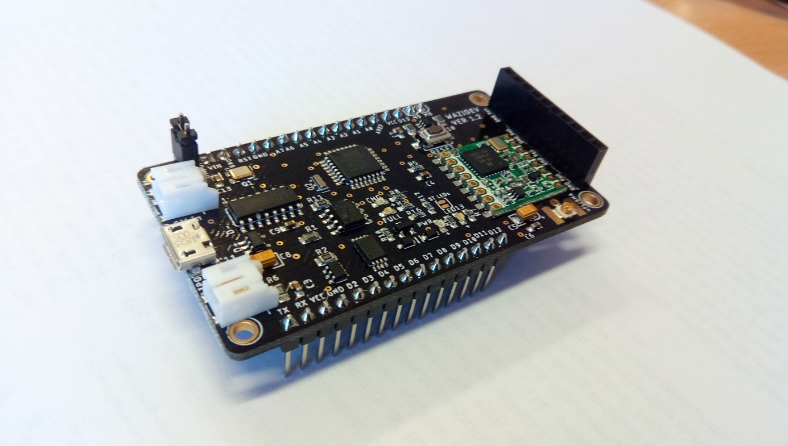

**Develop your IoT application with WAZIDev!**
WAZIDev is a development board integrating Arduino CPU and LoRa network.
Together with the WAZIUP Gateway and Cloud platform, you can develop a wide range of IoT applications.
The board is highly configurable to support a wide range of sensors.

WAZIDev is a development board with embedded LoRa module that allows you to simply develop IoT sensor node as well as IoT actuator node. 
It is an ideal solution for start-ups and entrepreneurs who want to rapid prototype a IoT applications.
Its features include:

- Arduino Pro Mini compatible CPU
- RFM95W LoRa module
- Fully compatible with the Arduino development environment
- Embedded Lipo battery charger for solar panels and low power options
- Two pins with high current support (500mA)

