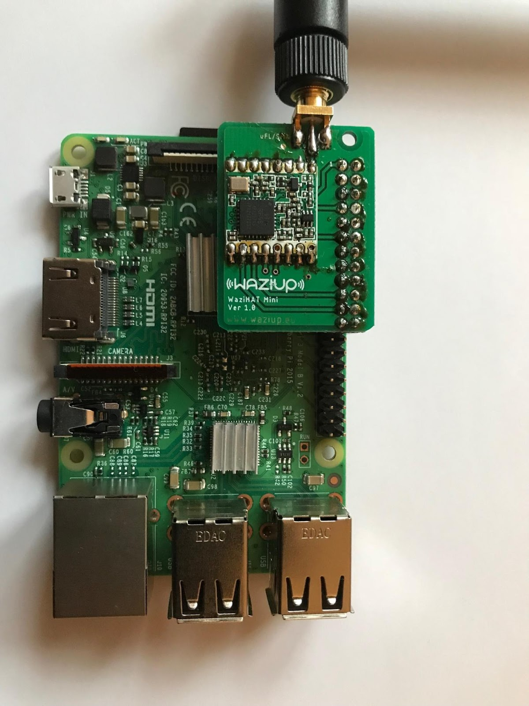

*WaziGate is a IoT LoRa Gateway, ideal for all your remote IoT applications.*

WaziGate is an affordable solution for developing countries needs’.
The WaziGate features:

- Edge capacity to host your applications
- LoRa communication up to 10-12 Km
- Permanent Wifi hotspot
- Wifi/3G/Ethernet internet connection
- Data upload with HTTP, MQTT or even SMS.
- Low power consumption
- Automation
- Remote management

The Gateway can cover up to 100 IoT Sensors and actuator nodes using LoRa radio network: Weather stations, soil monitoring, GPS applications... The possibilities are endless!
The Gateway can also control your actuators, such as electro-valves.
You can host your own applications directly in the gateway, and connect to it through WiFi.

WaziGate embeds an intuitive web administration interface that can be accessed remotely.
The gateway can easily work without Internet connectivity and still provides data to end-users through its embedded database and web-based visualization module.
To build your own WAZIGATE you need a Raspberry-PI, a memory sticks and a WAZIHAT. WAZIGATE uses 3G or Ethernet connection in order to send data to the cloud.
The Gateway can be connected with both direct power supply as well as solar panel.
Due to plug and play, one could need less than 15 minutes to setup a complete IoT infrastructure.
