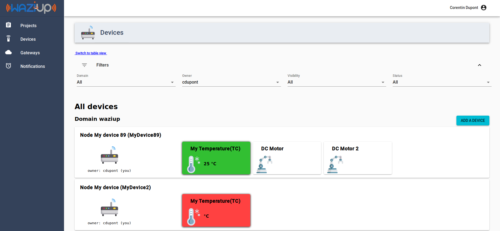

*The WAZIUP Cloud platform allows you to manage your sensors, actuators and IoT data.*
WAZIUP Cloud platform offers everything that you need for your application: 

- Remote connection of your sensors and actuators, 
- Send, receive, collect, store and analyze the data they generate 
- Manage your users and their privacy 
- Turn that data into actionable insights, in real time
- Using SMS or mobile application for notification 
- Standard IoT protocols (HTTP and MQTT).
- Open REST API for application development 
- Control your gateways from remote

**Try it ;) Just click on the "Go to Dashboard" red button.**

