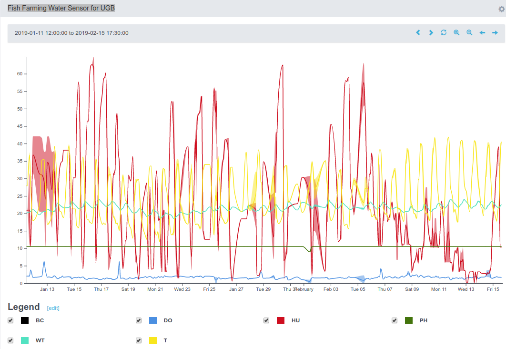
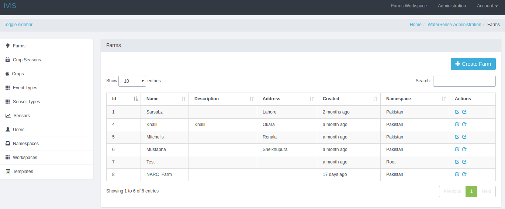

WAZIFARM farming application platform comes with a fully-fledged visualization application and analytics dashboard.
This tool is free to use for development of farming applications.
It is fully integrated with WAZIUP cloud platform.
For instance, a developer, or an entrepreneur can use this tool for rapid development of farming application.
Within few hours, you can develop your own farming applications dashboard.
WAZIFARM provides many customized visualization templates for various use cases.
In addition, it allows end-users to perform various data analytics on their data to take insightful decisions.
WAZIFARM has been used to support three MVPs of WAZIUP namely, agriculture (crop farming), fish farming, and weather station.

Using WAZIFARM tools, you will have everything you need for your farming application. You will be able to: 

- Develop advanced visualization and analytic applications
- Have remote management of the IoT devices
- Manage farm inputs, weather condition, and weather forecast, and feeding practices
- Manage your farming schedule and tasks
- Manage the notification and recommendation for farmers 
- Manage costs, and quantity of reports for your farming business
- Creation and management of farming schedules,  resources and entity
- Usage of the visualization template which can be customized the
- A developer or entrepreneur can create its own application workspaces, and information panels
- Different level of users access, right and roles

