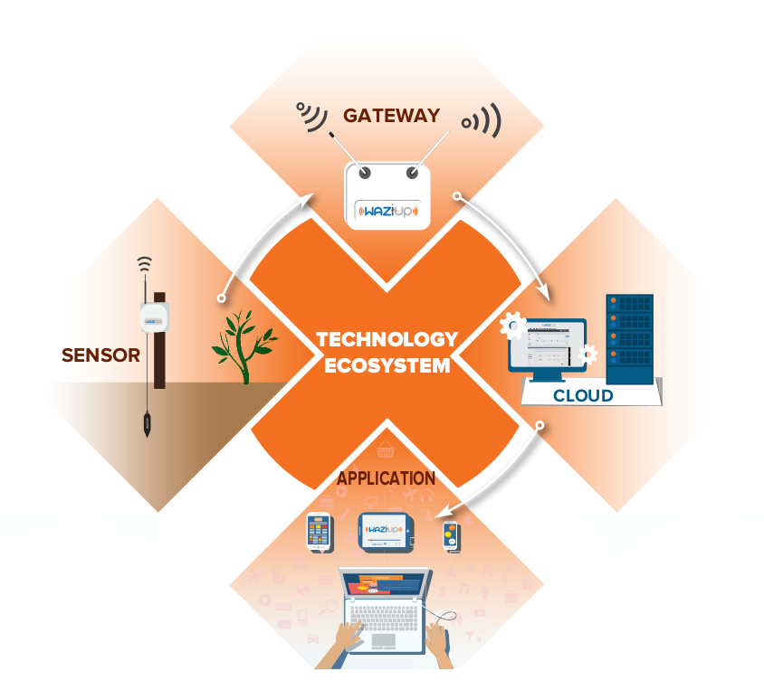
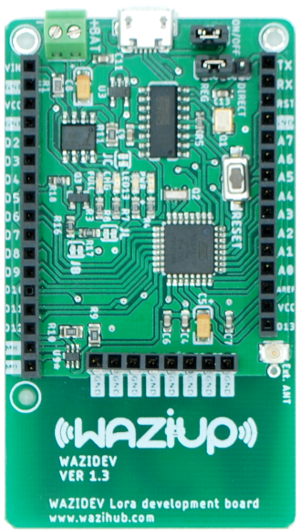
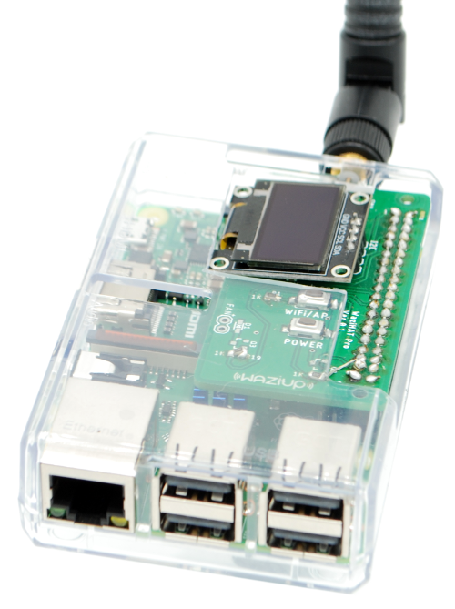

WAZIUP is an IoT and Cloud platform that allows you to create and deploy your IoT applications both in the Cloud and on the IoT gateway.
WAZIUP offers "out-of-box" complete solutions from sensors nodes to applicatons. WAZIUP is particularly adapted to tough conditions, for example for low power and long distance applications. 

Waziup Solutions 
================

WAZIUP modules are: 

- **WaziDev**: IoT LoRa development board based on open source hardware Arduino.  WAZIDev is used for rapid prototyping of the sensor nodes.
- **WaziGate**: IoT LoRa Gateway and edge platform based on Raspberry-pi and which includes the software framework for local processing as well as local application deployments. 
- **WaziCloud**: IoT Cloud Platform with open dashboard and Open API for IoT application development. 

WaziDev
-------

**Develop your IoT application with WAZIDev!**
WAZIDev is a development board integrating Arduino CPU and LoRa network.
Together with the WAZIUP Gateway and Cloud platform, you can develop a wide range of IoT applications.
The board is highly configurable to support a wide range of sensors.

WAZIDev is a development board with embedded LoRa module that allows you to simply develop IoT sensor node as well as IoT actuator node. 
It is an ideal solution for start-ups and entrepreneurs who want to rapid prototype a IoT applications.
Its features include:

- Arduino Pro Mini compatible CPU
- RFM95W LoRa module
- Fully compatible with the Arduino development environment
- Embedded Lipo battery charger for solar panels and low power options
- Two pins with high current support (500mA)

WaziGate
--------

*WaziGate is a IoT LoRa Gateway, ideal for all your remote IoT applications.*
WaziGate is an affordable solution for developing countries needs’.

The WaziGate features:

- Edge capacity to host your applications
- LoRa communication up to 10-12 Km
- Permanent Wifi hotspot
- Wifi/3G/Ethernet internet connection
- Data upload with HTTP, MQTT or even SMS.
- Low power consumption
- Automation
- Remote management

The Gateway can cover up to 100 IoT Sensors and actuator nodes using LoRa radio network: Weather stations, soil monitoring, GPS applications... The possibilities are endless!
The Gateway can also control your actuators, such as electro-valves.
You can host your own applications directly in the gateway, and connect to it through WiFi.

WaziGate embeds an intuitive web administration interface that can be accessed remotely.
The gateway can easily work without Internet connectivity and still provides data to end-users through its embedded database and web-based visualization module.
To build your own WAZIGATE you need a Raspberry-PI, a memory sticks and a WAZIHAT. WAZIGATE uses 3G or Ethernet connection in order to send data to the cloud.
The Gateway can be connected with both direct power supply as well as solar panel.
Due to plug and play, one could need less than 15 minutes to setup a complete IoT infrastructure.

WaziCloud
---------

*The WAZIUP Cloud platform allows you to manage your sensors, actuators and IoT data.*

WAZIUP Cloud platform offers everything that you need for your application: 

- Remote connection of your sensors and actuators, 
- Send, receive, collect, store and analyze the data they generate 
- Manage your users and their privacy 
- Turn that data into actionable insights, in real time
- Using SMS or mobile application for notification 
- Standard IoT protocols (HTTP and MQTT).
- Open REST API for application development 
- Control your gateways from remote

Features
========

WAZIUP IoT Cloud platform offers cutting-edge IoT features and capabilities for your IoT products

- **Device Management**: Manage million of IoT devices
- **Edge computing**: Light-weight IoT PaaS at gateway for computing and application
- **Visualization**: Real-time and advanced historic analytic and visualization of information
- **Big data analytic**: Real-time big data processing and analytic 
- **Users management**: Manage various user’s authentication and roles 
- **Privacy and security**: Offer policy based data access control 
- **Container framework**: Developed fully based on container framework 
- **Users interface**:  Offer various users interface like SMS, voice call, mobile app, web app

Use cases
=========

WAZIUP cutting-edge IoT PaaS platform and software framework support to develop 1000 of IoT applications, out of the box.
Any IoT application that you can imagine.
Due to the PaaS nature WAZIUP IoT PaaS platform enable you to easy and rapid IoT application development.
 
- **Agriculture:** The smart farming applications may include monitoring of soil moisture, water storage tanks and field conditions.
It can also track agro-management decisions such as date of sowing, irrigation, fertilizing, tilling.
For example, farmers will be able to monitor the temperature of grain bins (storage areas) and receive an alert if the temperature rises outside of an acceptable range. 

- **Fish farming:** WAZIUP enables you to connect a network of sensors to monitor the fish ponds in real time, measuring water temperature, quality, oxygen levels and other parameters.
This will improve the current farm management process by giving farmers the ability to monitor their ponds remotely and in near real-time. 

- **Water:** WAZIUP enables you to monitor water quantity, supply, treatment, transportation and storage. Also flood prevention and monitoring is possible.
A water management system based on IoT for rural areas and developing countries can help the community representative monitor and manage water use more efficiently.

- **Smart City:** WAZIUP supports various smart city applications like urban waste management, public transportation, street-light monitoring, traffic monitoring, smart parking, waste water management, urban air pollution, tourism, etc. 

- **Cattle management:** Cattle rustling is one of the main problem in developing countries.
WAZIUP platform can offer farmer to monitor real-time the cattle situation in order to have viable solution to prevent a theft.
The Farmer will receive alert for any critical condition especially the theft. 

- **Healthcare:** WAZIUP allows remote monitoring of patients, such as pregnant woman, patient with diabetics and high-blood pressure, ambient assisted living for the elderly people, and finally child nutrition. 

- **Logistic:** WAZIUP Logistic use case may connect “rural” areas (the goods) with the urban areas (the deliveries).
The supply chain ensure that goods (vegetables, fishes) are delivered in an efficient, safe and timely manner to address food safety.
The potential case study are tracking the fleet, check the integrity, identification and authentication and traceability of the goods, monitoring the temperature and cooling condition of the goods.

**Try it ;) Just click on the "Go to Dashboard" red button.**

