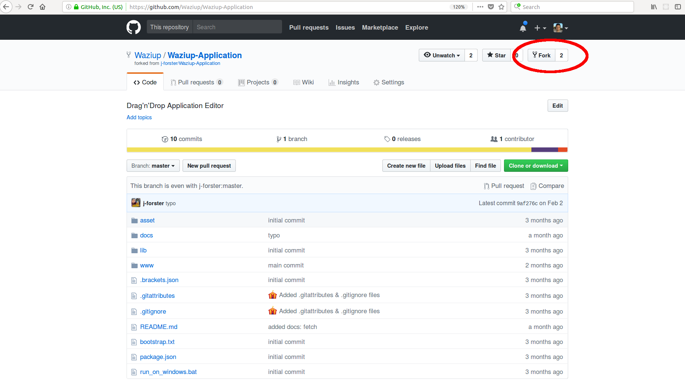
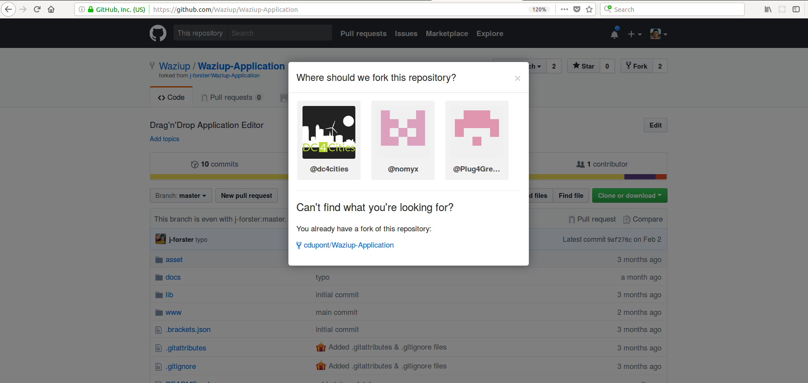
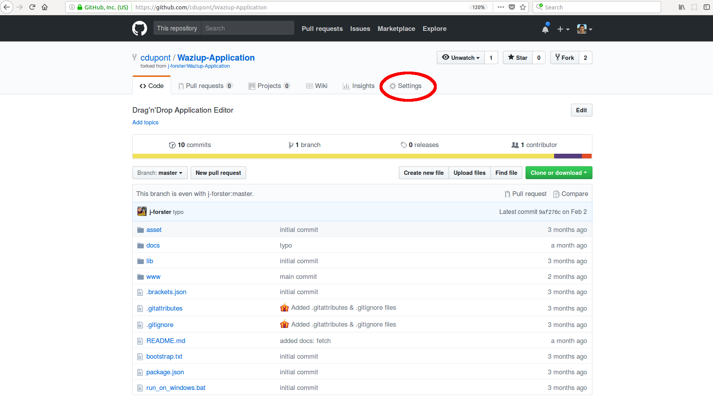
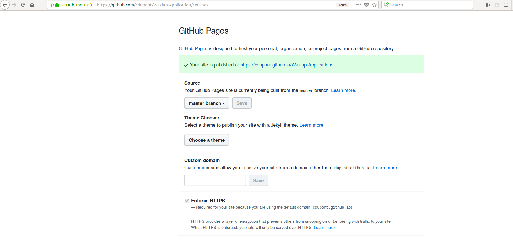

Waziup allows you to develop and host you own IoT applications.
The WaziApp is an HTML5 application and will be hosted directly on Github.
Only a few steps are necessary to get your application running with Waziup!

Fork the template WaziApp
-------------------------

The first step is to create an account on GitHub.
For this go to www.github.com and click on “Sign Up”.
Then, open the template WaziApp: https://github.com/Waziup/Waziup-Application.
Click on the button “Fork” in the top right corner.






You can fork the app in your own Github account.
This operation will duplicate the “Waziup-Application” in your account.



Once this is done, go in the newly created application and click on “Settings”.
Scroll down to “Github pages” and select “Master branch” in the sources, and click on “Save”.



Your application is ready! You can view it on: https://your_account.github.io/Waziup-Application/www/editor.html. 
This is the default application. Now is time to update it!

Modify your WaziApp
-------------------

The application can be modified directly on Github.
For that, click on the file you want to modify and click on the small pen on the right.
Once the modifications done, click on the “commit” button at the bottom of the page.
For heavy modifications, it is better to first clone the application on your own PC.
You need to install git  first.
Then issue the command :
```
git clone git@github.com:<your_account>/Waziup-Application.git
```

This will clone your new app on your computer.
You can then freely modify your applications.
When ready, you can upload it:
```
git add <your_modified_files>
git commit -m “my modifications”
git push
```

After the push is complete, your application is updated!
You can already view it on the URL : https://your_account.github.io/Waziup-Application/www/editor.html. 


Have fun with Waziup.


