**Discover here how to prototype an application for waste management using Waziup.**

The goal of this prototype is to provide an overwiew and quick start on how to develop an IoT device for environmental friendly urban waste manamegement.
The device is enabling of periodic reading about fill level information for waste bins equipped with a hard top.
This is done via ultrasonic distance measurment of the fill level and radio communication of this value via license free LoRa devices to a monitor station. 
Below you find some impressions, a scenario description and some hints how to start developing the electronic and software part of the solution.

## Local African waste soft bin

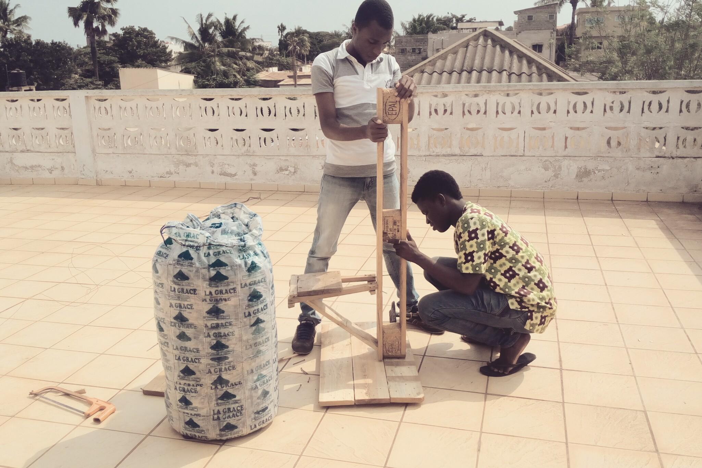

Waste Bin

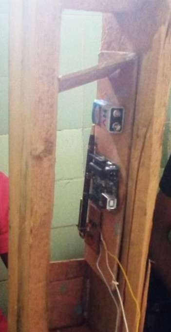

Electronic circuit of early experiments running locally.

# Development

## Development - electronics overview

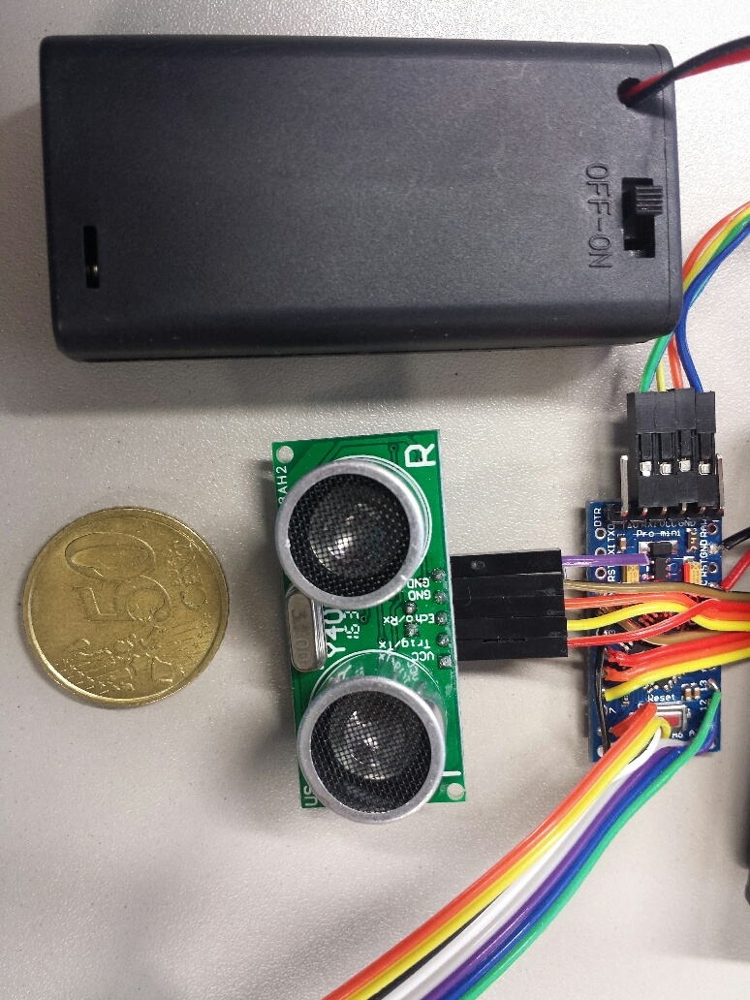

Electronic compoonents for the Urban Waste Management MVP after testing several options and final evaluation: Temperature compensated distance sensor US-100 (Voltage 2.4 - 5.5V), Arduino Pro Mini 3.3V (8MHz) version, energy source (2 or 3 battery type AA), (Radio module -- not visible).

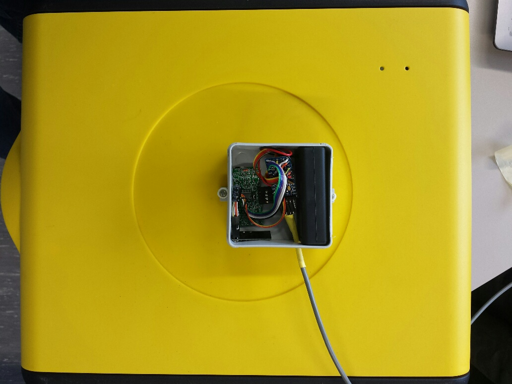

Top view of the waste bin electronics mounted on a waste bin holder.

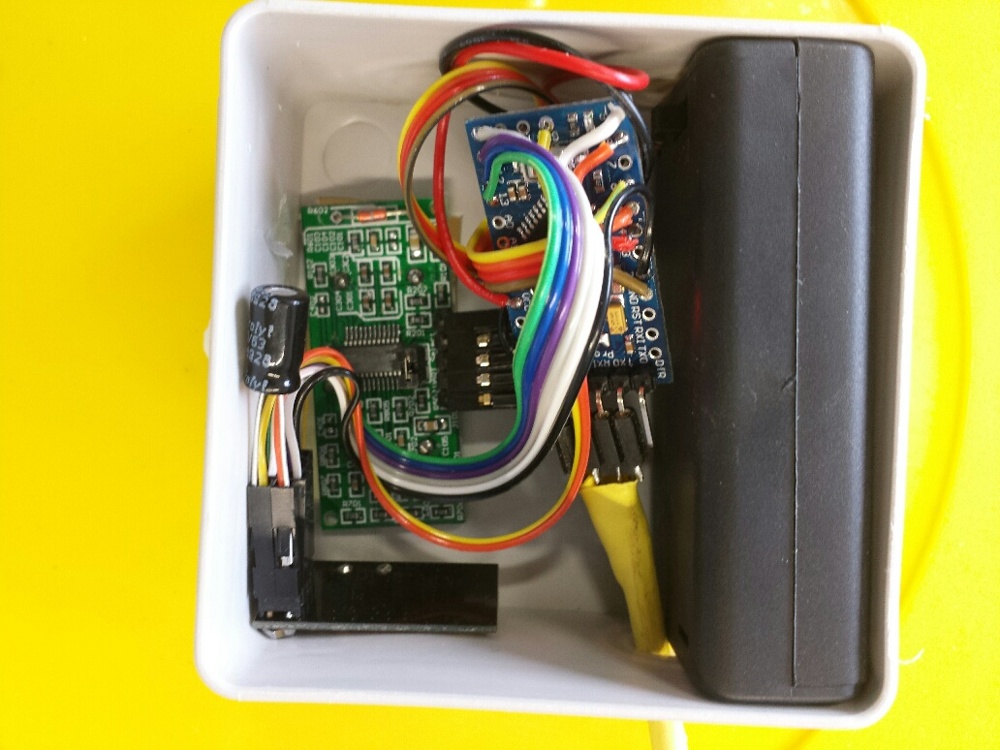

Detailed top view of electronics mounted for waste bin fill level experiments.

## Development - hardware list 

- [Arduino Pro Mini 3.3V] (https://www.sparkfun.com/products/11114)
- [InAir9 LoRa module] (http://modtronix.com/inair9.html)
- [Distance and Temperature Sensor] (https://www.bananarobotics.com/shop/US-100-Ultrasonic-Distance-Sensor-Module)
- [Battery AA] (common local shop)
	
## Development - hardware description

## Arduino

The Arduino Pro Mini 3.3V (8MHz) board with his 328P microcrontroller is the "heart" of the electronic assembly. It contains the central steering loop: it reads sensor information via a serial connection and sends it
via the LoRa module. In the following it is shown how to connect the sensor to the Arduino, afterwards it will be shown how to program it. 

## LoRa module

 The LoRa chip used here is the inAir9 module.
 
 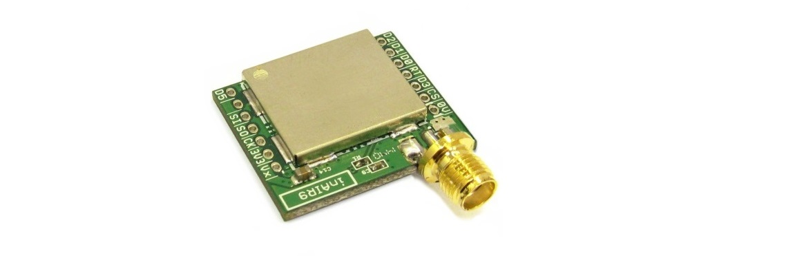

 Below the wire table of the InAir9 module is shown how to connect it to the arduino.
 
 
	
## Ultrasonic distance sensor US-100

Using US-100 in Serial Data Mode provides high accuracy and low computational power to the arduino main board:

Select the operating mode of the US-100 Ultrasonic Distance Sensor by using the jumper on the back of the module. When the jumper is present (choose serial data mode), the sensor outputs the distance as binary serial data. UART mode serial interface configuration 9600 baud rate, starting a one, and stop bits a, data bits, eight, and white parity checking, no flow control.

Attach the module to a serial port on your microcontroller. The Trig/TX pin connects to your microcontroller's TX serial transmit line. The Echo/RX pin connects to your microcontroller's RX serial receive line. Set the microcontroller's serial port to use 9600 baud at 8-N-1 (eight data bits, no parity, one stop bit).

To start measuring the distance, output a 0x55 over the serial port and read back the two byte distance in high byte, low byte format. The distance returned is measured in millimeters. Use the following formula to obtain the distance as millimeters:

    Millimeters = FirstByteRead * 256 + SecondByteRead

This module can also output the temperature when using serial output mode. To read the temperature, output a 0x50 byte over the serial port and read back a single temperature byte. The actual temperature is obtained by using the following formula:

    Celsius = ByteRead - 45
	
## Development - hardware connection

# Software

## Program the Arduino

Arduino cna be programmed by sending a set of instructions to the microcrontroller on the board.
To realize that the IDE Arduino Software which uses a simplified version of C++ is applied. The Arduino software can be download [here](https://www.arduino.cc/en/main/software).
Then to connect the Arduino Pro Mini to the computer an USB-FTDI chip as below was aused.

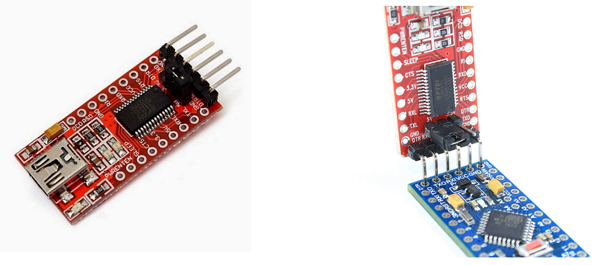

## Libraries

- [SoftwareSerial library] (https://www.arduino.cc/en/Reference/SoftwareSerial) is used with the distance sensor US-100 via serial communication
- [SX1272 library] (https://github.com/CongducPham/LowCostLoRaGw) is used with LoRa module

### LoRa module

To send the measured fill level data via the LoRa radio the SX1272 library is used. Examples to use this library  can be found [here](https://github.com/CongducPham/LowCostLoRaGw/tree/master/Arduino).

### Distance sensor module

To get the distance (and inherently temperature) measure from the US-100 sensor the SoftwareSerial library is used to run it in the serial (more accurate than the PWM) mode.
Here is a sample code used:

	
	// Test of distance and temperature for sensor module US-100
	// using 3,3 V  Arduino Pro Mini powering US-100 via Arduino GPIO
	// adapted from Zeisberg, Jan 2017
	// Original from RafaG, 2014
 	
	#include <SoftwareSerial.h>;
	
	const int US100_TX = 6;
	const int US100_RX = 5;
 
	// instntiation of a new serial channel
	SoftwareSerial portUS100(US100_RX, US100_TX);
 
	unsigned int MSByteDist = 0;
	unsigned int LSByteDist = 0;
	unsigned int mmDist = 0;
	int temp = 0;
 
	void setup() {
    	// provide VCC to US100 via GPIO 4 to enable later energy saving function 
    	pinMode(4, OUTPUT);
    	digitalWrite(4, HIGH);
    
    Serial.begin(9600);
    portUS100.begin(9600);
    
	}
 
	void loop() {
 
    portUS100.flush(); // limpia el buffer del puerto serie
    portUS100.write(0x55); // orden de medición de distancia
 
    delay(500);
 
    if(portUS100.available() >= 2) // comprueba la recepción de 2 bytes
    {
        MSByteDist = portUS100.read(); // lectura de ambos bytes
        LSByteDist  = portUS100.read();
        mmDist  = MSByteDist * 256 + LSByteDist; // distancia
        if((mmDist > 1) && (mmDist < 10000)) // comprobación de la distancia dentro de rango
        {
            Serial.print("Distance: ");
            Serial.print(mmDist, DEC);
            Serial.println(" mm");
        }
    }
 
    portUS100.flush(); // limpia el buffer del puerto serie
    portUS100.write(0x50); // orden de medición de distancia
 
    delay(500);
    if(portUS100.available() >= 1) // comprueba la recepción de 1 byte
    {
        temp = portUS100.read(); // lectura del byte
        if((temp > 1) && (temp < 130)) // comprobación de rango válido
        {
            temp -= 45; // corrige offset de 45º
            Serial.print("Temperature: ");
            Serial.print(temp, DEC);
            Serial.println(" Grad Celsius.");
        }
    }
 
    delay(1000);
	}

## Test scenario EU soft waste bin

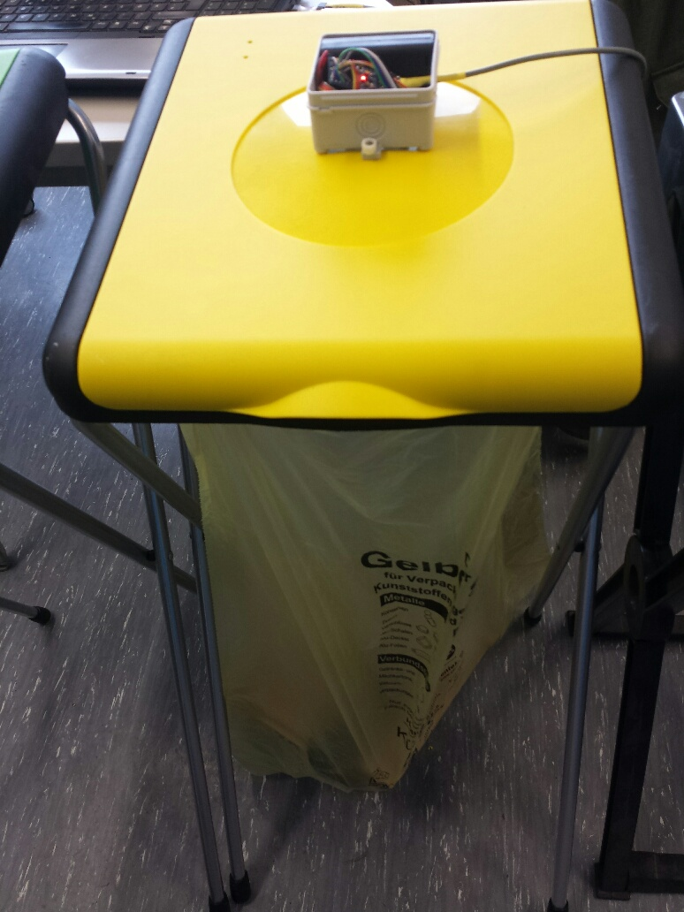
Front side view of MVP urban waste management experimental setup with soft bin and hard top.

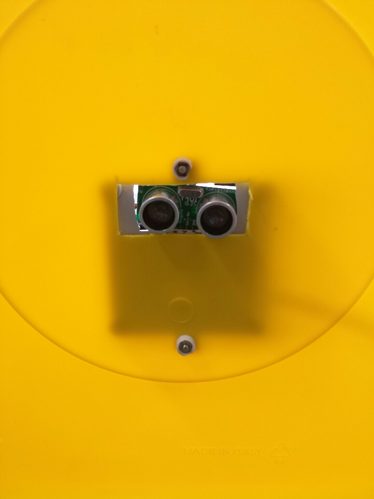
Inside top view from down - showing sensor looking downwards to estimate the distance from top to the surface of the waste.

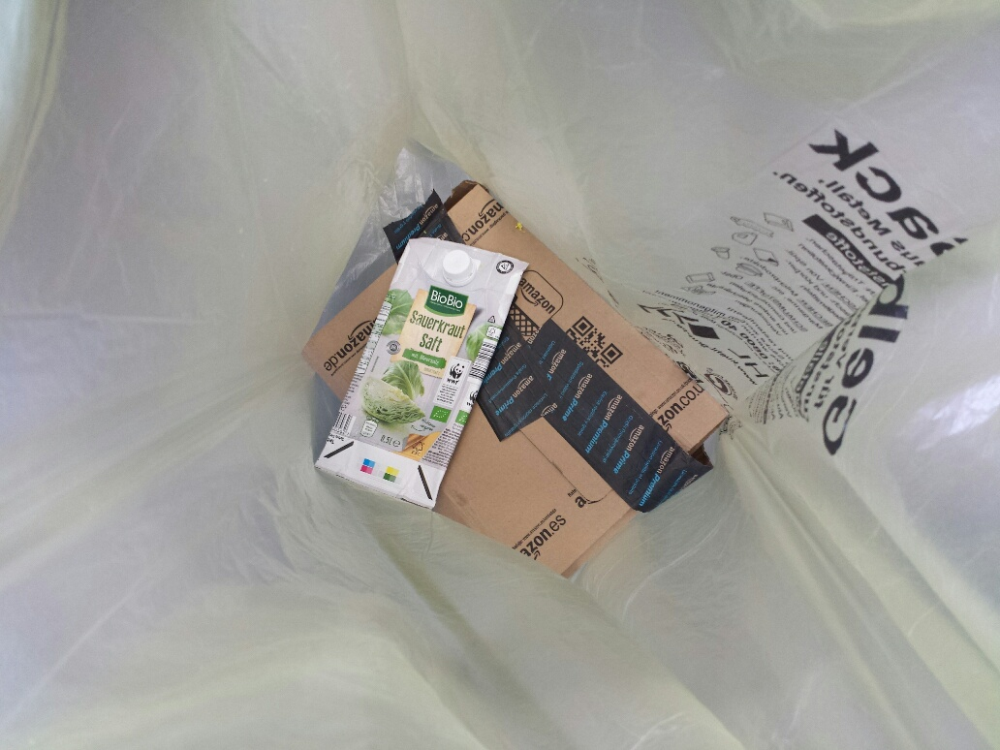
Almost empty German waste bin inside - downside looking view.

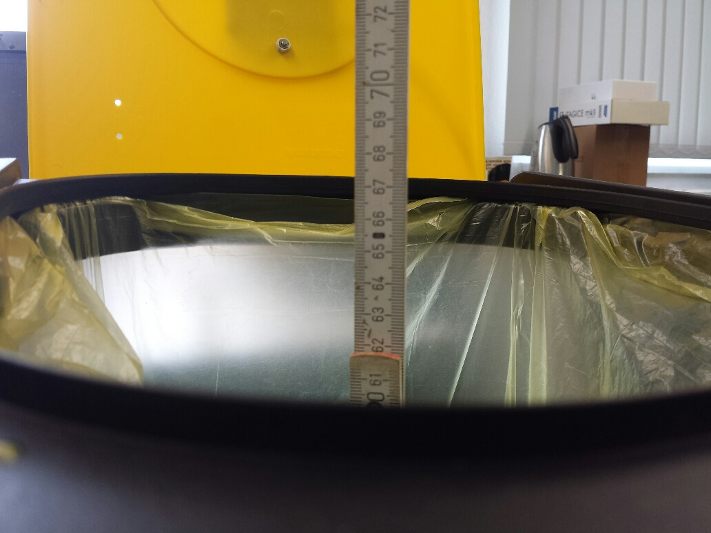

Distance measured 62cm for comparison for almost empty trash bin.

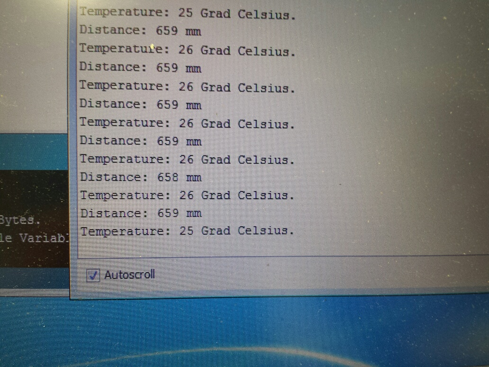

Distance measured 65cm with ultrasonic sensor US-100 for almost empty trash bin.

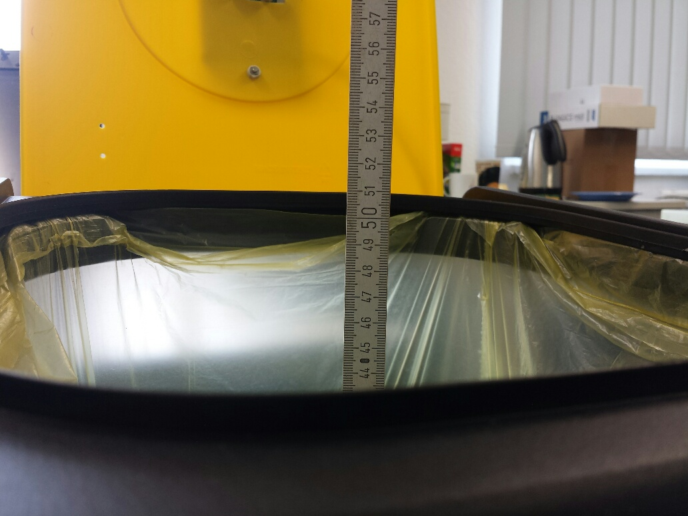

Distance measured 44cm for comparison for 1/3 filled trash bin.

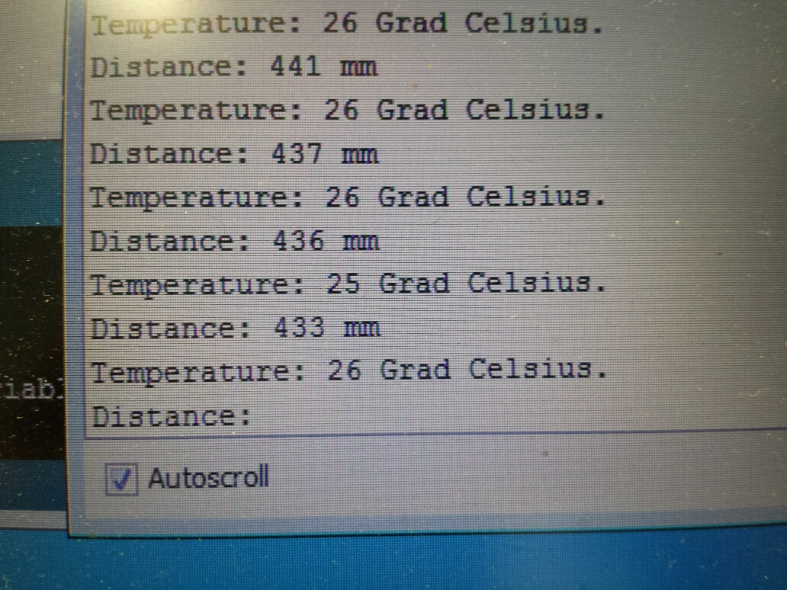

Distance measured 44cm with ultrasonic sensor US-100 for 1/3 filled trash bin.

