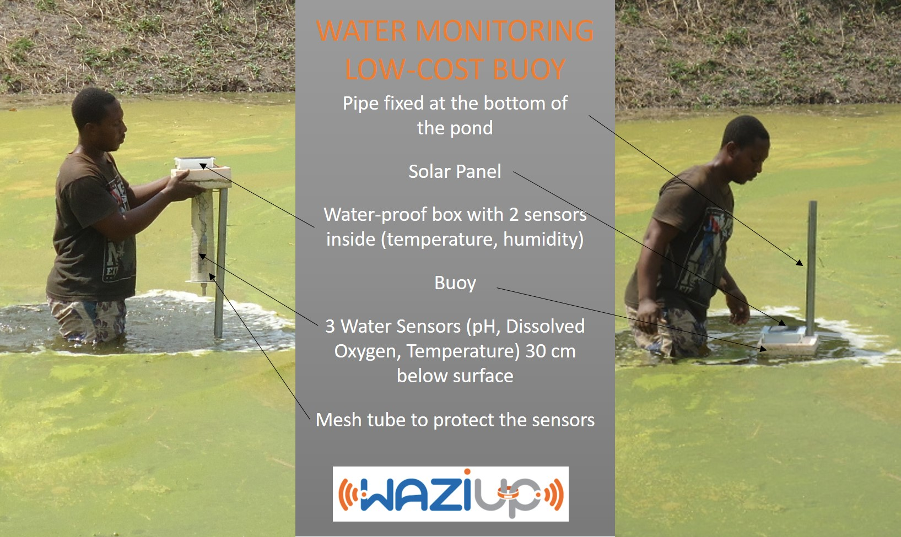

**Discover here how to prototype an application of fish farming using Waziup.**

The goal of this prototype is giving a first look on how to develop an IoT device for fish farming. The device is capable of giving real time reading about relevant information for fish ponds such as acidity,
dissolved oxygen and communicate this data via LoRa. Below you will find a get started tutorial : how to develop the electronic and software part of the solution.

## Measure

The measures taken by the device are the temperature, the dissolved oxygen and the acidity of the water. The device is powered by a solar panel with a battery.
The solution will be placed in a watertight box to protect the electronic, we also get temperature and humidity into the box. The last value controled
is the voltage of the battery. 

## hardware 

- [Arduino Pro Mini 3.3V] (https://www.sparkfun.com/products/11114)
- [InAir9 LoRa module] (http://modtronix.com/inair9.html)
- [Temperature Sensor (for water)] (https://www.sparkfun.com/products/11050)
- [Temperature and humidity Sensor] (http://www.robotshop.com/eu/fr/capteur-humidite-temperature-dht22.html)
- [DO Sensor] (https://www.sparkfun.com/products/11194)
- [PH Sensor] (http://www.atlas-scientific.com/product_pages/kits/ph-kit.html)
- [Solar Panel 2W] (https://www.sparkfun.com/products/13781)
- [Battery 2000mAh] (https://www.sparkfun.com/products/8483)
- [Charger for Solar Panel and Battery] (https://www.sparkfun.com/products/12885)
- Resistor:
	- 4k7 ohm x2
	- 47k ohm x1
	- 10k ohm x1  
	

# Electronic Build

## Arduino

The Arduino board with his microcrontroller is the central part of the electronic assembly. It contains all the logic : it gathers sensors information, process it and send it
via the LoRa module. In this first section we will just see how to connect the sensors to the Arduino, on a second hand we will see how to program it.
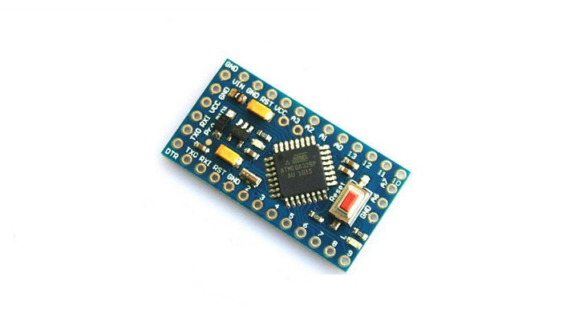

## PH and DO sensors
	
The PH and DO sensors work with a small circuit to precise measures and calibrate the sensor : [DO EZO circuit](http://www.atlas-scientific.com/_files/_datasheets/_circuit/DO_EZO_Datasheet.pdf) and [PH EZO circuit](http://www.atlas-scientific.com/_files/_datasheets/_circuit/pH_EZO_datasheet.pdf).

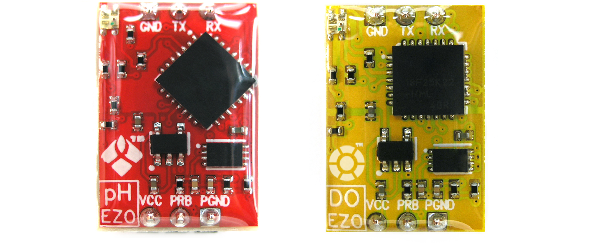

Both circuits are connect to I2C wire of arduino (pin A4 and A5 on arduino pro mini).
In order to works with I2C, the circuits need to be switch in I2C mode.

These are the instructions to switch an EZO circuit to I2C mode :

- Connect the circuit to the arduino as following  :
	- VCC of arduino to VCC of EZO circuit
	- GND of arduino to GND of EZO circuit
	- PGND of EZO circuit to TX of EZO circuit
- Power the arduino 
- Wait for the circuit LED to change from Green to Blue 
- Remove the connection from PGND pin to TX pin 
- The device is now in I2C mode

The default I2C adress for the EZO DO is 97, for the EZO PH it's 99.

Rather than power the sensors with the VCC output of the arduino we prefer power it with the digital output pins.
This choice makes power saving management easier.
In our prototype we choose the pin 6 to power the EZO DO circuit and pin 7 to power the EZO PH.

Wire table :
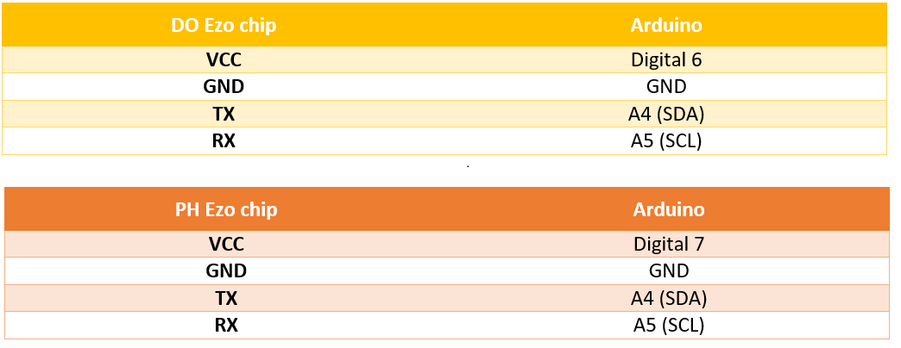

Then we have to connect each sensor to their EZO circuit. Each sensor come with a DC barrel jack to connect to the circuit.
Connect the GND pin of the barrel connector with the PGND pin of the EZO circuit and connect the pin next to the GND of the barrel connector to PRB bin of the EZO circuit as below.

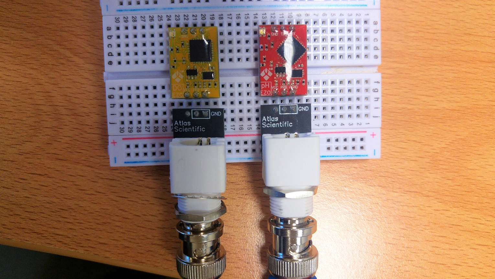

## Water temperature sensor

The sensor we use to control water temperature is the DS18B20.

As we did for PH and DO sensor, we power this sensor using digital output pin of the arduino. However you can use the VCC pin to your own preference.
Here the digital pin 8 is used for power and the digital pin 2 is used for data. A 4k7 ohms resistor is required between VCC pin and Data pin. Below it's the wire schema of the sensor. 

![DS18B20 Wire] (images/DS18B20_wire.jpg)

## LoRa module

 The LoRa chip we use is the inAir9 module.
 
 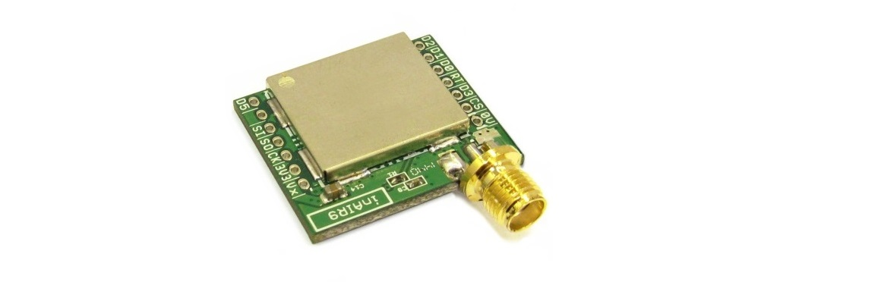

 Below the wire table of the InAir9 module with the arduino.
 
 

## Temperature and Humidity sensor (optional)

Our first prototype is test in Ghana which is a particulary hot country thus we decide to add a temperature and humidity sensor to check
 conditions into the box.
You can choose to add it or not as your convenience. The sensor we use to this purpose is the DHT22 sensor.

 ![DHT22] (images/DHT22.png)

The VCC pin of the sensor is connected to the digital pin 8 of the arduino, but you can use the VCC pin also.
The DATA pin of the sensor is connected to the digital pin 3 of the arduino. 
As we did with the DS18B20 sensor, a 4k7 ohms resistor is needed between VCC and DATA.

## Voltage measure

We want to know the voltage at battery outputs to estimate the charge level.
We use a li-ion battery so the voltage ranges from 3V (empty) to 4.2V (fully charged) at 25°C. We reach 50% charge level at about 3.8V still at 25°C temperature.
To get voltage at the arduino inputs we use a voltage divider. We choose the analog pin 1 of the arduino to calculate the real voltage.
Below this is the schema of the voltage divider. We use high-value resistor to minimize the current waste.

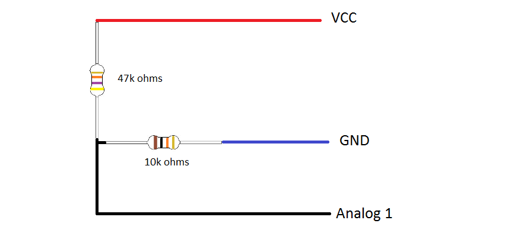

## Charger, battery and solar panel

 We take a charger board from sparkfun to connect the solar panel, the battery and the arduino together.
 This charger board provide us the ability to get the most possible power out of our solar panel and into a rechargable Li-ion battery. 
 The set up is easy, just plug the solar panel into one side of the circuit, the battery and the arduino in parallel on the other side.
 
 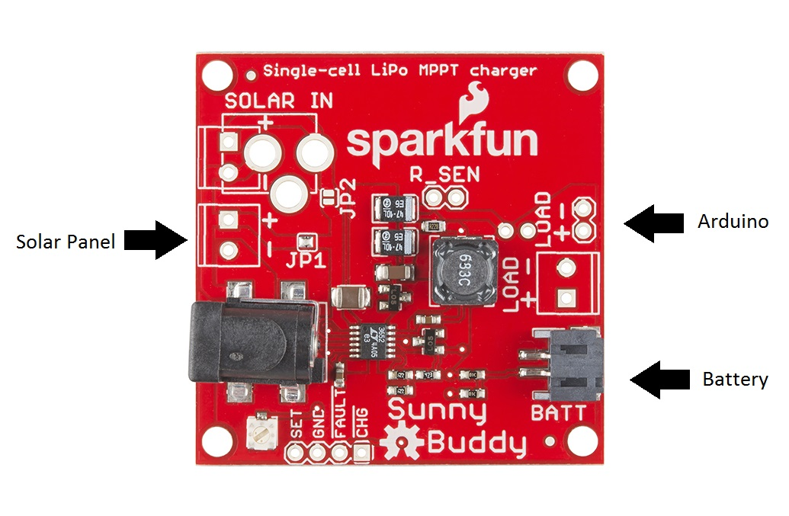

## General schematic

Here you can see the schematic of the entire circuit without the charger part.

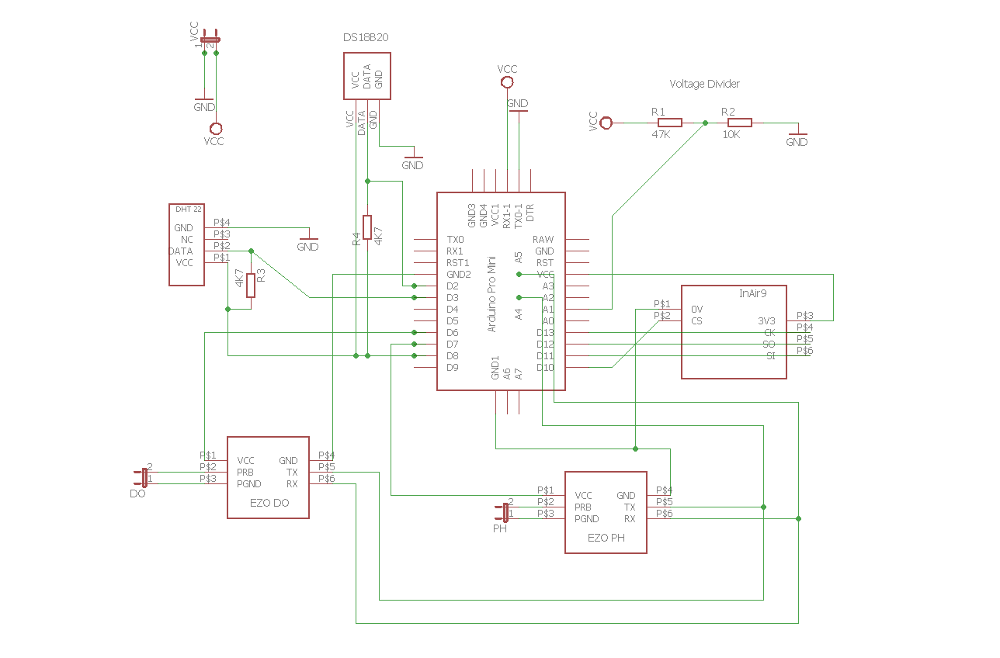

## Implementation

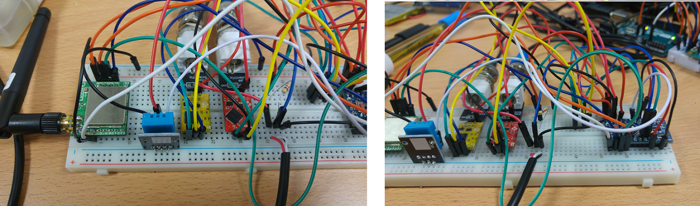

In our implementation we decide to create a PCB board of the circuit to make the component assembly easier.

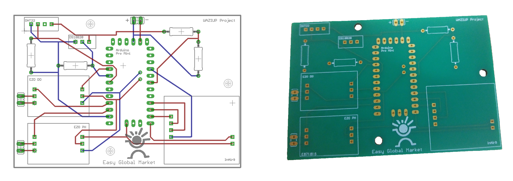

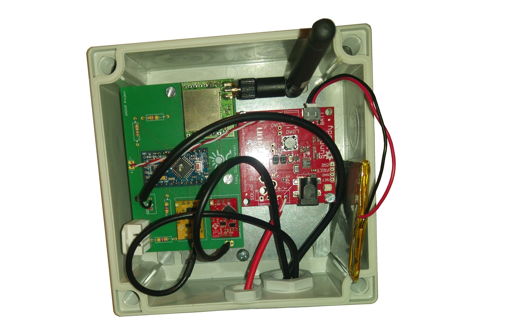

# Software

## Program the Arduino

We can program the Arduino by sending a set of instructions to the microcrontroller on the board.
To do so we use the IDE Arduino Software which uses a simplified version of C++. The Arduino software can be download [here](https://www.arduino.cc/en/main/software).
Then to connect the Arduino Mini to the computer we use an USB-FTDI chip as below.

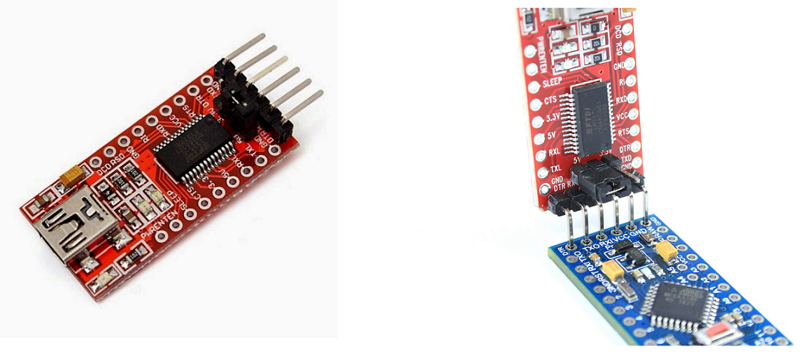

## Libraries

- [OneWire library] (https://github.com/PaulStoffregen/OneWire) is used with temperature DS18B20 sensor
- [DHT library] (https://github.com/RobTillaart/Arduino/tree/master/libraries/DHTlib) is used with temperature and humidity DHT22 sensor
- [SX1272 library] (https://github.com/CongducPham/LowCostLoRaGw) is used with LoRa module

## Sensor coding samples

### DO Sensor

The sample code to manage the DO sensor can be find [here](http://www.atlas-scientific.com/_files/code/do-i2c.pdf).

Attention, if you have used digital pin 6 for power supply, don't forget to add this code in setup section to switch power on :

		void setup()
		{
		 Serial.begin(9600);
		 Wire.begin();
		 pinMode(6,OUTPUT);
		 digitalWrite(6,HIGH);
		}
		
### PH Sensor

The sample code to manage the PH sensor can be find [here](http://www.atlas-scientific.com/_files/code/ph-i2c.pdf).

Attention, if you have used digital pin 6 for power supply, don't forget to add this code in setup section to switch power on:

		void setup()
		{
		 Serial.begin(9600);
		 Wire.begin();
		 pinMode(7,OUTPUT);
		 digitalWrite(7,HIGH);
		}

		
### Water temperature sensor

To get temperature from DS18B20 sensor we use the OneWire library.
Here is a sample code:

		#include <OneWire.h> 

		#define TemperatureSensorsPowerPin 8

		int DS18S20_Pin = 2; //DS18S20 Signal pin on digital 2

		//Temperature chip i/o
		OneWire ds(DS18S20_Pin);  // on digital pin 2

		void setup(void) {
		  Serial.begin(19200);
			pinMode(TemperatureSensorsPowerPin,OUTPUT);    // Switch on power for temp and humdity sensor
			digitalWrite(TemperatureSensorsPowerPin,HIGH);
		}

		void loop(void) {
		  float temperature = getTemp(); //will take about 750ms to run
		  Serial.println(temperature);
		  delay(2000);
		}

		float getTemp(){
		  //returns the temperature from one DS18S20 in DEG Celsius

		  byte data[12];
		  byte addr[8];

		  if ( !ds.search(addr)) {
			  //no more sensors on chain, reset search
			  ds.reset_search();
			  return -1000;
		  }

		  if ( OneWire::crc8( addr, 7) != addr[7]) {
			  Serial.println("CRC is not valid!");
			  return -1000;
		  }

		  if ( addr[0] != 0x10 && addr[0] != 0x28) {
			  Serial.print("Device is not recognized");
			  return -1000;
		  }

		  ds.reset();
		  ds.select(addr);
		  ds.write(0x44,1); // start conversion, with parasite power on at the end
		  
		  delay(750); // Wait for temperature conversion to complete

		  byte present = ds.reset();
		  ds.select(addr);    
		  ds.write(0xBE); // Read Scratchpad

		  
		  for (int i = 0; i < 9; i++) { // we need 9 bytes
			data[i] = ds.read();
		  }
		  
		  ds.reset_search();
		  
		  byte MSB = data[1];
		  byte LSB = data[0];

		  float tempRead = ((MSB << 8) | LSB); //using two's compliment
		  float TemperatureSum = tempRead / 16;
		  
		  return TemperatureSum;
		  
		}

		
### Temperature and Humidity Sensor

To get temperature and humidity measure from DHT22 sensor we use the DHT library.
Here is a sample code:

		#include "DHT.h"

		#define DHT_PIN 3

		const byte DHT_SUCCESS = 0;
		const byte DHT_TIMEOUT_ERROR = 1;
		const byte DHT_CHECKSUM_ERROR = 2;
		DHT dht(DHT_PIN);

		void setup()
		{
		  Serial.begin(19200);
		  pinMode(8,OUTPUT);
		  digitalWrite(8,HIGH);
		}

		void loop()
		{
		  float temperature, humidity;
		 

		  switch (dht.readDHT22(&temperature, &humidity)) {
		  case DHT_SUCCESS: 
			 
			Serial.print(F("Humidity (%): "));
			Serial.println(humidity, 2);
			Serial.print(F("Temperature (C): "));
			Serial.println(temperature, 2);
			break;
		 
		  case DHT_TIMEOUT_ERROR: 
			Serial.println(F("No response!")); 
			break;
		 
		  case DHT_CHECKSUM_ERROR: 
			Serial.println(F("Communication pb")); 
			break;
		  }

		  delay(1000);
		}

		
### LoRa module

To send data via LoRa we use the SX1272 library.

You will find all the samples to use this library [here](https://github.com/CongducPham/LowCostLoRaGw/tree/master/Arduino).

### Battery Voltage

Below we have a sample to calculate the battery voltage output.
	
	#define RESISTOR1 47000.0        // RESISTOR to calculate voltage
	#define RESISTOR2 10000.0

	#define VoltagePin  A2

	float batteryVoltage;

	void setup() {
	  Serial.begin(38400);
	  
	}

	void loop() {

	  batteryVoltage = getBatteryVoltage();
	  Serial.println(batteryVoltage);

	  delay(2000);

	}

	float getBatteryVoltage()
	{
	   int rawVin;
	   int sumRawVin = 0;
	   analogReference(INTERNAL);
	   
	  for (byte y=0; y<30; y++){
		rawVin = analogRead(VoltagePin);
		sumRawVin=sumRawVin+rawVin;
		delay(5);
	  }
	  
	  rawVin = sumRawVin/30;
	  float real_v = (rawVin * 1.1 / 1024.0) / (RESISTOR2/(RESISTOR1+RESISTOR2));
	  if (real_v < 0.1) {  real_v=0.0; }
	  
	  return real_v;
	}

## Arduino sleep mode

In order to save battery, you will certainly need to put the Arduino and the sensors in sleep mode.
It exists 5 different sleep modes in arduino from  the least to the most power saving mode:

 - SLEEP_MODE_IDLE
 - SLEEP_MODE_ADC
 - SLEEP_MODE_PWR_SAVE
 - SLEEP_MODE_STANDBY
 - SLEEP_MODE_PWR_DOWN 
 
When the arduino is in SLEEP_MODE_PWR_DOWN the only way to wake it is with either a watchdog timer interrupt,
 a level interrupt on pins 2 or 3, or a Pin Change interrupt. So in our cas we need to use the watchdog timer interrupt.
 
### Enable Watchdog timer interrupt

You can skip this section if you are not using an Arduin Pro mini board.

Unfortunately watchdog timer interrupt is defective on Arduino Pro mini board. To fix the problem a new bootloader has to be installed on it.
We will install the bootloader of the Arduino UNO which uses the same microprocessor chip(atmega328).

Here you will find how to install this bootloader :

- First Open the bootloader file boards.txt wich is located 

on windows :
			
> C:\Users\\{userName}\AppData\Local\Arduino\packages\arduino\hardware\avr\\{version}\boards.txt

on linux :  
			
> /usr/share/arduino/hardware/arduino/avr/boards.txt 

In this file, find the lines about the Arduino pro mini 3.3V

	## Arduino Pro or Pro Mini (3.3V, 8 MHz) w/ ATmega328
	## --------------------------------------------------
	pro.menu.cpu.8MHzatmega328=ATmega328 (3.3V, 8 MHz)

	pro.menu.cpu.8MHzatmega328.upload.maximum_size=30720
	pro.menu.cpu.8MHzatmega328.upload.maximum_data_size=2048
	pro.menu.cpu.8MHzatmega328.upload.speed=57600

	pro.menu.cpu.8MHzatmega328.bootloader.low_fuses=0xFF
	pro.menu.cpu.8MHzatmega328.bootloader.high_fuses=0xDA
	pro.menu.cpu.8MHzatmega328.bootloader.extended_fuses=0xfd
	pro.menu.cpu.8MHzatmega328.bootloader.file=atmega/ATmegaBOOT_168_atmega328.hex

	pro.menu.cpu.8MHzatmega328.build.mcu=atmega328p
	pro.menu.cpu.8MHzatmega328.build.f_cpu=8000000L

	
Replace the line: "***pro.menu.cpu.8MHzatmega328.bootloader.file=atmega/ATmegaBOOT_168_atmega328.hex***"

By the line :  "***pro.menu.cpu.8MHzatmega328.bootloader.file=optiboot/optiboot_atmega328.hex***"

Save and close the file.

- Then we need to flash the boot using an in system programmer.

In this tutorial we will use an Arduino UNO as ISP but it also works with other Arduino boards.
We start by connecting the Arduino UNO to the computer. In Arduino IDE, we go to ***file*** -> ***examples*** and select ***ArduinoISP***. It opens the sketch to use the Arduino as an in system programmer.
We flash this sketch on the Arduino UNO.

Next, we connect the Arduino UNO and the Arduino Pro mini as following.

| ***Arduino UNO*** | ***Arduino Pro mini*** |
|-------------|------------------|
|  3V3        | VCC              |
| GND         | GND              |
| Digital 10  | RST              |
| Digital 11  | Digital 11       |
| Digital 12  | Digital 12       |
| Digital 13  | Digital 13       |

Then we select "Arduino Pro or Pro mini" in ***tools->Board*** and "ATmega328 (3.3v, 8 MHz)" in ***tools->processor***. Finally we click on ***tools->Burn Bootloader***.

The Arduino Pro mini is now ready.

### Sample code for sleep mode

The longest interval the Watchdog timer can be set is 8 sec.

Here you will find a sample on how to put the Arduino Pro mini in sleep mode for a longer period.

	#include <avr/interrupt.h>
	#include <avr/wdt.h>
	#include <avr/sleep.h>
	#include <avr/power.h>

	#define SLEEP_LOOP 4  // one loop = 8 sec. Example sleep_loop = 4 -> 4*8 = 32 sec

	volatile int nbr_remaining; 

	void setup()
	{
	  
	  Serial.begin(38400);
	  configure_wdt();
	  nbr_remaining=0;

	}

	void loop(void)
	{

	  Serial.println("Loop Start");
	  while (1) {
		  Serial.println(F("System awake"));
		  wdt_reset(); // Reset the watchdog timer to not trigger when not needed
		  
		  // Put your code here
		  delay(2000);
		  // if your code take more than 8 sec to process 
		  //  dont forget to put some wdt_reset() or the watchdog will be triggered
		  
		  
		  Serial.println(F("System sleep"));
		  Serial.flush(); // always put a Serial.flush() before sleep
						  // to let the serial finished its task before starting sleep mode
		  sleep(SLEEP_LOOP);
	  }

	}

	// Init the watchdog timer interrupt
	void configure_wdt(void)
	{
	 
	  cli();                           // disable interrupts for changing the registers

	  MCUSR = 0;                       // reset status register flags

									   // Put timer in interrupt-only mode:                                       
	  WDTCSR |= 0b00011000;            // Set WDCE (5th from left) and WDE (4th from left) to enter config mode,
									   // using bitwise OR assignment (leaves other bits unchanged).
	  WDTCSR =  0b01000000 | 0b100001; // set WDIE: interrupt enabled
									   // clr WDE: reset disabled
									   // and set delay interval (right side of bar) to 8 seconds

	  sei();                           // re-enable interrupts 
	}

	// interrupt raised by the watchdog firing
	ISR(WDT_vect)
	{
		if(nbr_remaining > 0)
		{
			nbr_remaining = nbr_remaining - 1;
			wdt_reset();
		}
		else
		{
			MCUSR = 0;                          // reset flags
			 
			WDTCSR |= 0b00011000;               // Enter config mode.
			WDTCSR =  0b00001000 | 0b000000;    // clr WDIE (interrupt enable...7th from left)
												  // set WDE (reset enable...4th from left), and set delay interval
												  // reset system in 16 ms...
												  // unless wdt_disable() in loop() is reached first
		   while(1);          

		}
	}

	void sleep(int ncycles)
	{ 
	  nbr_remaining = ncycles;
	  set_sleep_mode(SLEEP_MODE_PWR_DOWN);
	 
	  power_adc_disable();
	 
	  while (nbr_remaining > 0){ 
		sleep_mode();
		sleep_disable();
	  }
	  power_all_enable();
	 
	}

## Implementation

The Arduino sketch used into the MVP water can be find [here](https://github.com/blissillour/MVPWater).
Into this sketch we use a library that we created to facilitate the implementation of the sensors.
The library can be find [here](https://github.com/blissillour/water-sensors).

Below you have a sample on how to use the library:

	#include <WaterSensor.h>

	#define address_PH 99         // default PH sensor adress on I2C port
	#define address_DO 97         // default DO sensor adress on I2C port
	#define DS18S20_Pin 2         // digital pin of the temperature sensor (outside the box)
	#define DHT_PIN 3             // digital pin of the humidity and temperature sensor (inside the box)

	#define TemperatureSensorsPowerPin 8
	#define EzoDOSensorPowerPin 6
	#define EzoPHSensorPowerPin 7

	float temperatureBox, humidityBox, temperature;
	char dataPH[10] , dataDO[10];

	WaterSensor waterSensor(DS18S20_Pin,DHT_PIN, address_PH,address_DO);

	void setup()
	{
	  // Open serial communications and wait for port to open:
	  Serial.begin(38400);
	  
	  Wire.begin();           //enable I2C port.

	  pinMode(TemperatureSensorsPowerPin,OUTPUT);    // Switch on power for temp and humdity sensor
	  pinMode(EzoDOSensorPowerPin,OUTPUT);          // Switch on power for DO sensor
	  pinMode(EzoPHSensorPowerPin,OUTPUT);          // Switch on power for PH sensor

	  digitalWrite(TemperatureSensorsPowerPin,HIGH);
	  digitalWrite(EzoPHSensorPowerPin,HIGH);
	  digitalWrite(EzoDOSensorPowerPin,HIGH);

	}

	void loop(void)
	{
	  dataPH[0] = '\0';
	  dataDO[0] = '\0';
	  
	  delay(200);
	  
	  // Wake up DO and PH sensors 
	  waterSensor.wakeUpPHSensor();
	  waterSensor.wakeUpDOSensor();
	  
	  temperature = waterSensor.getTemperatureValue();
	  Serial.print(F("Temp in water : "));
	  Serial.println(temperature);
	  
	  delay(1000);
		
	  waterSensor.getInboxTemperatureHumidityValue(&temperatureBox,&humidityBox);
	  Serial.print(F("Temp in box : "));
	  Serial.println(temperatureBox);
	  Serial.print(F("Humidity : "));
	  Serial.println(humidityBox);
	  
	  delay(1000);
	  
	  waterSensor.sendTempToDOSensor(temperature);   // Send the temperature to DO sensor to precise the reading value
	  waterSensor.getDOSensorValue(dataDO);          // Receive the DO value
	  Serial.print(F("DO : "));
	  Serial.println(dataDO);
	  
	  delay(1000);
	  
	  waterSensor.sendTempToPHSensor(temperature);     // Send the temperature to PH sensor to precise the reading of the value
	  waterSensor.getPHSensorValue(dataPH);            // Receive the PH value
	  Serial.print(F("PH : "));
	  Serial.println(dataPH);

	  delay(1000);

	  waterSensor.sleepPHSensor();             // Put the PH sensor in sleep mode to save battery power
	  waterSensor.sleepDOSensor();             // Put the DO sensor in sleep mode to save battery power
	  delay(4000);
	}
