The objective is to develop a low-cost and sustainable solution capable of reading real-time data typical of a Weather Station, using different sensors, and capable of communicating via LoRa.
The following steps provide a Getting Started tutorial. Detailed documentation, such as the complete Assembly guide and the Technical guide, can be found [here](https://github.com/Waziup/WAZIUP-WeatherStation/tree/master/extra/documents).

Hardware
--------

The following hardware is required to develop the LoRa Weather Station and can be found in [IoT-Catalogue](https://www.iot-catalogue.com/products/59b1797c763cfc066f6d092b) as well.

  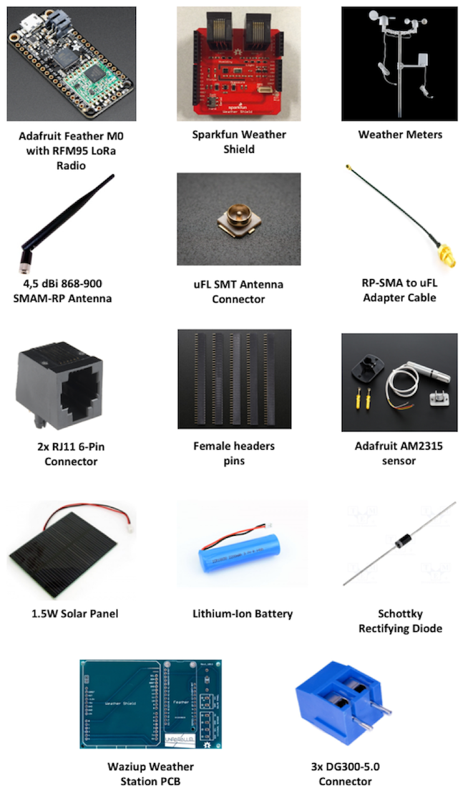

Assembly
--------

Follow the next steps to build the LoRa Weather Station.
To connect the cables in the respective places as shown in the following figures it is recommended to use a breadboard and cables with different colors.
In the initial two steps is necessary to solder some components. To help in the solder task can be consulted this [guide](https://learn.adafruit.com/adafruit-guide-excellent-soldering).

####  1) Adafruit Feather M0
Solder the Female Header pins and the uFL SMT Antenna Connector in Feather.

  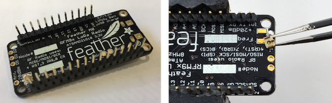

Once soldered the uFL SMT Antenna Connector can be connected the 868MHZ Antenna.

  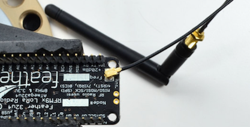

#### 2) Sparkfun Weather Shield
Solder the female header pins and the two RJ11 connectors in the Sparkfun Weather Shield.

  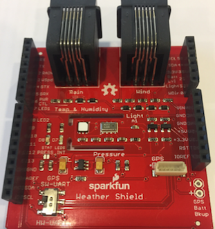

#### 3) Power the Weather Shield

  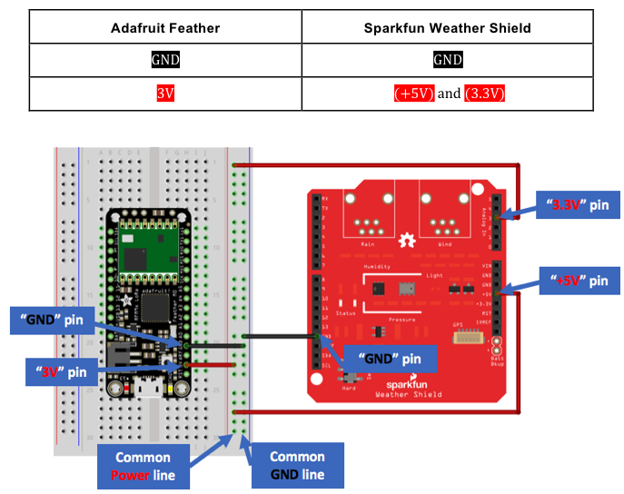

#### 4) Connect Weather Shield sensors

  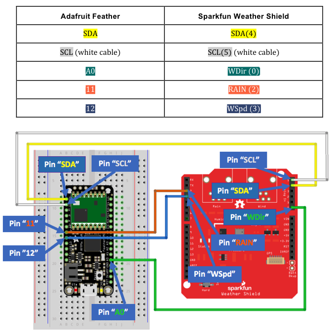

#### 5) Connect External sensor

  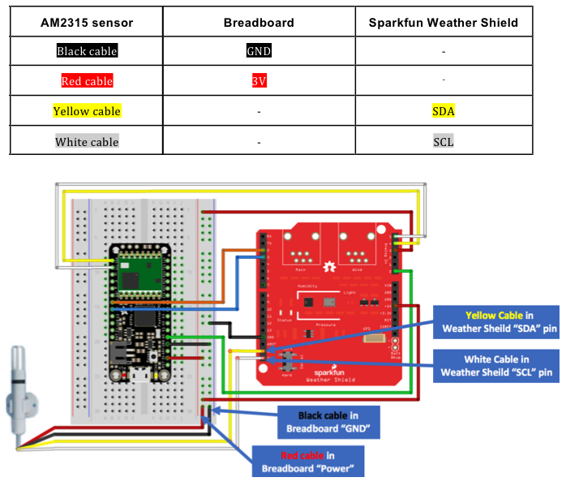

#### 6) Connect Weather Meters
Pay attention and connect the Rain and Wind RJ11 cables in the respective places as shown in the following figure.

  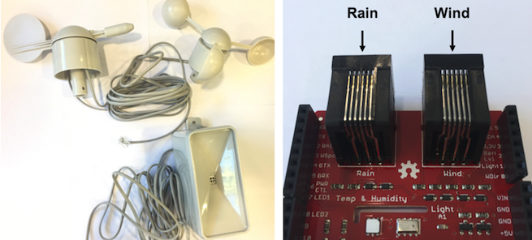

#### 7) Connect the Battery

  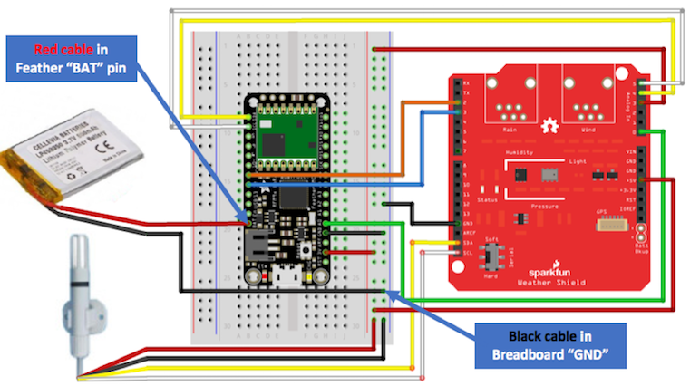

If the battery comes with the 2-pin JST connector will facilities the connection in Feather because is only necessary connect the Battery JST pin in the Feather as shown in the following figure.

  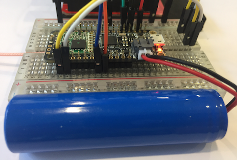

#### 8) Connect Solar Panel
It is necessary to use a Schottky Diode to allow that the current go in the right direction and not to the Solar Panel.

  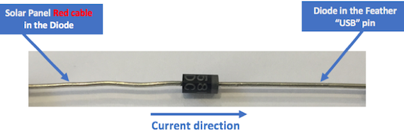

As represented in the following figure connect the Solar Panel red cable to the Schottky diode and from the diode to the Feather “USB” and also connect the Solar Panel black cable “GND” to the common breadboard “GND”.

  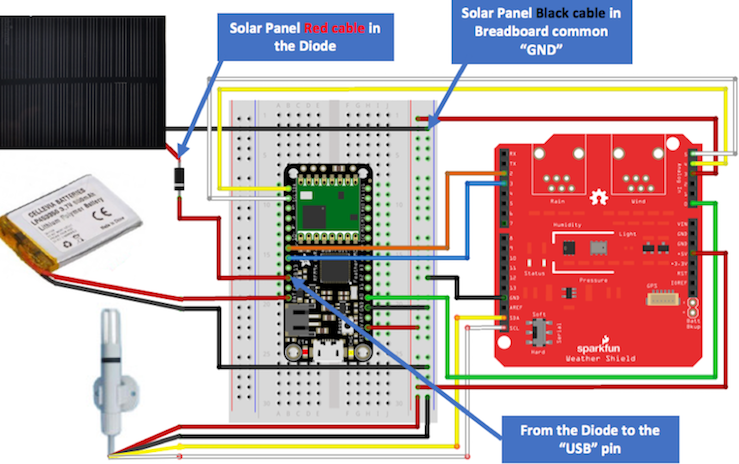

#### 9) Assembly Weather Station
The assembly LoRa Weather Station according to the previous steps is shown in the following figure.

  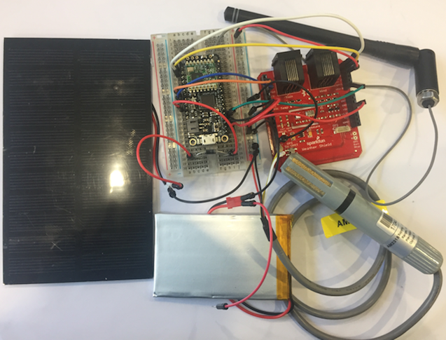

Upload Software
-------------

#### 10) Download & Install Arduino
To download the Arduino IDE 1.6.6 or later go to the Arduino [website](https://www.arduino.cc/en/Main/Software).

#### 11) Add Adafruit Boards to Arduino
To add the Adafruit Boards in the Arduino IDE go to “Arduino”, “Preferences” and include the link for Adafruit boards in the "Additional Boards Manager URLs".
This link can be found in the official Adafruit [guide](https://learn.adafruit.com/adafruit-feather-m0-radio-with-lora-radio-module/setup).

#### 12) Install Adafruit Boards in Arduino
To install the Adafruit Boards in Arduino IDE go to  “Tools”, “Board”, access the “Board Manager” and follow the steps in the official Adafruit [guide](https://learn.adafruit.com/adafruit-feather-m0-radio-with-lora-radio-module/using-with-arduino-ide).

#### 13) Download & Install Weather Station library
To download the Weather Station library go the [Waziup Github](https://github.com/Waziup/WAZIUP-WeatherStation), click on “Clone or download” green button located in the right side and choose “Download Zip” option to download the “WAZIUP-WeatherStation-master.zip” file.
To install the Weather Station library go to, in Arduino IDE, “Sketch”, “Include Library” and click in the “Add .ZIP Library” option. Will appear a window where need to be added the zip file.

#### 14) Open Weather Station example code
To open the Waziup Weather Station code go to “File”, “Examples”, “Waziup Weather Station” and click in the “WaziupWeatherStation” example.

#### 15) Choose Board & USB Port in Arduino
After connecting the micro-USB cable from the computer to the Feather, it is necessary to choose the correct Adafruit Feather Board in the Arduino IDE.
To do that go to “Tools”, “Board” and click in the “Adafruit Feather M0”.
To define the USB port go to "Tools”, “Port” and click in the “Adafruit Feather M0”.

#### 16) Upload the Weather Station software
To upload the software in the Adafruit Feather M0 just need to click in the “Upload” button presented in the upper left side of the Arduino IDE.
After concluding the upload with success, a message will appear in the lower left side.
To open the Arduino Serial Monitor and visualize the LoRa Weather Station workflow click in upper right side button.

Deployment
----

#### 17) Assembly Weather Station in a Box
It is recommended to use a box to place the assembly Weather Station in the desired location.
The following figures show, as an example, the Waziup Weather Station in a box that not needs to be the same.
Pay attention to the material that the box is made.
To place the Weather Station in locations under the rain, it is convenient to use a waterproof box.

  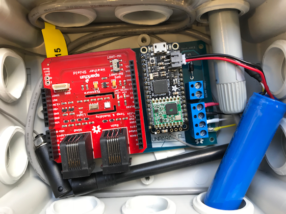

#### 18) External Sensor outside the box
Make sure that the external sensor is slightly out of the box, as shown in the box of Figure, and preferably in a shadow location without sun.

  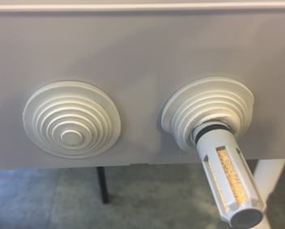

#### 19) Assembly Weather Meters sensors
The Weather Meters come with material components, to allow their assembly in an auxiliary structure.
To mount it is recommended to perform the suggested steps in the Sparkfun's [guide](https://learn.sparkfun.com/tutorials/weather-meter-hookup-guide).

#### 20) Solar Panel outside the box
Place the Solar Panel outside the box in a place where it is possible to guarantee the conditions of implementation.
To realize and ensure a correct Solar Panel implementation it is recommended to consult the "Solar Panel Deployment" document that is available in folder “documents” in the Waziup Weather Station [Github](https://github.com/Waziup/WAZIUP-WeatherStation).

  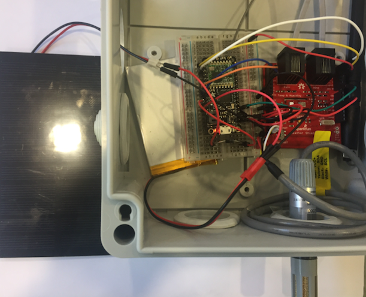

The hole created for the external sensor can be used to route the Solar Panel cables as well as the RJ11 Rain and Wind sensor cables.

After complete these steps, the Waziup LoRa Weather Station is ready to receive the measurements and send the information to the LoRa gateway.
