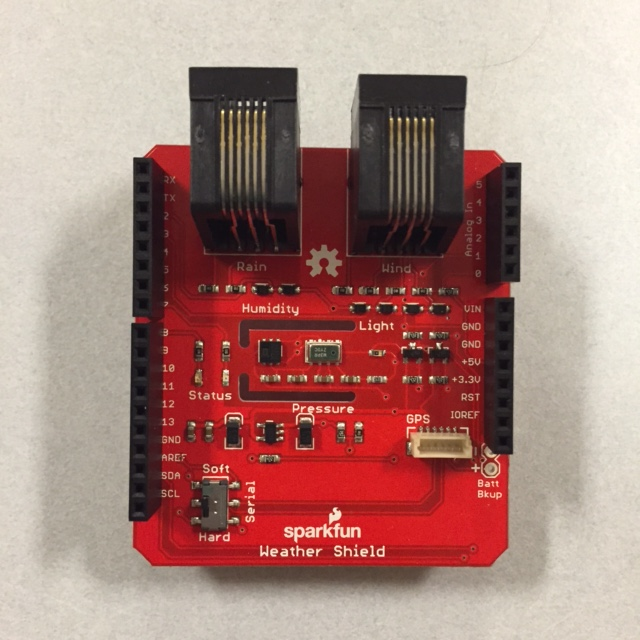
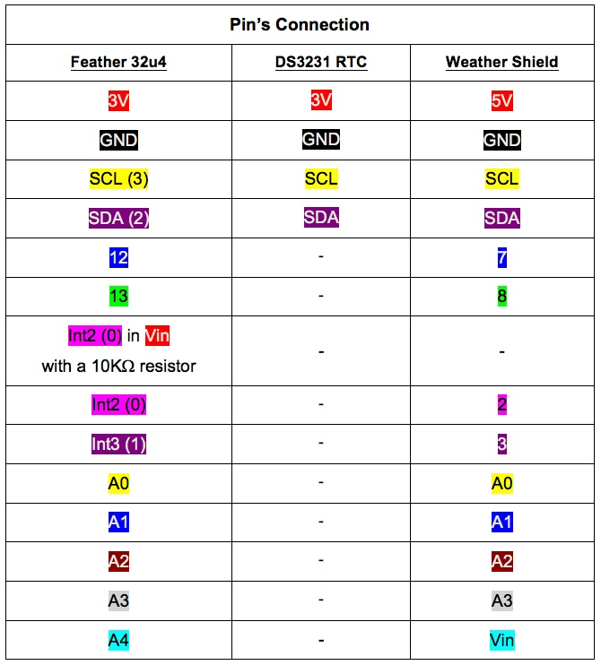
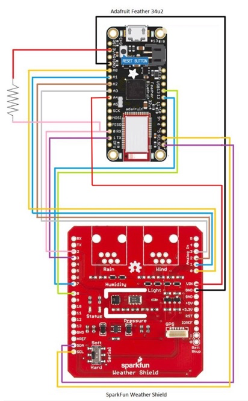
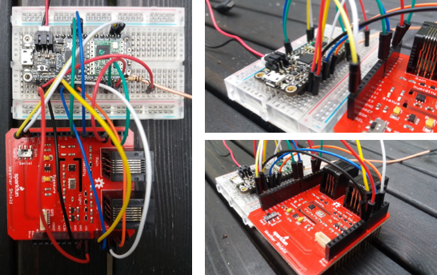
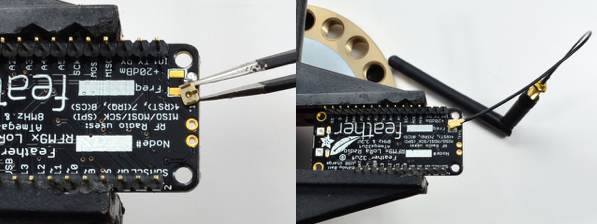
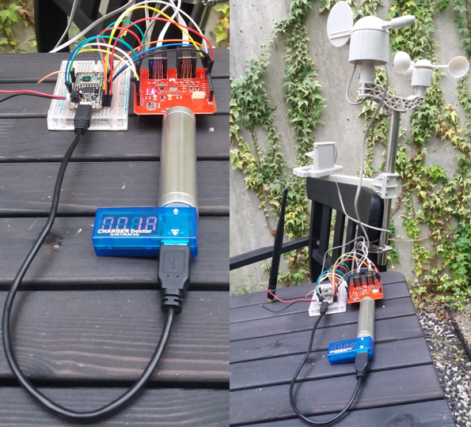

## Discover here how to prototype a weather station using Waziup.

The objective is to develop a low-cost and sustainable solution capable of reading real-time data typical of a weather station, using different sensors, and capable of communicating via LoRa.
The following subsection are a Getting Strated tutorial.
You can find detailed documentation (here)[WeatherStationGitHub]. 

#### Hardware

The following hardware it's needed to develop your own station:

- (Adafruit Feather 32u4 RFM95 LoRa Radio)[Feather]
- (Adafruit RTC DS3231)[RTC]
- (Sparkfun Weather Shield)[Shield]
- (Wind and Rain sensors Kit)[WindRain]
- (Antenna 868 Mhz)[Antenna]
- (SMA cable)[SMA] 

#### Libraries
You will need that following specific libraries. They are available (here)[Libraries].

- SparkFunHTU21D
- SparkFunMPL3115A2
- RTClib
- LowPower
- Feather_Lib

#### Build & Implementation

You need to follow the next steps to build and implement the Weather Station:

1. **Connect the Wind and Rain sensors to the Weather Shield**;
The Weather Shield come with two unpopulated RJ11 connector spaces that you need to soldering. You need to connect the Wind and the Rain cables to the RJ11 connector.

2. **Connect the Adafruit Feather 32u4 with Sparkfun Weather Shield**;

3. **Connect the Antenna 868 MHz to Feather**;

4. **Weather Station built with components**;

5. **Download the IDE and specific software**;
Don't forget to include the specific libraries. To did this use the Library Manager of your IDE.

6. **Compile the software**;
To this step you need to compile the "WAZIUP_Weather_Station_v1.ino" file. This is a "ready-to-run" file that contains the latest "firmware" to sample the sensors and output data with LoRa communication. Will give you all the sensor data: Temperature, Humidity, Luminosity, Pressor, Supply, Wind Direction, Wind speed and the Amount of Rain. You can see the info in your IDE Serial Monitor and you can also change the file has you want.

#### System Running

The following steps are about how the system works:

1. Power-on the Feather. The script starts automatically when feather is powered on;
2. At the start and during its automatic sensors calibration process the green led appears on (take about 5 seconds). 
3. Wakes-up every 15 min, take all the measurements and send to Gateway.
4. At the moment of reading values by the sensors and send a message to LoRa gateway the blue led turns on and then: If feather does not receive acknowledge then the blue led turns off and Feather sleeps. If feather receive acknowledge from master gateway then the blue led switch to green for 2 seconds, and feathers start sleeping.
5. When Feather sleeps all led’s are off.
6. Feather wakes up after four minute (by default), get the measurements and send back to master gateway until sleeping again.

[Feather]: <https://www.adafruit.com/product/3078>
[Shield]: <https://www.sparkfun.com/products/12081>
[RTC]: <https://www.adafruit.com/product/3013>  
[WindRain]: <https://www.sparkfun.com/products/8942>
[Antenna]: <https://www.cooking-hacks.com/868mhz-antenna>
[SMA]: <https://www.cooking-hacks.com/interface-cable-rp-sma-to-u-fl>
[Libraries]: <https://github.com/unparallel-innovation/UI_Waziup_Weather_Station/tree/master/WAZIUP%20Weather%20Station%20Client/lib>
[WeatherStationGitHub]: <https://github.com/unparallel-innovation/UI_Waziup_Weather_Station>
